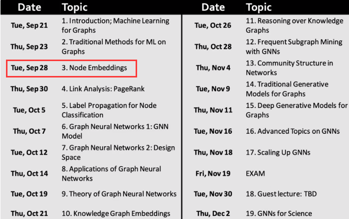

# CS224W_notes

上传学习CS224W图机器学习课程的笔记以及代码

**本次学习参考**

CS224W公开课：[双语字幕 斯坦福CS224W《图机器学习》课程(2021) by Jure Leskove](https://www.bilibili.com/video/BV1RZ4y1c7Co?vd_source=55755af81e9ec7ae17d639fb86860235)

官方课程主页：[官方主页](https://web.stanford.edu/class/cs224w)

子豪兄精讲：[斯坦福CS224W图机器学习、图神经网络、知识图谱 同济子豪兄](https://www.bilibili.com/video/BV1pR4y1S7GA?vd_source=55755af81e9ec7ae17d639fb86860235)

子豪兄公开代码：[TommyZihao/zihao_course: 同济子豪兄的公开课 (github.com)](https://github.com/TommyZihao/zihao_course)

基于图的项目：

- 读论文、搜论文、做笔记、吐槽论文的社区：[ReadPaper](https://readpaper.com/)

- 可以画出来论文之间的应用关系：[CONNECTED PAPERS](https://www.connectedpapers.com/)

- 医疗知识图谱：[BIOS](https://bios.idea.edu.cn/)

知识图谱专业老师：刘焕勇老师[主页](https://liuhuanyong.github.io/)，[github主页](https://github.com/liuhuanyong)，[CSDN主页](https://blog.csdn.net/lhy2014)，也有公众号：老刘说NLP。

**CS224w课程目录：**

