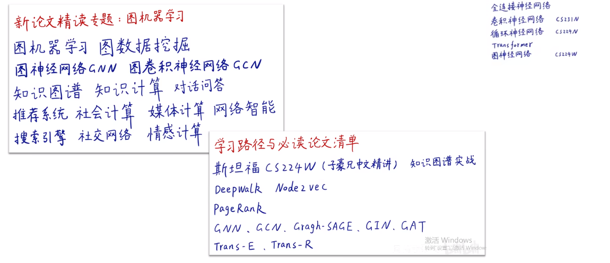
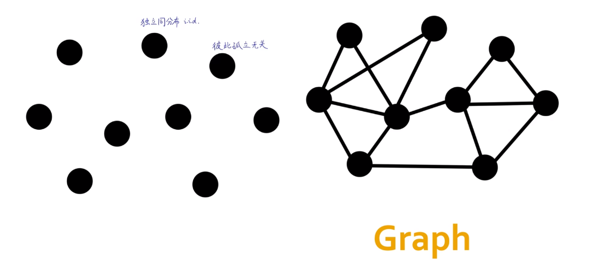
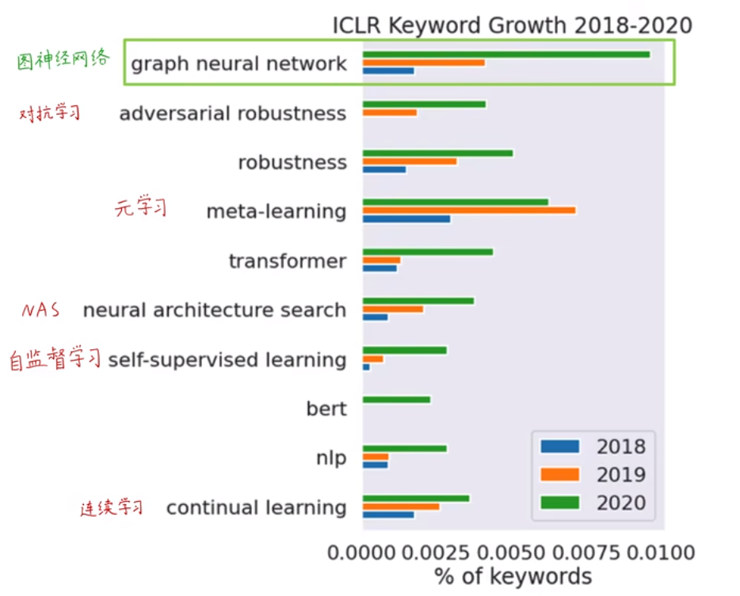
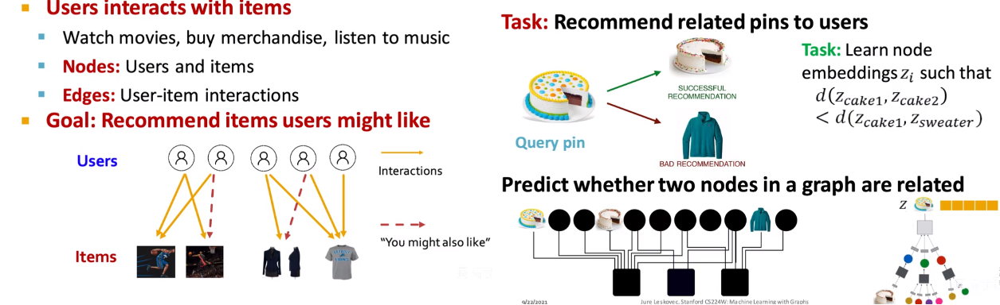
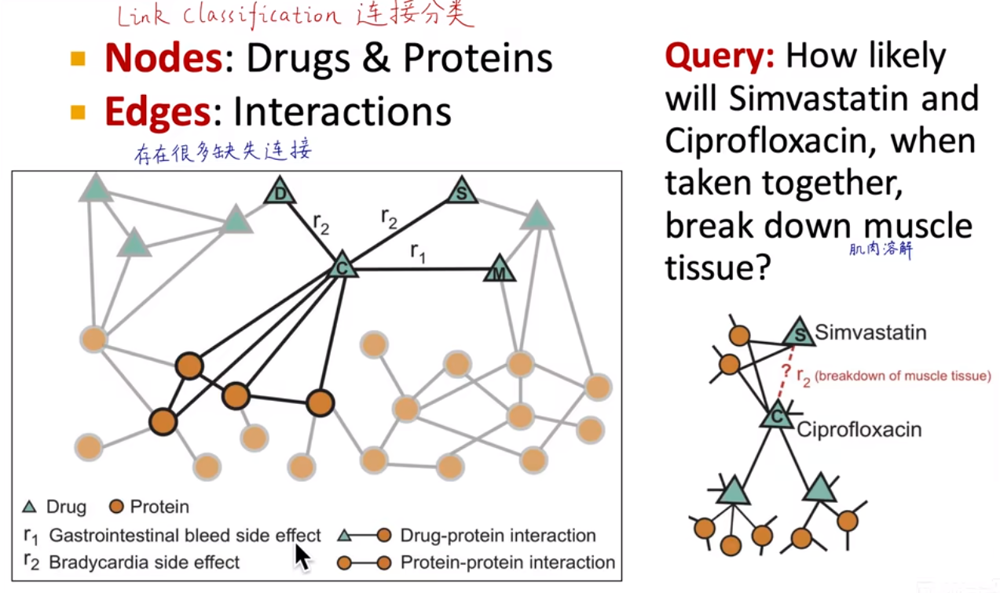
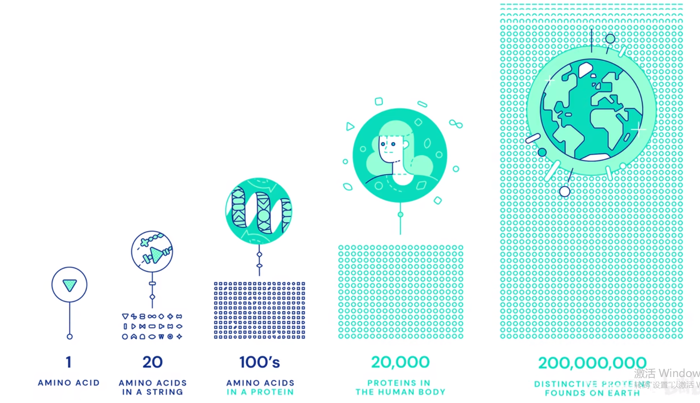
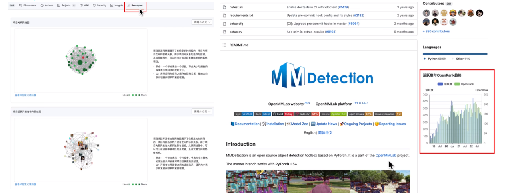
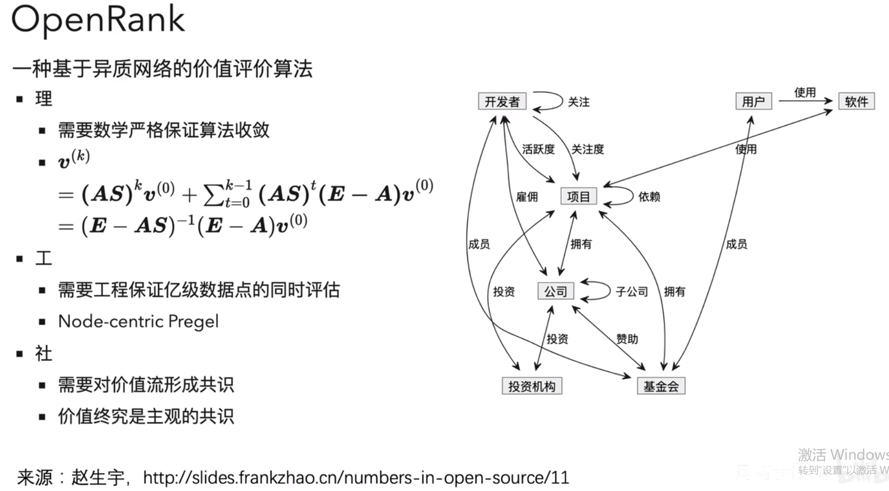
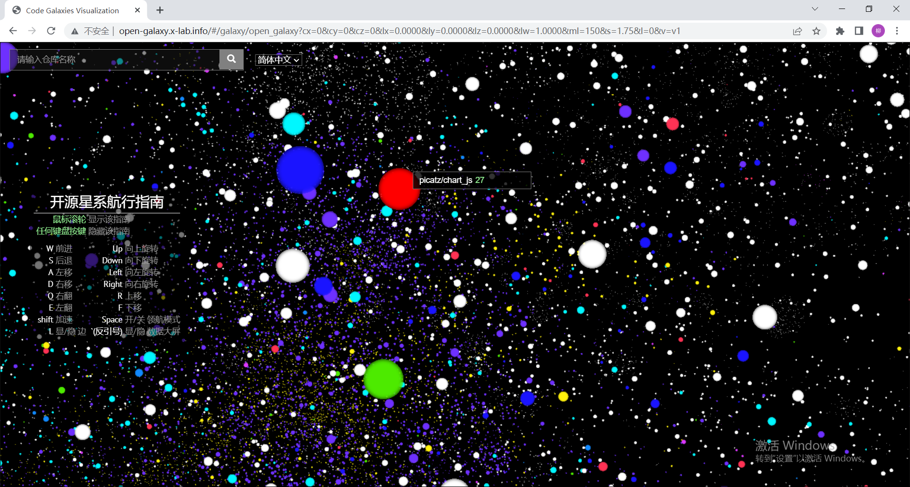

# 斯坦福大学CS224W图机器学习笔记

## 学习参考

CS224W公开课：[双语字幕 斯坦福CS224W《图机器学习》课程(2021) by Jure Leskove](https://www.bilibili.com/video/BV1RZ4y1c7Co?vd_source=55755af81e9ec7ae17d639fb86860235)

官方课程主页：[官方主页](https://web.stanford.edu/class/cs224w)

子豪兄精讲：[斯坦福CS224W图机器学习、图神经网络、知识图谱 同济子豪兄](https://www.bilibili.com/video/BV1pR4y1S7GA?vd_source=55755af81e9ec7ae17d639fb86860235)

子豪兄公开代码：[TommyZihao/zihao_course: 同济子豪兄的公开课 (github.com)](https://github.com/TommyZihao/zihao_course)

基于图的项目：

* 读论文、搜论文、做笔记、吐槽论文的社区：[ReadPaper](https://readpaper.com/)
* 可以画出来论文之间的应用关系：[CONNECTED PAPERS](https://www.connectedpapers.com/)
* 医疗知识图谱：[BIOS](https://bios.idea.edu.cn)

知识图谱专业老师：刘焕勇老师[主页](https://liuhuanyong.github.io)，[github主页](https://github.com/liuhuanyong)，[CSDN主页](https://blog.csdn.net/lhy2014)，也有公众号：老刘说NLP。

CS224W的课程目录：

往期笔记回顾：[CS224W笔记](https://github.com/lyc686/CS224W_notes/tree/main/notes)

## Task_01、图机器学习导论

## 图相关必读论文

**知识储备**（如果有的话接下来的学习会事半功倍）：

* 理论知识
  * 机器学习
  * 图论
  * 概率论
* 编程知识
  * python
  * pytorch

## 一、为什么要学习图机器学习

### 1.图无处不在

图就是用来描述每一个样本之间相互之间有关联的。在此之前我们都是描述样本之间是**独立同分布**的。而图可以使用**节点**和**边**的形式通用的表述样本之间的关系。

（恩格斯：人的本质，一切社会关系的总和。）

**图**在我们日常生活中有非常多的应用，例如：

* 社交网络
* 食物链，食物网
* 地铁线
* 论文之间的引用网络
* 人脑神经元之间通过突触（轴突、树突）进行连接
* 医学的知识图谱
* 代码中的计算图（Tensorflow）
* 分子结构图（原子是节点，化学键和相互作用力是边）

### 2.数学中的图

最早的提出：**哥尼斯堡七桥问题**（不重复的走过七个桥，后来由于图论的提出证明了是不可能的）

### 3.深度学习的进展

#### （1）传统机器学习

数据样本之间**独立同分布**，只需要简单的拟合一个**分类边界**或者预测曲线就可以完成了。

#### （2）现代的深度学习算法

主要用于解决一些**表格数据**和**序列数据**，例如

* 全连接神经网络

* 卷积神经网络（CS231N）
* 循环神经网络（CS224N）
* Transformer

目前还没有一种专门用于处理**图数据**的神经网络

#### （3）图机器学习/图神经网络

`ICLR`顶会中我们可以发现关于图的研究是非常火爆的。

## 二、图学习

### 1.图学习的难点在哪里

和其他传统网络结构（卷积神经网络、循环神经网络等等）不同的是，图数据有以下几个难点：

* **任意尺寸输入**的，例如你可以往模型中输入一个很大的有很多条边的图，也可以输入一个非常小的图
* **没有固定的节点顺序**和**参考锚点**，例如：
  * 卷积神经网络中我们卷积核扫过图片是从左到右、从上到下
  * 循环神经网络中我们处理文本也是有先后顺序的，有能够参考的锚点
* **动态变化**的数据，例如淘宝的顾客信息，偏好等等都是随时变化的。
* **多模态的特征**，例如一个音乐的推荐系统中，既有歌手的名字，也有歌曲，还有一些MV视频等等。

### 2.图神经网络结构

1. 首先，**输入部分**：肯定是一张图。
2. 其次，通过一连串的**图卷积**操作和**激活函数**。这部分也就是`黑箱子`：实现**端到端**的学习（**表示学习**），图神经网络可以自动学习特征，类似卷积神经网络，不需要人工干预教学。

表示学习：将一个输入的高维特征，输出成一个d维的向量，能够表示出输入的语义特征。也叫做图嵌入(Node Embedding)

变成d维的向量之后后续就相当于处理一个**传统的问题**。

3. 最后，**输出**：可能是节点的label标签，也可能是节点之间的连接，也可能是生成另一个图或者一个子图

### 3.做图学习的编程工具

1. [PyG](www.pyg.org)（斯坦福老师团队开发的）
2. GraphGym（斯坦福老师团队开发的）
3. NetworkX（子豪兄推荐的，做图学习必备的库）
4. [DGL](www.dgl.ai)（李沐老师推荐，复现了很多论文，适合做学术研究用）

### 4.图数据可视化工具

1. [AntV可视化](graphin.antv.vision)（蚂蚁金服的，其中的[g6.antv](g6.antv.antgroup.com)是专门做图数据可视化的）
2. [Echarts可视化](echarts.apache.org/examples/zh/index.html#chart-type-graphGL)（百度和阿帕奇基金会制作的，专门有针对大规模数据的图的引擎，几千几万的图也可以画出来）
3. [graphxr](app.graphxr.cn)（也支持非常多的节点的渲染，也可以放在3维的空间中进行渲染）

### 5.图数据库排名

1. Neo4j（常年盘踞市场第一，推荐使用）
2. Miscrosoft Azure Cosmos DB
3. Virtuoso
4. ArangoDB
5. OrientDB

### 6.应用

一些图领域的常见应用：

* **最短路径的搜索和查找**（例如导航）
* **分析节点重要度**（度中心性评价，著名的就是PageRank）
* **社群检测**（比如银行卡欺诈中，可以通过社群检测判断出哪一片人群经常欺诈）
* **连接预测**（在社交网络中很重要，可以推荐你可能认识的人，还有商品的推荐系统也是）
* **节点相似度**（也许图中的两个节点距离非常远，但是他们有非常大的相似性，我们就可以通过节点相似度找到他们）
* **图嵌入**（把一个节点映射为一个d维向量，例如Node2Vec。这个d维的向量就可以反应节点的语义和连接关系）

上述的应用包括了各种层级的任务：比如**节点层面**、**社群层面**(子图)、**边层面**、**图层面**(生成另一张图)等等

## 三、各层面应用具体例子

### 1.节点层面

节点层面：从已知的节点推未知的节点

### 2.边层面（连接层面）

推荐系统：如下图所示由用户和商品两类节点组成的图称为**二分图**。

推荐系统的关键就是**图神经网络**的设计，如右图所示，如何让蛋糕和蛋糕之间距离更近，让蛋糕和毛衣之间距离更远，就是图学习应该关注的问题，也就是如何更加精准的进行推荐。

另外一个连接层面的应用：**药物组合的作用** -- 也就是连接的**分类**与**预测**。

### 3.子图层面

非常经典的就是导航，如何根据一个道路的巨大图，规划出一个节点到另一个节点的路线。

### 4.图层面

**药物设计**：每一个原子就是一个节点，原子间的化学键和作用力就是边。我们可以先使用图的技术进行**图分类**，从海量的分子池子中，筛选出有潜力的分子，既可以直接生成符合条件的新分子，也可以在已有分子的基础上进行修改。

* 从头设计药物
* 现有数据库的虚拟筛选
* 药物再利用

图层面还可以做一些**物理模拟**，比如流体力学、粘土土壤模拟、把每一个粒子当成一个节点，粒子之间的距离和相互作用力作为连接，不断迭代预测模拟例子下一时刻的状态，就可以实现物理模拟。

## 四、革命性进展--预测蛋白质空间结构

2022年最具有革命性的进展：

* AI绘画
* Chatgpt聊天机器人
* AIphaFold蛋白质空间结构预测

蛋白质的功能：是生命活动的承担者和体验者，通过**氨基酸**进行脱水缩合变成多肽链，最终几条台联盘曲折叠成蛋白质。

### 1.蛋白质空间结构的预测困难点

氨基酸种类非常少：20种。但是氨基酸的拼接情况和转角等等非常多，于是使得蛋白质的空间结构非常难以预测。仅从氨基酸多肽链的**一级结构**预测蛋白质的**三维结构**非常困难。

### 2.成果

AIphaFold成功预测了两亿种蛋白质，在生物领域一巨大的价值。

## 五、hypercrx插件

`hypercrx`插件是基于图的算法的插件，可以实现对github中项目的项目之间以及开源贡献者的关系图，也可以反映出开源项目的活跃度。

例如，OpenMMlab的目标检测的项目的关系图如下所示：

类似**PageRank**，该团队提出了一个**OpenRank**，可以通过活跃度、开发者关系、开发者协作图等信息，计算出图数据的模型。

有了图的结构，该团队还提出了一个开源项目和开源企业的排行榜：https://open-leaderboard.x-lab.info，可以看到什么是重要的项目（活跃度，影响力）。

以及一个开源项目构成的宇宙：http://open-galaxy.x-lab.info

## 总结

本次任务主要学习了什么是图机器学习，图机器学习和传统的机器学习任务有哪些不同的地方，图学习的一些难点以及工具，还介绍了在各个不同层面上的具体例子（节点层面、连接层面、全图层面），最后介绍了近年来的一些革命性进展。

## 思考

- [x] 为什么要把图表示成矩阵的形式
  - [x] 因为我们要在计算机中进行运算，而计算机运算就是针对矩阵做运算。并且现在的对于深度学习/机器学习的加速实质就是加速矩阵的运算（乘法/分解）。所以用矩阵表示图其实就是相当于翻译官的问题。
