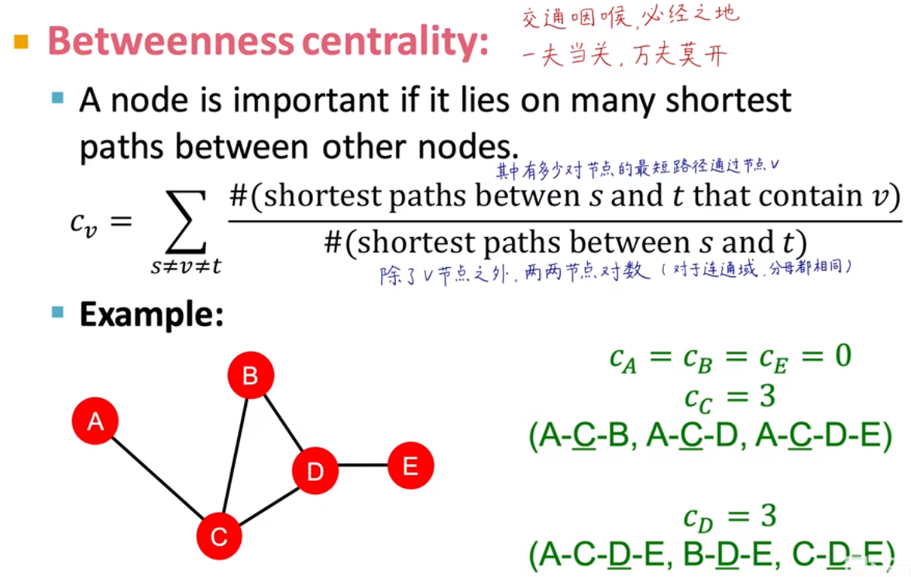
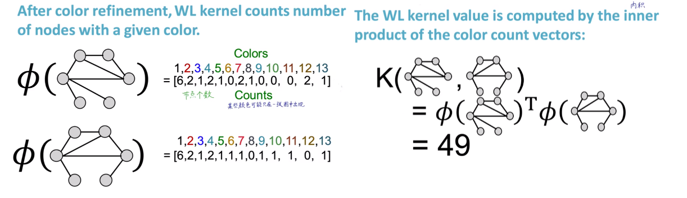

# 斯坦福大学CS224W图机器学习笔记

## 学习参考

CS224W公开课：[双语字幕 斯坦福CS224W《图机器学习》课程(2021) by Jure Leskove](https://www.bilibili.com/video/BV1RZ4y1c7Co?vd_source=55755af81e9ec7ae17d639fb86860235)

官方课程主页：[官方主页](https://web.stanford.edu/class/cs224w)

子豪兄精讲：[斯坦福CS224W图机器学习、图神经网络、知识图谱 同济子豪兄](https://www.bilibili.com/video/BV1pR4y1S7GA?vd_source=55755af81e9ec7ae17d639fb86860235)

子豪兄公开代码：[TommyZihao/zihao_course: 同济子豪兄的公开课 (github.com)](https://github.com/TommyZihao/zihao_course)

基于图的项目：

* 读论文、搜论文、做笔记、吐槽论文的社区：[ReadPaper](https://readpaper.com/)
* 可以画出来论文之间的应用关系：[CONNECTED PAPERS](https://www.connectedpapers.com/)
* 医疗知识图谱：[BIOS](https://bios.idea.edu.cn)

知识图谱专业老师：刘焕勇老师[主页](https://liuhuanyong.github.io)，[github主页](https://github.com/liuhuanyong)，[CSDN主页](https://blog.csdn.net/lhy2014)，也有公众号：老刘说NLP。

CS224W的课程目录：

往期笔记回顾：[CS224W笔记](https://github.com/lyc686/CS224W_notes/tree/main/notes)

## Task_02、图的基本表示和特征工程

## 一、图的基本表示

* 图的本体设计
* 图的种类（有向、无向、异质、二分、连接带权重）
* 节点连接数
* 图的基本表示 - 邻接矩阵
* 图的基本表示 - 连接列表和邻接列表
* 图的连通性

在图中**节点**可以用`nodes`表示或者用`vertices`表示；**边**由`links`或者`edges`表示；**整个图**可以用`network`或者`graph`表示。图是由节点和边组成的。

## 二、本体图Ontology

那么图用哪些作为节点，哪些作为边就是**本体图**考虑的问题。

例如下图所示的就是一个本体图，通常在我们开始做图学习的**任务之前**，在导入数据之前，我们就应该**先构建出本体图**来。在具体导入数据的时候只不过是在本体图对应的节点中填入实际的数值而已。

本体图如何设计通常取决于**将来想解决什么问题**。而且本体图有时是**唯一**的，有时也可以是**不唯一**的。

例如：下图所示的红楼梦的人物关系知识图谱，可以很清晰的看到人物之间的关系是怎么样的。

## 三、各种类型的图

### 1.无向图：

* 节点之间是没有方向的，或者说是相互的，是双向的
* 边是对称的
* 例如facebook的关系网

### 2.有向图：

* 节点之间是有方向的
* 例如网页之间的相互引用

### 3.异质图：

* 图中的节点或者连接会有不同的类型

### 4.二分图：

* 如果一个异质图中只有两种节点
* 一种特殊的异质图
* 例如每个用户和商品的关系
* 展开二分图
  * 如下图所示，我们可以把与同一个节点之间有连接的节点之间添加边，进行展开
  * 
  * 上面的二分图展开后的左、右两张图都不是二分图，都是由一类节点组成的图
  * 可以分别对两张展开图做数据挖掘

## 四、重要概念

### 1.节点连接数

**无向图：**

* 节点连接数：一个节点存在多少个连接（度）
* 平均连接数：一个节点的平均连接数（2E/N）

**有向图：**

* 入度、出度
* 一个节点的入度=0，则为起始节点
* 一个节点的出度=0，则为终止节点
* 平均连接数：E/N节点和边一一对应
* 平均入度连接数 = 平均出度连接数

节点连接数可以用来表示节点的重要性（中心度/枢纽度）

### 2.图的基本表示

#### （1）邻接矩阵

**无向图：**

* 对称矩阵，关于主对角线对称
* 主对角线表示自己指向自己的边，若没有则为0
* 连接总数：看矩阵一半即可（所有非零元素求和 / 2），既可以按行计算，也可以按列计算

**有向图：**

* 非对称阵
* 入度按行求和
* 出度按列求和
* 连接总数：矩阵中所有非零元素求和

**稀疏矩阵：**

* 常见的矩阵都是稀疏矩阵（矩阵中零的节点远远多于非零节点）

#### （2）连接列表 & 邻接列表

**连接列表：**

* 只记录存在连接的节点对
* 节省存储空间
* 连接表（三元组：起始节点；终止节点；关系）

**邻接列表：**

* 将所有和某个节点相关的（指向）的节点按照行记录下来
* 按行存放
* 进一步压缩存储空间，同时没有丢失信息

#### （3）带权图 & 不带权图

**不带权图：**

* 邻接矩阵中的节点非1即0

**带权图：**

* 邻接矩阵中的节点不是非1即0，带有权值

不管是带权图还是不带权图，无向图计算连接总数都是1/2矩阵中非零节点求和，平均连接总数都是2E / N

### 3.图的连通性

#### （1）连通图

* 图中的任意两个顶点都能找到边到达，就是连通图
* 如果几个不连通图中出现了能够将他们连接起来的桥接节点，那么就会打破不连通图邻接矩阵分块对角的形式

#### （2）不连通图

* 如果图中存在任意两个顶点不能找到边到达，则不是连通图 
* 其中最大的连通部分称作**最大连通子图**
* 数据分布呈现**分块对角**的形式

#### （3）强连通图

* 对于**有向图**而言，如果任意两个节点都能找到边到达，那么这个图就是强连通图

#### （4）弱连通图

* 对于**有向图**而言，如果存在两个节点不能找到边到达，那么这个图就是弱连通图
* 但是其中的一些子图也许是强连通的，称为**强连通域（`SCC`）**
* 从`SCC`中指出来的节点称为`Out-component`
* 指向`SCC`的节点称为`In-component`

* 对于一张图的SCC分解是非常重要的

六度空间理论：全世界任意两个人，都可以通过不超过6个中间人相互认识，而且这些中间人不受时间空间限制。

## 五、图机器学习的基本任务

一个图数据的层面包括：

* 节点层面
* 连接层面
* 全图层面

图机器学习需要的**输入**是一张图（矩阵），但是传统机器学习的输入是**向量**没有图（矩阵）的形式，所以我们需要将不同的层面的信息向量输入，相当于叠加成矩阵。

### 1.节点和边的特征

节点、连接、子图、全图都可以有特征，其中特征可能是**多模态**的（图像、视频、文本、音频）。

* 属性特征：某个节点自己就具有的特征
* 连接特征：一个节点在图中和其他节点的连接关系

### 2.传统图机器学习关注的特征

在传统的图机器学习中主要关注的是**连接特征**，而不是属性特征。更关注图中某个节点是桥接、枢纽还是边缘节点，侧重在于研究这个节点在他的社群中扮演什么角色。

本次笔记中的D维特征向量指的也是**连接特征**

### 3.特征工程

假设我们现在有一个数据集是某一种花的四个特征，我们通过训练得到了一个机器学习的模型。当一个新的花的图片到来的时候我们就可以放到模型中，去观察新的图片在这四个特征上的占比分别是多少，最终来判断这是什么花。

而**特征工程**所要做的事情就是：设计一些其他特征，这些自己设置的特征相比于之前的特征能够更好地去分辨花的种类。通过**人工**的方式去将一些我们认为可能比较重要的特征用**向量**表示出来丢给模型。

例如，判断一个学生是否是一个品学兼优的好学生，可能以下的一些特征就是重要的：

* 是否花钱铺张浪费
* 是否成绩优异获得奖学金
* 是否每天在图书馆学习
* 等等

最终我们就需要把上述特征转换成机器能够看懂的样子（向量），来进行预测。

如上图所示，我们想要完成一个分类问题，当我们只使用简单的两个特征x1，x2（线性）的时候他无法完成非线性的分类的问题。而当我们**添加一个特征**`x1 ✖ x2`的时候，就可以解决这个**非线性的异或问题**。

总结：只有输入的是好的食材，配合上好的厨师才能得到好的饭菜。

* 食材：数据+特征
* 厨师：机器学习模型算法
* 饭菜：预测/分类结果

## 六、在图中使用特征工程

以无向图为例子，如何将节点、边、全图的特征用向量表示就是图中的特征工程

**如何将节点、边、全图都转换成D维向量**

### 1.节点层面的特征工程

以节点分类为例：

* **半监督**节点分类问题，由已知信息推出未知的信息
  * 根据左图的已知节点（绿色、红色）推测出灰色的未知节点

### 2.构造D维特征

一些可以考虑的角度：

* 节点的连接数（度）
* 节点的重要度
* 节点的聚集系数（和相邻节点是否有边相连）
* 自己定义一些子图的模型（数出节点周围有多少个我们构造的子图）

#### （1）节点连接数（数连接数）

如上图所示，如果只看节点连接数，那么下图中A、G节点的特征是相同的，但是两个节点所处的圈子的质量是完全不同的（一个是院士的关门弟子、另一个是一个人旗下的博士）

（无向图中）获取节点的连接数，既可以通过数邻接矩阵中对应节点的一行或者一列，也可以使用如下图所示的方式乘以一个全为1的列向量（相当于每一行求和），计算出每一个节点的连接数。

**度中心性**：**最终得到的这个每个节点的连接数的值就可以作为D维向量的第一维。**比如节点3的开年结束计算出来就是3，第一维就是3。

由于节点往往还要考虑节点的**质量**，所以我们除了考虑节点连接数还要考虑节点的**重要度**

#### （2）节点重要度

**同时考虑节点的重要度（质量）**，有如下方法

* `Eigenvector centrality`（**特征向量重要度**）
  * 如果一个节点和他**相连的节点非常重要**，那么这个节点也非常重要
  * 即，某一个节点的重要度等于与他相连的邻居节点的重要度求和再除以常数λ（归一化）
  * 本质就是一个**递归**问题，需要迭代的求解
  * 
  * 如上图所示求和将λ乘到左边，就可以等价为求矩阵A的**特征向量**的问题，上图的公式可以做如下解释：
    * 如果图中一共有四个节点，那么c向量就是一个4行一列的向量，每一行都是一个节点的特征向量重要度
    * 等号右边等价于一个矩阵✖c向量
    * 矩阵A每一行对应的就是和当前节点相连的边的数量，和c相乘就是左边的每一个节点的特征重要度求和的意思
    * 此时c向量就是矩阵A的**特征向量**，λ就是矩阵A的**特征值**
  * 可以思考`Eigenvector centrality`和`PageRank`的区别与联系
* `Betweenness centrality`（**中介中心性**）
  * 中介中心性用于刻画一个节点是否处于**交通咽喉**（必经之地）
  * 计算案例如下图所示：
  * 
  * 如上图算C节点的中介中心性
    * 除了C节点之外其他四个节点的两两组合就会有C42=6
    * 计算这六对的最短距离，有哪些一定要经过C
    * 最终带入公式就能计算出节点v的链接中心性
  * 例、湖北（从湖北到其他任意一个省，最多跨两个省）、马六甲海峡等等
* `Closeness centrality`（**连接中心性**）
  * 连接中心性刻画了一个节点是否**去哪儿都近**
  * 计算案例如下图所示：
  * 
  * 某一个节点的连接中心性越高说明这个节点越在图中的**中心位置**
* 等等

#### （3）节点聚集系数（数三角形个数）

`Clustering Coefficient`聚集系数就是节点有多抱团（和相邻节点是否有边相连），简单来说就是看图中的**三角形**个数

计算案例如下图所示：

此对数非log，而是连接对数量

其中有一种自我中心网络`ego-network`就是数三角形的个数，而这种三角形其实就是我们人为定义的一种**子图**，当然我们也可以定义其他形状来作为子图，也就是`Gtaphlets`

#### （4）构造子图（数子图个数）

`Gtaphlets`构造子图就是如下图所示：

* 两个节点能构成一种子图，有一种节点角色
* 三个节点能构成两种子图，有三种节点角色
* 四个节点能构成六种子图
* 五个节点能构成的子图中，有0-72共73个节点角色

什么是节点角色呢？节点角色的定义是在网络中具有相似位置的点的集合，类似于化学中的同分异构体，进一步说这个定义和 community 其实是互补的，比如各个公司可能是不同的 community，而每个公司内部的角色大致是相同的(管理层和下属员工)。公司(community)内个体间会有比较密切的联系，但公司间相同职位(角色)的个体并不一定会有关联。

此时，我们提取某一个节点周围的graphlets子图个数，就可以构建一个向量，称为`Graphlet Degree Vector(GDV)`，如下图所示：

计算u节点的GDV

* u节点周围的子图总共能够组成3种graphlets，包含4种节点角色(a,b,c,d)
* 然后分别数u周围的角色节点a、b、c、d都有多少个，c=0是因为是u节点邻域的信息种u没有扮演c-d种c角色的作用
* 此时的[2,1,0,2]就是u的GDV

因为5个节点的子图能够有73种节点角色，所以就是一个73维的向量，可以很全面的表示图中的拓扑连接结构，通过比较两个节点的GDV我们就可以计算两个节点的距离和相似度

补充：在NetworkX中子图称为Atlas

**小结一下：**

节点的**重要度信息**可以看：

* Node Degredd
* 各种的centrality

节点的**结构信息**可以看：

* Node Degree
* Clustering coefficent聚集系数
* Graphlet构造子图

**除此之外**还有：

* PageRank
* Katz Centrality
* HITS Hubs and Authorities

使用本小节的知识我们能够区分如下图左边形式的图中的节点（哪些是边缘，哪些是中心），但是无法区分右边所示的**社群**的概念（抱团），这部分区分需要后续的图神经网络的方法来完成。

### 3.连接层面的特征工程

`Link-Prediction`：通过已知连接补全未知连接，生成连接层面的D维向量有如下两种思路：

* 直接提取link的特征，把link变成D维向量
* 把link两端节点的两个D维向量拼在一起变成一个2D维的向量或者一个2行D列的矩阵

更鼓励使用第一种方式，因为第二种方式会丢失link本身的**连接结构信息**，而第一种方式直接提取link的特征之后我们就可以直接输入到下游的任务中去进行预测，看看两个节点之间是否有哪些类别呢。

Link-Prediction的任务可以分为两种：

* 客观静态图，例如：
  * 蛋白质结构
  * 分子
  * 可以尝试把已经客观存在的部分删掉再去预测出来
* 随时间变化的，例如：
  * 网站论文的引用
  * 社交网络
  * 我们需要从一个时间段中的图去预测出下一个时间段的图中的连接，并且找到预测的连接中top-n的连接
  * 在用预测出来的top-n个连接和下一个时段真实的连接作比较

#### （1）连接层面的工作

总结上面提到的连接层面的工作不论是静态的还是动态的，都是如下几个步骤：

* 提取连接特征 -> D维向量 -> 输入机器学习模型中，打一个分
* 然后从高到低降序排列分数，得到top-n
* 再去比较这top-n和真实值的区别

#### （2）连接特征分类

连接层面的特征可以分为：基于**两节点间距离、基于两节点局部连接信息、基于两节点在全图的连接信息**

* **基于两节点的最短路径长度**

  * 类似Node Degree这种方式只看最短路径的长度，但是忽视了个数和通路的结构

  如下图所示：

  

* **基于两节点局部连接信息**

  * 例如两节点的共同好友个数
  * 两节点的交并比
    * 两节点邻域节点的交集，比上邻域节点的并集
  * 共同好友是不是社牛
    * 共同好友的连接数的倒数求和
    * 如果共同好友是个社牛，那么两个节点之间的连接就显得不重要（分母大使得整体变小），如果共同好友是个社恐，那么两个节点的连接就显得很坚实了。
  * 缺点：当两个节点没有共同好友时，各项局部连接的指标计算结果都是0，所以我们通常需看全图的信息。

  如下图所示：

  

* **基于两节点在全图的连接信息**

  * `Katz index`卡兹系数：表示节点u和节点v之间长度为k的路径个数
    * 用邻接矩阵的幂运算
    * 离散数学中提到，邻接矩阵的n次幂表示的就是路径长度为n的路径（假设每条路径长度均为1）

  如下图所示表示了k=1和k=2的计算结果：

  **节点u和节点v之间长度为k的路径个数就是Auvk矩阵的第u行第v列元素**

  

  * 卡兹系数的具体计算，如下图所示
    * 考虑到随着距离的增大，关系可能会变弱，所以添加了β（折扣系数）
    * 求和的过程就是一个等比数列求和
    * 参考高等数学中的几何级数知识，将其写成后面的形式

  

### 4.全图层面的特征工程

将全图提取的特征表示为一个D维的特征向量，并且这个特征向量可以反映全图的结构特点

#### （1）Bag-of-*

* **Bag-of-Words(BoW)**

对于全图提取特征其本质仍然是：**数数（数不同特征在图中存在的个数）**。类比在自然语言处理NLP中的一种思想`Bag-of-Words(BoW)`，将一个文章的内容全都列出来，然后去数里面每一个词/字**出现的次数**，这样我们就可以把一篇文章表示为一个D维的向量，其中每一维都是每一个词的次数，这样就可以把向量输入给计算机进行处理。

同理，对于图，我们可以把图看作文章把节点看作单词，**只看每个节点有没有出现而不考虑连接结构**，使得两个完全不同的图最终的编码结果是一样的，这是不可行的。

* **Bag-of-Node degrees**

一种改进想法：使用`Bag-of-Node degrees`，**只看节点的连接数不看连接结构**，最终效果是确实可以区分之前的两个结构不同的图，如下图所示

同理我们也可以把这种`Bag-of-*`的思想推广到其他的特征中去

#### （2）Graphlat

* **Bag-of-Graphlats**

如下图所示，对于3个节点组成的graphlat从全图角度分析有四种（即，节点之间可以没有连接），对于4个节点组成的graphlat就有11种。我们就可以将全图的graphlat总结出来作为D维特征。

* 与之前的节点层面的特征不同的是
  * 可以有孤立节点
  * 从全图来数graphlat个数而不是计算节点邻域内的graphlat个数

如下图所示，假设全图中共有nk个graphlat那么，最终就会构造出nk维的特征向量，其中第i个表示的就是第i个graphlat在全图中的个数

如果把两张图的`graphlat的特征向量`做**数量积**，就可以的得到两张图的`kernel`，这个`kernel`是一个**标量**，可以反映出两张图是否相近，是否匹配。如果两张图的graphlet尺寸不匹配，需要一个归一化操作使其大小变成相同量级，避免计算结果产生歪曲。

不经常使用这种**Graphlat构造子图**方式的原因主要是，这种方式比较消耗硬件（从原图中枚举寻找子图），是一个nk多项式量级的复杂度，k越大，复杂度越高，也就是一个`N-P难问题`

#### （3）Weisfeiler-Lehman Kernel

是一种性能上更加优化的kernel，使用**颜色微调**的方法迭代地丰富“节点词库”

案例如下：

* 左图是假设都是一种颜色1，每个节点表示的就是**当前颜色，和自己相连的节点的颜色**，例如G1中的左上角节点颜色为1并且和三个颜色为1的节点相连，所以表示为1,111
* 右图是将左图中的结果用了不同颜色来表示的结果，这个过程称为**哈希**（每一种颜色都有自己的编号---编号就是那个1,1...）

不断重复上述过程，发现之前的颜色又开始发生变化，观察发现G1中最下面两个节点由于**结构完全一致**，所以颜色一直相同，但是G2最下面的两个节点由于**结构不一致**所以颜色不再是第一次**哈希**之后的相同值。

到这里我们经过两次**哈希**得到了13种颜色，也就是两张图均用13维的向量表示。我们就可以开始计算`kernel`求两张图的**内积**。

**13维向量：针对每一种颜色计算对应的节点个数**，有一些向量的元素为0，但是既然他有这种颜色，说明在另一张图中出现，即另一张图中他至少为1。

内积结果为：6x6+2x2+1x1+2x2+1x1+0x1+2x1+1x0+0x1+0x1+0x1+2x0+1x1 = 49，这个49就是这两张图的`Weisfeiler-Lehman Kernel`

用算法表示就是如下图所示：

这种方式的计算是和节点、连接呈**线性关系**，所以计算起来是非常方便的。而且`Weisfeiler-Lehman Kernel`与图神经网络`GNN`是非常类似的。

#### （4）Kernel Methods

Kernel Methods核方法经常用在**图机器学习**中，因为经常需要用两个图来作比较（两张大图、一张大图和子图等等）。

kernel值是一个**标量**，这时候就用这个kernel值来代表**两张图**的结构，而不是用一张图的向量来表示。有了kernel之后一些现成的带有核函数的机器学习方法就可以直接拿来使用，比如`Kernel SVM`支持向量机。

#### （5）其他的kernel

* Random-walk kernel
* Shortest-path graph kernel
* 等等

这些都是在**统计机器学习时代**的方法，现在是深度学习、神经网络的年代了。

## 总结

本次任务从图的基本表示开始，学习了各种不同类型的图（无向图、有向图、异质图、二分图），还学习了图的一些基本表示（邻接矩阵、连接表、邻接表）以及一些图的连通性问题。之后的特征工程提到了不管是上面提到的节点层面的特征还是连接层面的还是全图层面的，这些都是需要**人工去设计**，再输入到机器学习模型中的，对于特征的回顾如下图所示：

在后面要学习的的图神经网络中，我们就是**端到端**的用深度学习的方法，使用**图嵌入**自动得到图中的特征（包括结构、连接、语义特征等等），不再需要人工设计特征。

## 思考

***

- [ ] 节点层面，存在哪些数据挖掘任务，有何应用场景？
- [x] “传统图机器学习方法”传统在何处？
- [ ] 特征由人工进行确定
- [x] 特征工程在数据挖掘中有什么作用？
  - [ ] 使用人工确定的特征，可以最终满足实际问题的需要，例如解决非线性的异或问题添加x1x2
- [ ] 在传统图机器学习中，为什么要对节点、连接、全图做特征工程？
- [ ] 传统图机器学习方法相比图神经网络（深度学习）、有什么优点和缺点？
- [x] 节点层面可以构造哪些特征？
  - [ ] 节点层面可以构造节点的度中心性、特征向量中心性、中介中心性、连接中心性、构造子图
- [x] 这些特征可以归为哪两类？
  - [ ] 分为重要度信息和结构两类
- [x] 简述不同的Node Centrality计算方法？
  - [ ] 中心度计算方法：
  - [ ] Degree centrality - 乘以一个全为1的列向量来表示每个节点的度
  - [ ] Eigenvector centrality - 用λc = Ac来计算，其中c为特征向量，λ为特征值
  - [ ] Betweenness centrality - 用两两节点最短距离通过节点u的数量 / 除去节点u的两两节点对数计算
  - [ ] Closeness centrality - 用节点u到其他路径的最短距离求和的倒数计算
- [x] 只用Node Degree作为节点重要度，会有什么缺点？
  - [ ] 只用Node Degree会丢失节点的质量信息
- [ ] Eigenvector centrality和PageRank有什么异同？
- [x] Betweenness Centrality和Closeness Centrality有什么区别？分别揭示了节点是什么特征？
  - [ ] Betweenness centrality是中介中心性、Closeness centrality是连接中心性，前者刻画了哪些节点是必经之路上的节点（交通咽喉），后者刻画了哪些节点是中心节点
- [x] 你认识的所有海峡中，那个海峡的Betweenness Centrality最高？
  - [ ] 也许是马六甲海峡吧（来自遥远的地理课）
- [x] 你认为中国所有城市中，哪个城市的Closeness Centrality最高？
  - [ ] 湖北（到任意一个省级直辖市最多经过两个节点）
- [x] 湖北到中国任何一个省级行政区，最多跨两个省，说明哪个特征高？
  - [ ] 说明Betweeness centrality最高
- [ ] 你认为你所在城市的地铁线中，哪个地铁站的Closeness Centrality最高？哪个地铁站的Clutering Coefficient最高？
- [x] 地铁线路连接关系，应该如何表示？（邻接矩阵、连接列表、邻接列表）
  - [ ] 当地铁线比较稠密的时候我认为可以用邻接矩阵表示
  - [ ] 当地铁线比较稀疏的时候我认为可以用邻接列表表示
- [x] 你认为你的人脉圈中，谁的Clutering Cofficient最高，为什么？
  - [ ] 我可以说我自己吗hhhh
- [ ] 什么是Ego-network（自我中心网络）？
- [ ] Graphlet和Wavelet（小波分析）有什么异同？
- [x] 由四个节点组成的图，存在多少种Graphlet？
  - [ ] 6种
- [x] 五个节点构造的所有Graphlet中，存在多少种不同角色的节点？
  - [ ] 73种
- [x] 节点的哪些特征可以衡量该节点是否为中心枢纽节点？桥接节点？边缘孤立节点？
  - [ ] 节点的连接中心性
- [ ] 除了课程中讲的Centrality之外还有哪些Centrality指标？（PageRank、Katz Centrality、HITS Hubs and Authorities）

***

- [ ] 连接层面，存在哪些数据挖掘任务，有何应用场景？
- [x] 连接层面可以构造哪些特征？这些特征可以归为哪三类？
  - [ ] 两节点间距离、基于两节点局部连接信息、基于两节点在全图的连接信息
- [x] 简述Link Prediction的基本流程
  - [ ] 首先根据已知信息提取link的D维特征向量，然后输入机器学习模型进行打分，将得到的分值从高到低进行排序，取出其中前n个，和真实情况比较
- [x] A和B都知道梅西，C和D都知道子豪兄，请问哪对人物更容易产生社交连接，可以用哪个特征解释？
  - [ ] C和D因为，梅西属于社牛类型，所以对应的A和B的联系相对较弱，用基于良好系欸但的局部连接信息可以解释
- [x] 两个节点没有共同好友时，可以用什么特征，将连接编码为D维向量？
  - [ ] 用基于两节点的全图特征进行编码特征
- [x] 简述Katz Index的算法原理？
  - [ ] 基于离散数学中提到，邻接矩阵的n次幂表示的就是路径长度为n的路径（假设每条路径长度均为1），然后对各个幂运算求和，使用高等数学中的几何级数思想，将等比数列求和转换成线性代数的操作
- [x] 如何计算节点U和节点V之间，长度为K的路径个数
  - [ ] 用邻接矩阵的幂运算，邻接矩阵的n次幂表示的就是路径长度为n的路径（假设每条路径长度均为1）
- [x] 为什么不直接把link两端节点的向量特征concat到一起，作为link的向量特征？
  - [ ] 直接concat到一起会丢失连接的结构信息

***

- [ ] 全图层面，存在哪些数据挖掘任务，有何应用场景？
- [x] 全图层面可以构造哪些特征？
  - [ ] Bag-of-node degrees
  - [ ] Bage-of-graphlats
  - [ ] kernel的思想
- [x] 全图层面的Graphlat，和节点层面的Graphlat，有什么区别？
  - [ ] 全图层面允许有孤立的节点产生，并且一些子图蕴含在其他结构一致的子图中
- [x] 子图匹配，算法复杂度如何计算？
  - [ ] O(nk)，由子图种类k和维度n决定
- [x] 简述Weiseiler-Lehman Kernel的算法原理
  - [ ] 通过颜色表的方式将不同的节点进行编码，使用哈希的方法，使其想通过结构具有相同的颜色，不同结构具有不同的颜色，最后根据颜色构建D维向量，每一个维度表示一种颜色的节点个数
- [x] Weiseiler-Lehman Kernel的词汇表（颜色表）是如何构建的？
  - [ ] 使用哈希的方法，使其想通过结构具有相同的颜色，不同结构具有不同的颜色，最后根据颜色构建D维向量，每一个维度表示一种颜色的节点个数
- [x] Weiseiler-Lehman Kernel，算法复杂度是多少？
  - [ ] O(n)，因为和节点、连接都是线性关系
- [ ] Weiseiler-Lehman Kernel和图神经网络（GNN）有什么关系？
- [x] 简述Kernel Methods基本原理
  - [ ] 对于两张图的比较，使用核的方法，将其对应D维向量做点积运算，得到一个标量，用这个标量表示两张图的结构
- [x] 为什么在Graph-level任务中，使用Kernel Methods
  - [ ] 计算量和节点、连接都是线性关系，便于计算
- [x] 除了Graphlet Kernel和Weiseiler-Lehman Kernel之外，还有那些Kernel
  - [ ] Random-walk kernel、Shortest-path graph kernel等等
- [ ] 传统给图机器学习和特征工程中，哪些特征用到了邻接矩阵Adjacency Matrix？
- [ ] 如何无向图节点、连接、全图的特征推广到有向图？
- [x] 如何利用代码实现Weiseiler-Lehman Kernel？
  - [ ] 使用类似sklearn的一个叫做gklearn的库实现
