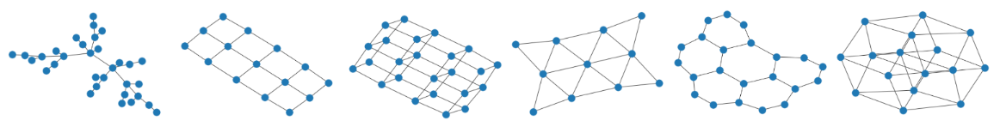
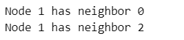
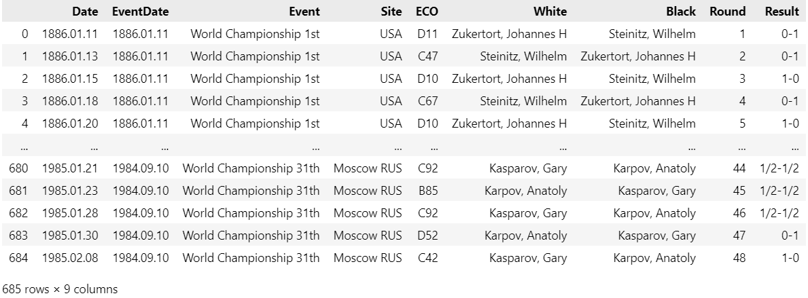
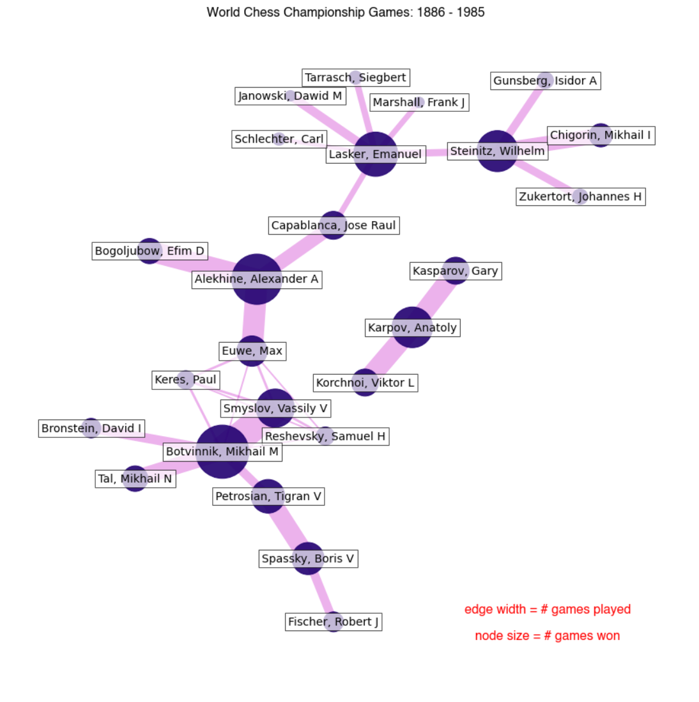
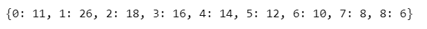

# 斯坦福大学CS224W图机器学习笔记

## 学习参考

CS224W公开课：[双语字幕 斯坦福CS224W《图机器学习》课程(2021) by Jure Leskove](https://www.bilibili.com/video/BV1RZ4y1c7Co?vd_source=55755af81e9ec7ae17d639fb86860235)

官方课程主页：[官方主页](https://web.stanford.edu/class/cs224w)

子豪兄精讲：[斯坦福CS224W图机器学习、图神经网络、知识图谱 同济子豪兄](https://www.bilibili.com/video/BV1pR4y1S7GA?vd_source=55755af81e9ec7ae17d639fb86860235)

子豪兄公开代码：[TommyZihao/zihao_course: 同济子豪兄的公开课 (github.com)](https://github.com/TommyZihao/zihao_course)

基于图的项目：

* 读论文、搜论文、做笔记、吐槽论文的社区：[ReadPaper](https://readpaper.com/)
* 可以画出来论文之间的应用关系：[CONNECTED PAPERS](https://www.connectedpapers.com/)
* 医疗知识图谱：[BIOS](https://bios.idea.edu.cn)

知识图谱专业老师：刘焕勇老师[主页](https://liuhuanyong.github.io)，[github主页](https://github.com/liuhuanyong)，[CSDN主页](https://blog.csdn.net/lhy2014)，也有公众号：老刘说NLP。

CS224W的课程目录：


往期笔记回顾：[CS224W笔记](https://github.com/lyc686/CS224W_notes/tree/main/notes)

## Task_03、NetworkX代码实战

## 一、NetworkX介绍

`NetworkX`是复杂网络研究领域中的常用Python包。用于构建和操作复杂的图结构，提供分析图的算法。图是由顶点、边和可选的属性构成的数据结构，顶点表示数据，边是由两个顶点唯一确定的，表示两个顶点之间的关系。顶点和边也可以拥有更多的属性，以存储更多的信息。对于networkx创建的无向图，允许一条边的两个顶点是相同的，即允许出现自循环，但是不允许两个顶点之间存在多条边，即出现平行边。边和顶点都可以有自定义的属性，属性称作边和顶点的数据，每一个属性都是一个Key:Value对。

### 1.本节参考

官方文档：[NetworkX参考文档](https://www.osgeo.cn/networkx/reference/classes/graph.html#)

NetworkX主页：https://networkx.org

NetworkX绘图函数参考：https://blog.csdn.net/weixin_46348799/article/details/108169216

networkx官方教程：https://networkx.org/documentation/stable/tutorial.html

nx.Graph https://networkx.org/documentation/stable/reference/classes/graph.html#networkx.Graph

给图、节点、连接添加属性：https://networkx.org/documentation/stable/tutorial.html#attributes

读写图：https://networkx.org/documentation/stable/reference/readwrite/index.html

## 二、安装配置环境

首选安装配配置环境

* 实验平台：[Featurize云GPU平台](https://featurize.cn/)
* 选择服务器：GPU RTX 3060、CUDA v11.2

```python
!pip install numpy pandas matplotlib tqdm networkx -i https://pypi.tuna.tsinghua.edu.cn/simple
```

验证安装成功

```python
import networkx as nx

nx.__version__
```

显示中文字体（在linux中）

```python
import matplotlib.pyplot as plt
%matplotlib inline

# Linux操作系统，例如 云GPU平台：https://featurize.cn/?s=d7ce99f842414bfcaea5662a97581bd1
# 如果报错 Unable to establish SSL connection.，重新运行本代码块即可
!wget https://zihao-openmmlab.obs.cn-east-3.myhuaweicloud.com/20220716-mmclassification/dataset/SimHei.ttf -O /environment/miniconda3/lib/python3.7/site-packages/matplotlib/mpl-data/fonts/ttf/SimHei.ttf --no-check-certificate
!rm -rf /home/featurize/.cache/matplotlib

import matplotlib
import matplotlib.pyplot as plt
%matplotlib inline
matplotlib.rc("font",family='SimHei') # 中文字体
plt.rcParams['axes.unicode_minus']=False  # 用来正常显示负号
```

```python
plt.plot([1,2,3], [100,500,300])
plt.title('matplotlib中文字体测试', fontsize=25)
plt.xlabel('X轴', fontsize=15)
plt.ylabel('Y轴', fontsize=15)
plt.show()
```

效果如下所示：


## 三、创建图-NetworkX内置图

通过NetworkX自带的函数和API，创建内置的样例图，包括各种有向图、无向图、栅格图、随机图、社交网络。

NetworkX主页：https://networkx.org

networkx创建图：https://networkx.org/documentation/stable/reference/generators.html

* 导入工具包

```python
import networkx as nx

# 数据可视化
import matplotlib.pyplot as plt
%matplotlib inline

plt.rcParams['font.sans-serif']=['SimHei']  # 用来正常显示中文标签  
plt.rcParams['axes.unicode_minus']=False  # 用来正常显示负号
```

* 经典图结构
  * 全连接无向图
  * 全连接有向图
  * 环状图
  * 梯状图
  * 线性串珠图
  * 星状图
  * 轮辐图
  * 二项树
  * 栅格图
    * 二维矩形网格图
    * 多维矩形网格图
    * 二维三角形网格图
    * 二维六边形蜂窝图
    * n维超立方体图
  * NetworkX内置图
    * 钻石图
    * 牛角图
    * 小房子图
    * 风筝图
    * 随机图
  * 随机图
  * 有向图
    * 无标度有向图（20%的人拥有了80%的连接 -- 一些节点连接非常多，但绝大部分节点连接非常少）
  * 社交网络
    * 空手道俱乐部数据集
    * 雨果《悲惨世界》人物关系
    * Florentine families graph
  * 社群聚类图
  * 树

```python
# 全连接无向图
G = nx.complete_graph(7) # 共七个节点
nx.draw(G)
# 查看全图连接数
G.size()

# 全连接有向图
G = nx.complete_graph(7, nx.DiGraph())
nx.draw(G)
# 查看图是否为有向图
G.is_directed()

# 环状图
G = nx.cycle_graph(5)
nx.draw(G)

# 梯状图
G = nx.ladder_graph(5) # 梯子一边5个节点
nx.draw(G)

# 线性串珠图
G = nx.path_graph(15)
nx.draw(G)

# 星状图
G = nx.star_graph(7)
nx.draw(G)

# 轮辐图
G = nx.wheel_graph(8)
nx.draw(G)
```


```python
# 二项树
G = nx.binomial_tree(5)
nx.draw(G)

# 栅格图（二维矩形网格图）
G = nx.grid_2d_graph(3,5)
nx.draw(G)

# 栅格图（多维矩形网格图）
G = nx.grid_graph(dim=(2, 3, 4))
nx.draw(G)

# 栅格图（二维三角形网格图）
G = nx.triangular_lattice_graph(2,5)
nx.draw(G)

# 栅格图（二维六边形蜂窝图）
G = nx.hexagonal_lattice_graph(2,3)
nx.draw(G)

# 栅格图（n维超立方体图）
G = nx.hypercube_graph(4)
nx.draw(G)
```



```python
# NetworkX内置图（钻石图）
G = nx.diamond_graph()
nx.draw(G)

# NetworkX内置图（牛角图）
G = nx.bull_graph()
nx.draw(G)

# NetworkX内置图
G = nx.frucht_graph()
nx.draw(G)

# NetworkX内置图（小房子图图）
G = nx.house_graph()
nx.draw(G)

# NetworkX内置图
G = nx.house_x_graph()
nx.draw(G)

# NetworkX内置图（风筝图）
G = nx.petersen_graph()
nx.draw(G)

# NetworkX内置图（随机图）
G = nx.krackhardt_kite_graph()
nx.draw(G)
```


```python
# 随机图
G = nx.erdos_renyi_graph(10, 0.5)
nx.draw(G)

# 有向图（无标度有向图）
G = nx.scale_free_graph(100)
nx.draw(G)

# 社交网络
# 空手道俱乐部数据集
G = nx.karate_club_graph()
nx.draw(G, with_labels=True)#  with_labels=True表示在节点上写上对应名字
G.nodes[5]["club"] # 查看5号节点的“club”属性
G.nodes[9]["club"]# 查看9号节点的“club”属性

# 雨果《悲惨世界》人物关系
G = nx.les_miserables_graph()
plt.figure(figsize=(12,10))
pos = nx.spring_layout(G, seed=10)# pos是在绘图之前先生成一个布局，spring_layout-弹簧布局，seed是一个随机数种子
nx.draw(G, pos, with_labels=True)#   with_labels=True表示在节点上写上对应名字

# Florentine families graph
G = nx.florentine_families_graph()
nx.draw(G, with_labels=True)

# 社群聚类图
G = nx.caveman_graph(4, 3)
nx.draw(G, with_labels=True)
```


```python
# 树
tree = nx.random_tree(n=10, seed=0)
print(nx.forest_str(tree, sources=[0]))
```


## 四、创建图-连接表和邻接表创建图

* 首先还是像上面一样**导入配置环境和工具包**

* 然后导入**三元组连接表**（是一个最简单的知识图谱所应该具备的部分 -- 谁和谁是什么关系）

数据来源：OpenKG-四大名著人物关系知识图谱和OWL本体：http://www.openkg.cn/dataset/ch4masterpieces

```python
# 导入 csv 文件定义的三元组连接表，构建有向图
df = pd.read_csv('triples.csv')
df
```


* **通过连接表Edge List创建图**

```python
G = nx.DiGraph()
# 提取出head列和tail列用来构造连接
edges = [edge for edge in zip(df['head'], df['tail'])]

G.add_edges_from(edges)
# 查看关羽和谁有关系
G.edges('关羽')
```


* **查看全图参数**

  * len(G)节点数
  * G.size()边数
  * G.nodes所有的节点
  * G.edges所有的边

  ```python
  print(G)
  len(G)
  G.size()
  G.nodes
  ```


* **保存并载入邻接表Adjacency List中**
  * 三元组表示的是连接表 -- 谁和谁是什么关系
  * 邻接表是只看某一个节点和谁有关系 -- 一行表示一个节点的所有关系

```python
for line in nx.generate_adjlist(G):
    print(line)
```


* 读取保存的邻接表，并且重建图关系

```python
# 将邻接表导出为本地文件 grid.edgelist
nx.write_edgelist(G, path="grid.edgelist", delimiter=":")

# 从本地文件 grid.edgelist 读取邻接表
H = nx.read_edgelist(path="grid.edgelist", delimiter=":")

# 可视化，重建图
plt.figure(figsize=(15,14))
pos = nx.spring_layout(H, iterations=3, seed=5)
nx.draw(H, pos, with_labels=True)
plt.show()
```


<font color="red">所以，如果要自己构造图机器学习应用或者知识图谱的化，首先都要构造这个三元组的CSV文件</font>

## 五、用NetworkX自己的函数创建节点和连接

### 1.创建节点

* **老规矩导入工具包**
* **创建无节点、无连接的空图**

```python
# 创建空图
G = nx.Graph()
print(G)
print(G.nodes)
# 可视化
nx.draw(G)
```

* **添加单个节点（节点名字不论中文、英文、数字均可）**

```python
# 添加名为刘备的节点
G.add_node('刘备')
G.nodes

# 添加名为Tommy的节点
G.add_node('Tommy')
G.nodes

# 添加名为1的节点
G.add_node(1)
G.nodes
```


* **一次性添加多个节点**

```python
G.add_nodes_from(['诸葛亮', '曹操'])
G.nodes

G.add_nodes_from(range(100, 105))
G.nodes
```


* **添加带属性特征的节点**

```python
G.add_nodes_from([
    ('关羽',{'武器': '青龙偃月刀','武力值':90,'智力值':80}),
    ('张飞',{'武器': '丈八蛇矛','武力值':85,'智力值':75}),
    ('吕布',{'武器':'方天画戟','武力值':100,'智力值':70})
])
G.nodes
# 可视化，此时只有节点没有连接
nx.draw(G)
```


* **创建另一个首尾相连的串珠图**

```python
H = nx.path_graph(10)
H.nodes
# 可视化
nx.draw(H)
```


* **将串珠图加入到原图中**

```python
G.add_nodes_from(H)
G.nodes
# 节点个数
len(G)
# 可视化
nx.draw(G)
```


* **将串珠图本身作为一个节点添加到原图中**

```python
G.add_node(H)
G.nodes
# 节点个数
len(G)
# 可视化
nx.draw(G)
```


<font color="blue">注意：节点可以为任意[可哈希](https://docs.python.org/3/glossary.html#term-hashable)的对象，比如字符串、图像、XML对象，甚至另一个Graph、自定义的节点对象。通过这种方式，你可以根据你的应用，自由灵活地构建：图为节点、文件为节点、函数为节点，等灵活的图形式。</font>

### 2.创建连接

* **首先创建一张图**

```python
# 创建无向图
G = nx.Graph()
# 查看是否是有向图
print(G.is_directed())
```


NetworkX支持有向图（directed graph）、无向图（undirected graph）、带权重的图(weighte graph)、多路图（multigraph）。

文档：https://networkx.org/documentation/stable/reference/classes/index.html

* **可以给整张图添加一个属性**

```python
# 给整张图添加特征属性
G.graph['Name'] = 'HelloWorld'
print(G.graph)
```


* **创建有向图**

```python
# 创建有向图
H = nx.DiGraph()
# 查看是否是有向图
print(H.is_directed())
```


* **创建单个节点另一种方式**
  * 属性名可以随便起

```python
# 创建0号节点，并添加特征属性
G.add_node(0, feature=5, label=0, zihao=2)
G.nodes[0]
```


* **创建多个节点**

```python
G.add_nodes_from([
  (1, {'feature': 1, 'label': 1, 'zihao':3}),
  (2, {'feature': 2, 'label': 2, 'zihao':4})
])

# 全图节点信息
G.number_of_nodes()
G.nodes
# 传入data=True可以看到每一个节点对应的属性
G.nodes(data=True)

# 遍历所有节点，data=True 表示输出节点特征属性信息

for node in G.nodes(data=True):
    print(node)
```


* **创建单个链接**

```python
G.add_edge(0, 1, weight=0.5, like=3)
```

* **创建多个连接**

```python
G.add_edges_from([
  (1, 2, {'weight': 0.3, 'like':5}),
  (2, 0, {'weight': 0.1, 'like':8})
])

G.edges[(0, 1)]

# 可视化
nx.draw(G, with_labels = True)
```


* **全图连接信息**

```python
G.number_of_edges()
#G.size()
#G.edges()
G.edges(data=True)
# 遍历所有连接，data=True 表示输出连接特征属性信息

for edge in G.edges(data=True):
    print(edge)
```


* **节点连接数（Node Degree）**

```python
# 指定节点
node_id = 1
G.degree[node_id]
# 指定节点的所有相邻节点
for neighbor in G.neighbors(node_id):
    print("Node {} has neighbor {}".format(node_id, neighbor))
```



## 六、综合上述知识进行可视化

使用NetworkX自带的可视化函数`nx.draw`，绘制不同风格的图。设置节点尺寸、节点颜色、节点边缘颜色、节点坐标、连接颜色等。

参考文档：https://networkx.org/documentation/stable/auto_examples/drawing/plot_four_grids.html#sphx-glr-auto-examples-drawing-plot-four-grids-py

### 1.简单可视化

* **导入工具包**

```python
# 图数据挖掘
import networkx as nx

import numpy as np

# 数据可视化
import matplotlib.pyplot as plt
%matplotlib inline

# plt.rcParams['font.sans-serif']=['SimHei']  # 用来正常显示中文标签  
plt.rcParams['axes.unicode_minus']=False  # 用来正常显示负号
```

* **创建4x4网格图，原生可视化**

```python
G = nx.grid_2d_graph(4, 4)
pos = nx.spring_layout(G, seed=123)
nx.draw(G, pos)# pos是在绘图之前先生成一个布局，spring_layout-弹簧布局，seed是一个随机数种子
```


* **不显示节点**

```python
nx.draw(G, pos, node_size=0, with_labels=False)
```


* **设置颜色**

```python
len(G.edges())

nx.draw(
    G,
    pos,
    node_color='#A0CBE2',      # 节点颜色
    edgecolors='red',          # 节点外边缘的颜色
    edge_color="blue",         # edge的颜色
    # edge_cmap=plt.cm.coolwarm, # 配色方案
    node_size=800,
    with_labels=False,
    width=3,
)
```


* **创建有向图，并设置颜色**

```python
nx.draw(
    G.to_directed(),
    pos,
    node_color="tab:orange",
    node_size=400,
    with_labels=False,
    edgecolors="tab:gray",
    arrowsize=10,
    width=2,
)
```


* **设置每个节点的坐标**
  * **无向图**

```python
G = nx.Graph()
G.add_edge(1, 2)
G.add_edge(1, 3)
G.add_edge(1, 5)
G.add_edge(2, 3)
G.add_edge(3, 4)
G.add_edge(4, 5)

nx.draw(G, with_labels=True)
```


```python
# 设置每个节点可视化时的坐标
pos = {1: (0, 0), 2: (-1, 0.3), 3: (2, 0.17), 4: (4, 0.255), 5: (5, 0.03)}

# 设置其它可视化样式
options = {
    "font_size": 36,
    "node_size": 3000,
    "node_color": "white",
    "edgecolors": "black", 
    "linewidths": 5, # 节点线宽
    "width": 5, # edge线宽
}

nx.draw_networkx(G, pos, **options)

ax = plt.gca()
ax.margins(0.20) # 在图的边缘留白，防止节点被截断
plt.axis("off")
plt.show()
```


* **设置每个节点的坐标**
  * **有向图**

```python
G = nx.DiGraph([(0, 3), (1, 3), (2, 4), (3, 5), (3, 6), (4, 6), (5, 6)])

nx.draw(G, with_labels=True)
```


```python
# 可视化时每一列包含的节点
left_nodes = [0, 1, 2]
middle_nodes = [3, 4]
right_nodes = [5, 6]

# 可视化时每个节点的坐标
pos = {n: (0, i) for i, n in enumerate(left_nodes)}
pos.update({n: (1, i + 0.5) for i, n in enumerate(middle_nodes)})
pos.update({n: (2, i + 0.5) for i, n in enumerate(right_nodes)})
print(pos)

nx.draw_networkx(G, pos, **options)

ax = plt.gca()
ax.margins(0.20) # 在图的边缘留白，防止节点被截断
plt.axis("off")
plt.show()
```


### 2.可视化实战

#### （1）绘制小房子

```python
G = nx.house_graph()
nx.draw(G, with_labels=True)
# 设置节点坐标
pos = {0: (0, 0), 1: (1, 0), 2: (0, 1), 3: (1, 1), 4: (0.5, 2.0)}
plt.figure(figsize=(10,8))

# 绘制“墙角”的四个节点
nx.draw_networkx_nodes(G, pos, node_size=3000, nodelist=[0, 1, 2, 3], node_color="tab:blue")
# 绘制“屋顶”节点
nx.draw_networkx_nodes(G, pos, node_size=2000, nodelist=[4], node_color="tab:orange")

# 绘制连接
nx.draw_networkx_edges(G, pos, alpha=0.5, width=6)
plt.axis("off") # 去掉坐标轴
plt.show()
```


#### （2）美国128城市交通关系无向图可视化模板

* 导入工具包

```python
# 图数据挖掘
import networkx as nx

import numpy as np

# 数据可视化
import matplotlib.pyplot as plt
%matplotlib inline

# plt.rcParams['font.sans-serif']=['SimHei']  # 用来正常显示中文标签  
plt.rcParams['axes.unicode_minus']=False  # 用来正常显示负号
import gzip
import re

import warnings
warnings.simplefilter("ignore")
```

* 构建图（这个图是根据节点的坐标进行建立的）

```python
fh = gzip.open("knuth_miles.txt.gz", "r")

G = nx.Graph()
G.position = {}
G.population = {}

cities = []
for line in fh.readlines(): # 遍历文件中的每一行
    line = line.decode()
    if line.startswith("*"):  # 其它行，跳过
        continue

    numfind = re.compile(r"^\d+")

    if numfind.match(line):  # 记录城市间距离的行
        dist = line.split()
        for d in dist:
            G.add_edge(city, cities[i], weight=int(d))
            i = i + 1
    else:  # 记录城市经纬度、人口的行
        i = 1
        (city, coordpop) = line.split("[")
        cities.insert(0, city)
        (coord, pop) = coordpop.split("]")
        (y, x) = coord.split(",")

        G.add_node(city)
        # assign position - Convert string to lat/long
        x = -float(x) / 100
        y = float(y) / 100
        G.position[city] = (x, y)
        pop = float(pop) / 1000
        G.population[city] = pop
    
print(G)
G.nodes
```


* 128座城市的经纬度坐标、人口数据、互联互通关系（连接）

```python
G.position
G.population
G.edges
```


* 两节点之间的距离

```python
# 纽约到里士满的交通距离
G.edges[('Rochester, NY', 'Richmond, VA')]
```


* 筛选出距离小于指定阈值的城市

```python
H = nx.Graph()
for v in G:
    H.add_node(v)
for (u, v, d) in G.edges(data=True):
    if d["weight"] < 800:
        H.add_edge(u, v)
        
# 可视化
# 节点颜色-节点度
node_color = [float(H.degree(v)) for v in H]

# 节点尺寸-节点人口
node_size = [G.population[v] for v in H]

fig = plt.figure(figsize=(12, 10))
nx.draw(
    H,
    G.position,
    node_size=node_size,
    node_color=node_color,
    with_labels=False,
)
plt.show()
```


#### （3）有向图可视化模板

* 导入工具包

```python
# 图数据挖掘
import networkx as nx

import numpy as np

# 数据可视化
import matplotlib.pyplot as plt
%matplotlib inline

# plt.rcParams['font.sans-serif']=['SimHei']  # 用来正常显示中文标签  
plt.rcParams['axes.unicode_minus']=False  # 用来正常显示负号

import matplotlib as mpl
```

* 创建有向图，基础可视化

```python
seed = 13648
# 随机生成边，有可能指向自己
G = nx.random_k_out_graph(10, 3, 0.5, seed=seed)
pos = nx.spring_layout(G, seed=seed)

# 可视化
nx.draw(G, pos, with_labels=True)
```


* 高级可视化

```python
# 节点大小
node_sizes = [12 + 10 * i for i in range(len(G))]

node_sizes

# 节点颜色
M = G.number_of_edges()
edge_colors = range(2, M + 2)

edge_colors

# 节点透明度
edge_alphas = [(5 + i) / (M + 4) for i in range(M)]

edge_alphas

# 配色方案
cmap = plt.cm.plasma
# cmap = plt.cm.Blues

plt.figure(figsize=(10,8))

# 绘制节点
nodes = nx.draw_networkx_nodes(G, pos, node_size=node_sizes, node_color="indigo")

# 绘制连接
edges = nx.draw_networkx_edges(
    G,
    pos,
    node_size=node_sizes,   # 节点尺寸
    arrowstyle="->",        # 箭头样式
    arrowsize=20,           # 箭头尺寸
    edge_color=edge_colors, # 连接颜色
    edge_cmap=cmap,         # 连接配色方案
    width=4                # 连接线宽
)


# 设置每个连接的透明度
for i in range(M):
    edges[i].set_alpha(edge_alphas[i])

# 调色图例
pc = mpl.collections.PatchCollection(edges, cmap=cmap)
pc.set_array(edge_colors)
plt.colorbar(pc)

ax = plt.gca()
ax.add_collection(pc)
plt.colorbar(pc)
ax.set_axis_off()
plt.show()
```


#### （4）国际象棋对局MultiDiGraph多路图可视化

* 导入工具包

```python
# 图数据挖掘
import networkx as nx

# 数据可视化
import matplotlib.pyplot as plt
%matplotlib inline

# plt.rcParams['font.sans-serif']=['SimHei']  # 用来正常显示中文标签  
plt.rcParams['axes.unicode_minus']=False  # 用来正常显示负号
```

* 导入数据，构建MultiDiGraph

```python
import pandas as pd

df = pd.read_csv('WCC.csv')
df
```



* 从连接表创建MultiDiGraph多路有向图

```python
G = nx.from_pandas_edgelist(df, 'White', 'Black', edge_attr=True, create_using=nx.MultiDiGraph())

print('棋手（节点）个数', G.number_of_nodes())
print('棋局（连接）个数', G.number_of_edges())

# 所有节点
G.nodes

# 所有连接（带特征）
# G.edges(data=True)

# 两个棋手的所有棋局
G.get_edge_data('Zukertort, Johannes H', 'Steinitz, Wilhelm')
```


* 初步可视化

```python
pos = nx.spring_layout(G, seed=10)
nx.draw(G, pos)
```


* 连通域分析

```python
# 将G转为无向图，分析连通域
H = G.to_undirected()

for each in nx.connected_components(H):
    print('连通域')
    print(H.subgraph(each))
    print('包含节点')
    print(each)
    print('\n')
```


* 高级可视化

```python
# 将G转为无向-单连接图
H = nx.Graph(G)

H.edges()

# 两个棋手的所有棋局
len(G.get_edge_data('Zukertort, Johannes H', 'Steinitz, Wilhelm'))

# 两个棋手节点之间的 连接宽度 与 棋局个数 成正比
edgewidth = [len(G.get_edge_data(u, v)) for u, v in H.edges()]

print(edgewidth)

# 棋手节点的大小 与 赢棋次数 成正比
wins = dict.fromkeys(G.nodes(), 0) # 生成每个棋手作为key的dict
for (u, v, d) in G.edges(data=True):
    r = d["Result"].split("-")
    if r[0] == "1":
        wins[u] += 1.0
    elif r[0] == "1/2":
        wins[u] += 0.5
        wins[v] += 0.5
    else:
        wins[v] += 1.0
nodesize = [wins[v] * 50 for v in H]

print(wins)
print(nodesize)
```


```python
# 布局
pos = nx.kamada_kawai_layout(H)

# 手动微调节点的横坐标（越大越靠右）、纵坐标（越大越靠下）
pos["Reshevsky, Samuel H"] += (0.05, -0.10)
pos["Botvinnik, Mikhail M"] += (0.03, -0.06)
pos["Smyslov, Vassily V"] += (0.05, -0.03)

fig, ax = plt.subplots(figsize=(12, 12))

# 可视化连接
nx.draw_networkx_edges(H, pos, alpha=0.3, width=edgewidth, edge_color="m")

# 可视化节点
nx.draw_networkx_nodes(H, pos, node_size=nodesize, node_color="#210070", alpha=0.9)

# 节点名称文字说明
label_options = {"ec": "k", "fc": "white", "alpha": 0.7}
nx.draw_networkx_labels(H, pos, font_size=14, bbox=label_options)

# 标题和图例
font = {"fontname": "Helvetica", "color": "k", "fontweight": "bold", "fontsize": 16}
ax.set_title("World Chess Championship Games: 1886 - 1985", font)
# 图例字体颜色
font["color"] = "r"

# 文字说明
ax.text(
    0.80,
    0.10,
    "edge width = # games played",
    horizontalalignment="center",
    transform=ax.transAxes,
    fontdict=font,
)
ax.text(
    0.80,
    0.06,
    "node size = # games won",
    horizontalalignment="center",
    transform=ax.transAxes,
    fontdict=font,
)

# 调整图的大小，提高可读性
ax.margins(0.1, 0.05)
fig.tight_layout()
plt.axis("off")
plt.show()
```



#### （5）自定义节点图标

* 导入工具包

```python
# 图数据挖掘
import networkx as nx

# 数据可视化
import matplotlib.pyplot as plt
%matplotlib inline

# plt.rcParams['font.sans-serif']=['SimHei']  # 用来正常显示中文标签  
plt.rcParams['axes.unicode_minus']=False  # 用来正常显示负号

import PIL
```

* 自定义图标

```python
# 图标下载网站
# www.materialui.co
# https://www.flaticon.com/
# 服务器：https://www.flaticon.com/free-icon/database-storage_2906274?term=server&page=1&position=8&page=1&position=8&related_id=2906274&origin=search
# 笔记本电脑：https://www.flaticon.com/premium-icon/laptop_3020826?term=laptop&page=1&position=13&page=1&position=13&related_id=3020826&origin=search
# 路由器：https://www.flaticon.com/premium-icon/wifi_1183657?term=router&page=1&position=3&page=1&position=3&related_id=1183657&origin=search

icons = {
    'router': 'database-storage.png',
    'switch': 'wifi.png',
    'PC': 'laptop.png',
}

# 载入图像
images = {k: PIL.Image.open(fname) for k, fname in icons.items()}

images
```


* 创建图

```python
# 创建空图
G = nx.Graph()

# 创建节点
G.add_node("router", image=images["router"])
for i in range(1, 4):
    G.add_node(f"switch_{i}", image=images["switch"])
    for j in range(1, 4):
        G.add_node("PC_" + str(i) + "_" + str(j), image=images["PC"])

# 创建连接
G.add_edge("router", "switch_1")
G.add_edge("router", "switch_2")
G.add_edge("router", "switch_3")
for u in range(1, 4):
    for v in range(1, 4):
        G.add_edge("switch_" + str(u), "PC_" + str(u) + "_" + str(v))
        
nx.draw(G, with_labels=True)
```


```python
fig, ax = plt.subplots()
# 图片尺寸（相对于 X 轴）
icon_size = (ax.get_xlim()[1] - ax.get_xlim()[0]) * 0.04
icon_center = icon_size / 2.0
```

* 可视化自定义节点图标（如果第一次节点图标尺寸偏小，可再次运行本代码块）

```python
pos = nx.spring_layout(G, seed=1)
fig, ax = plt.subplots(figsize=(14,10))

# 绘制连接
# min_source_margin 和 min_target_margin 调节连接端点到节点的距离
nx.draw_networkx_edges(
    G,
    pos=pos,
    ax=ax,
    arrows=True,
    arrowstyle="-",
    min_source_margin=30,
    min_target_margin=30,
)

# 给每个节点添加各自的图片
for n in G.nodes:
    xf, yf = ax.transData.transform(pos[n]) # data坐标 转 display坐标
    xa, ya = fig.transFigure.inverted().transform((xf, yf)) # display坐标 转 figure坐标
    
    a = plt.axes([xa - icon_center, ya - icon_center, icon_size, icon_size])
    a.imshow(G.nodes[n]["image"])
    a.axis("off")

plt.show()
```


#### （6）自我中心图（Ego图）

在NetworkX中创建`自我中心图（Ego图）`，并找出连接数最大的主节点，构建以主节点为中心的邻域子图。

* 导入工具包

```python
# 图数据挖掘
import networkx as nx

import numpy as np

# 数据可视化
import matplotlib.pyplot as plt
%matplotlib inline

plt.rcParams['font.sans-serif']=['SimHei']  # 用来正常显示中文标签  
plt.rcParams['axes.unicode_minus']=False  # 用来正常显示负号

from operator import itemgetter
```

* **建Barabási-Albert无标度网络**

  论文：A. L. Barabási and R. Albert "Emergence of scaling in random networks", Science 286, pp 509-512, 1999.

  n个节点逐渐生长，新节点与degree高的旧节点产生m条连接。

```python
n = 1000
m = 2
seed = 20532
G = nx.barabasi_albert_graph(n, m, seed=seed)

pos = nx.spring_layout(G, seed=seed)
nx.draw(G, pos)
```


* 找到degree最大的主节点

```python
largest_hub, degree = sorted(G.degree(), key=itemgetter(1))[-1]
largest_hub # 4
degree # 88
```

* 找到以主节点为中心的邻域子图（Ego Graph）

```python
nx.ego_graph?
```


```python
hub_ego = nx.ego_graph(G, largest_hub, radius=1)

pos = nx.spring_layout(hub_ego, seed=seed)
nx.draw(hub_ego, pos, node_color="b", node_size=50, with_labels=False)

# 大红显示主节点
options = {"node_size": 300, "node_color": "r"}
nx.draw_networkx_nodes(hub_ego, pos, nodelist=[largest_hub], **options)

plt.show()
```


## 七、数据分析实战案例

### 1.PageRank节点重要度

在NetworkX中，计算**有向图**节点的PageRank节点重要度。在NetworkX中直接调包执行就可以完成PageRank的计算。PageRank可以把图中的节点映射维一个**一维的标量**用于表示该节点的重要度

```python
# 图数据挖掘
import networkx as nx

# 数据可视化
import matplotlib.pyplot as plt
%matplotlib inline

plt.rcParams['font.sans-serif']=['SimHei']  # 用来正常显示中文标签  
plt.rcParams['axes.unicode_minus']=False  # 用来正常显示负号

# 创建一个七个节点的图
G = nx.star_graph(7)
# 可视化
nx.draw(G, with_labels = True)
```


* **计算PageRank节点重要度**

```python
pagerank = nx.pagerank(G, alpha=0.8)
print(pagerank)
```


<font color="red">注意：PageRank只能在有向图中使用，这里我们的无向图计算PageRank是因为，输入到函数计算的时候他自动把无向图变成了一个双向图。</font>

### 2.Node Degree节点连接数

节点连接数越多，这个节点可能就比较重要

```python
# 图数据挖掘
import networkx as nx

import numpy as np

# 数据可视化
import matplotlib.pyplot as plt
%matplotlib inline

plt.rcParams['font.sans-serif']=['SimHei']  # 用来正常显示中文标签  
plt.rcParams['axes.unicode_minus']=False  # 用来正常显示负号

# 创建 Erdős-Rényi 随机图，也称作 binomial graph
# n-节点数
# p-任意两个节点产生连接的概率

G = nx.gnp_random_graph(100, 0.02, seed=10374196)

# 初步可视化
pos = nx.spring_layout(G, seed=10)
nx.draw(G, pos)
```


* 最大连通域子图

```python
Gcc = G.subgraph(sorted(nx.connected_components(G), key=len, reverse=True)[0])

pos = nx.spring_layout(Gcc, seed=10396953)
# nx.draw(Gcc, pos)

nx.draw_networkx_nodes(Gcc, pos, node_size=20)
nx.draw_networkx_edges(Gcc, pos, alpha=0.4)
```


如果想放到论文里面可以美化一下

```python
plt.figure(figsize=(12,8))
pos = nx.spring_layout(Gcc, seed=10396953)

# 设置其它可视化样式
options = {
    "font_size": 12,
    "node_size": 350,
    "node_color": "white",
    "edgecolors": "black",
    "linewidths": 1, # 节点线宽
    "width": 2, # edge线宽
}

nx.draw_networkx(Gcc, pos, **options)

plt.title('Connected components of G', fontsize=20)
plt.axis('off')
plt.show()
```


* 每个节点的连接数

```python
G.degree()

# 降序排序
degree_sequence = sorted((d for n, d in G.degree()), reverse=True)
degree_sequence
```


```python
plt.figure(figsize=(12,8))
plt.plot(degree_sequence, "b-", marker="o")
plt.title('Degree Rank Plot', fontsize=20)
plt.ylabel('Degree', fontsize=25)
plt.xlabel('Rank', fontsize=25)
plt.tick_params(labelsize=20) # 设置坐标文字大小
plt.show()
```


* 节点degree的直方图

```python
X = np.unique(degree_sequence, return_counts=True)[0]
Y = np.unique(degree_sequence, return_counts=True)[1]

print(X)
print(Y)

plt.figure(figsize=(12,8))
# plt.bar(*np.unique(degree_sequence, return_counts=True))
plt.bar(X, Y)

plt.title('Degree Histogram', fontsize=20)
plt.ylabel('Number', fontsize=25)
plt.xlabel('Degree', fontsize=25)
plt.tick_params(labelsize=20) # 设置坐标文字大小
plt.show()
plt.show()
```


### 3.棒棒糖图特征分析

本例使用了NetworkX中的一个图的样例模板比较像棒棒糖

```python
# 图数据挖掘
import networkx as nx

# 数据可视化
import matplotlib.pyplot as plt
%matplotlib inline

# plt.rcParams['font.sans-serif']=['SimHei']  # 用来正常显示中文标签  
plt.rcParams['axes.unicode_minus']=False  # 用来正常显示负号

# 第一个参数指定头部节点数，第二个参数指定尾部节点数
G = nx.lollipop_graph(4, 7)

# 可视化
pos = nx.spring_layout(G, seed=3068)
nx.draw(G, pos=pos, with_labels=True)
plt.show()
```


* 对整张图进行分析：半径、直径、偏心度

```python
# 半径 = 4
nx.radius(G)

# 直径 = 8
nx.diameter(G)

# 偏心度：每个节点到图中其它节点的最远距离 = {0: 8, 1: 8, 2: 8, 3: 7, 4: 6, 5: 5, 6: 4, 7: 5, 8: 6, 9: 7, 10: 8}
nx.eccentricity(G)

# 中心节点，偏心度与半径相等的节点 = [6]
nx.center(G)

# 外围节点，偏心度与直径相等的节点 = [0, 1, 2, 10]
nx.periphery(G)

# 计算一张图的density密度 = 0.23636363636363636
nx.density(G)
```


* 3号节点到图中其它节点的最短距离

```python
node_id = 3
nx.single_source_shortest_path_length(G, node_id)
```


* 每两个节点之间的最短距离

```python
pathlengths = []
for v in G.nodes():
    spl = nx.single_source_shortest_path_length(G, v)
    for p in spl:
        print('{} --> {} 最短距离 {}'.format(v, p, spl[p]))
        pathlengths.append(spl[p])
```


```python
# 平均最短距离
sum(pathlengths) / len(pathlengths)
```


* 不同距离的节点对数

```python
dist = {}
for p in pathlengths:
    if p in dist:
        dist[p] += 1
    else:
        dist[p] = 1
print(dist)
```



### 4.计算节点特征

* 导入工具包

```python
import networkx as nx
import matplotlib.pyplot as plt
import matplotlib.colors as mcolors
%matplotlib inline
```

* 可视化辅助函数

```python
def draw(G, pos, measures, measure_name):
    
    nodes = nx.draw_networkx_nodes(G, pos, node_size=250, cmap=plt.cm.plasma, 
                                   node_color=list(measures.values()),
                                   nodelist=measures.keys())
    nodes.set_norm(mcolors.SymLogNorm(linthresh=0.01, linscale=1, base=10))
    # labels = nx.draw_networkx_labels(G, pos)
    edges = nx.draw_networkx_edges(G, pos)

    # plt.figure(figsize=(10,8))
    plt.title(measure_name)
    plt.colorbar(nodes)
    plt.axis('off')
    plt.show()
```

* 导入无向图

```python
G = nx.karate_club_graph()

pos = nx.spring_layout(G, seed=675)
nx.draw(G, pos, with_labels=True)
```


* 导入有向图

```python
DiG = nx.DiGraph()
DiG.add_edges_from([(2, 3), (3, 2), (4, 1), (4, 2), (5, 2), (5, 4),
                    (5, 6), (6, 2), (6, 5), (7, 2), (7, 5), (8, 2),
                    (8, 5), (9, 2), (9, 5), (10, 5), (11, 5)])
# dpos = {1: [0.1, 0.9], 2: [0.4, 0.8], 3: [0.8, 0.9], 4: [0.15, 0.55],
#         5: [0.5,  0.5], 6: [0.8,  0.5], 7: [0.22, 0.3], 8: [0.30, 0.27],
#         9: [0.38, 0.24], 10: [0.7,  0.3], 11: [0.75, 0.35]}

nx.draw(DiG, pos, with_labels=True)
```


#### （1）Node Degree

* Node Degree
* 颜色越亮说明连接数越多

```python
list(nx.degree(G))

dict(G.degree())

# 字典按值排序
sorted(dict(G.degree()).items(),key=lambda x : x[1], reverse=True)   

draw(G, pos, dict(G.degree()), 'Node Degree')
```


#### （2）Degree Centrality

NetworkX文档：节点重要度特征 Centrality

https://networkx.org/documentation/stable/reference/algorithms/centrality.html

* Degree Centrality-无向图

```python
nx.degree_centrality(G)

draw(G, pos, nx.degree_centrality(G), 'Degree Centrality')
```


* Degree Centrality-有向图

```python
nx.in_degree_centrality(DiG)

nx.out_degree_centrality(DiG)

draw(DiG, pos, nx.in_degree_centrality(DiG), 'DiGraph Degree Centrality')

draw(DiG, pos, nx.out_degree_centrality(DiG), 'DiGraph Degree Centrality')
```


#### （3）Eigenvector Centrality

* Eigenvector Centrality-无向图

```python
nx.eigenvector_centrality(G)

draw(G, pos, nx.eigenvector_centrality(G), 'Eigenvector Centrality')
```


* Eigenvector Centrality-有向图

```python
nx.eigenvector_centrality_numpy(DiG)

draw(DiG, pos, nx.eigenvector_centrality_numpy(DiG), 'DiGraph Eigenvector Centrality')
```


#### （4）Betweenness Centrality

* Betweenness Centrality（必经之地）

```python
nx.betweenness_centrality(G)

draw(G, pos, nx.betweenness_centrality(G), 'Betweenness Centrality')
```


#### （5）Closeness Centrality

* Closeness Centrality（去哪儿都近）

```python
nx.closeness_centrality(G)

draw(G, pos, nx.closeness_centrality(G), 'Closeness Centrality')
```


#### （6）PageRank

* PageRank

```python
nx.pagerank(DiG, alpha=0.85)

draw(DiG, pos, nx.pagerank(DiG, alpha=0.85), 'DiGraph PageRank')
```


#### （7）Katz Centrality

* Katz Centrality

```python
nx.katz_centrality(G, alpha=0.1, beta=1.0)

draw(G, pos, nx.katz_centrality(G, alpha=0.1, beta=1.0), 'Katz Centrality')

draw(DiG, pos, nx.katz_centrality(DiG, alpha=0.1, beta=1.0), 'DiGraph Katz Centrality')
```


#### （8）HITS Hubs and Authorities

* HITS Hubs and Authorities

```python
h, a = nx.hits(DiG)
draw(DiG, pos, h, 'DiGraph HITS Hubs')
draw(DiG, pos, a, 'DiGraph HITS Authorities')
```


#### （9）社群属性 Clustering

**NetworkX文档：社群属性 Clustering**

https://networkx.org/documentation/stable/reference/algorithms/clustering.html

* 三角形个数

```python
nx.draw(G, pos, with_labels=True)

# 三角形个数
nx.triangles(G)

# 18
nx.triangles(G, 0)

 # 
draw(G, pos, nx.triangles(G), 'Triangles')
```


#### （10）Clustering Coefficient

```python
nx.clustering(G)

# 0.15
nx.clustering(G, 0)

draw(G, pos, nx.clustering(G), 'Clustering Coefficient')
```


#### （11）Bridges

如果某个连接断掉，会使连通域个数增加，则该连接是bridge。

bridge连接不属于环的一部分。

```python
pos = nx.spring_layout(G, seed=675)
nx.draw(G, pos, with_labels=True)

# [(0, 11)]
list(nx.bridges(G))
```


#### （12）Common Neighbors （共同好友个数）和 Jaccard Coefficient（交并比）

```python
pos = nx.spring_layout(G, seed=675)
nx.draw(G, pos, with_labels=True)

# [6, 10]
sorted(nx.common_neighbors(G, 0, 4))

# (0, 1) -> 0.38888889
# (2, 3) -> 0.33333333
preds = nx.jaccard_coefficient(G, [(0, 1), (2, 3)])
for u, v, p in preds:
    print(f"({u}, {v}) -> {p:.8f}")
    
# (0, 1) -> 6.13071687
# (2, 3) -> 2.15847583
for u, v, p in nx.adamic_adar_index(G, [(0, 1), (2, 3)]):
    print(f"({u}, {v}) -> {p:.8f}")
```


#### （13）Katz Index

**Katz Index**

节点u到节点v，路径为k的路径个数。

```python
import networkx as nx
import numpy as np
from numpy.linalg import inv
G = nx.karate_club_graph()

# 34
len(G.nodes)

# 计算主特征向量
L = nx.normalized_laplacian_matrix(G)
e = np.linalg.eigvals(L.A)
print('最大特征值', max(e)) # 最大特征值 1.7146113474736193

# 折减系数
beta = 1/max(e)

# 创建单位矩阵
I = np.identity(len(G.nodes))

# 计算 Katz Index
S = inv(I - nx.to_numpy_array(G)*beta) - I

S.shape # (34, 34)

print(S)
```


### 5.节点特征实战-北京上海地铁站图像数据挖掘

实战案例就是按照上面提到的一系列节点特征来分别计算节点特征

从`CSV`文件（三元组的连接表）导入数据`构建图`

数据来源：

* 上海地铁线路图：http://www.shmetro.com

* 上海地铁时刻表：http://service.shmetro.com/hcskb/index.htm

* 北京地铁线路图：https://map.bjsubway.com

* 北京地铁时刻表：https://www.bjsubway.com/station/smcsj

#### （1）导入数据

```python
import networkx as nx
import pandas as pd
import matplotlib.pyplot as plt
import matplotlib.colors as mcolors
%matplotlib inline

# 可视化辅助函数
def draw(G, pos, measures, measure_name):
    
    plt.figure(figsize=(20, 20))
    nodes = nx.draw_networkx_nodes(G, pos, node_size=250, cmap=plt.cm.plasma, 
                                   node_color=list(measures.values()),
                                   nodelist=measures.keys())
    nodes.set_norm(mcolors.SymLogNorm(linthresh=0.01, linscale=1, base=10))
    # labels = nx.draw_networkx_labels(G, pos)
    edges = nx.draw_networkx_edges(G, pos)

    plt.title(measure_name, fontsize=30)
    # plt.colorbar(nodes)
    plt.axis('off')
    plt.show()

# 字典安值排序辅助函数
def dict_sort_by_value(dict_input):
    '''
    输入字典，输出按值排序的字典
    '''
    return sorted(dict_input.items(),key=lambda x : x[1], reverse=True)   

# 导入地铁站连接表
# 上海地铁站点连接表
df = pd.read_csv('shanghai_subway.csv')

# 北京地铁站点连接表
# df = pd.read_csv('beijing_subway.csv')

print(df)
```


#### （2）创建图

```python
# 创建无向图
G = nx.Graph()

# 从连接表创建图
for idx, row in df.iterrows(): # 遍历表格的每一行
    G.add_edges_from([(row['前一站'], row['后一站'])], line=row['地铁线'], time=row['时间（分钟）'])

# 检查是否导入成功
# 节点个数
len(G) # 402

# 节点个数
len(G.nodes) # 402

# 连接个数
len(G.edges) # 480

# 查看连接属性特征
G.edges[('同济大学', '四平路')] # {'line': 10, 'time': 2}

# 可视化
# 节点排版布局-默认弹簧布局
pos = nx.spring_layout(G, seed=123)

# 节点排版布局-每个节点单独设置坐标
# pos = {1: [0.1, 0.9], 2: [0.4, 0.8], 3: [0.8, 0.9], 4: [0.15, 0.55],
#         5: [0.5,  0.5], 6: [0.8,  0.5], 7: [0.22, 0.3], 8: [0.30, 0.27],
#         9: [0.38, 0.24], 10: [0.7,  0.3], 11: [0.75, 0.35]}
plt.figure(figsize=(15,15))
nx.draw(G, pos=pos)
```


#### （3）计算节点特征

* Shortest Path 最短路径
  * NetworkX-最短路径算法：https://networkx.org/documentation/stable/reference/algorithms/shortest_paths.html

* 节点的Node Degree
* 特征向量中心性Eigenvector Centrality
* 中介中心性Beteweeness Centrality
* 连接中心性Closeness Centrality
* PageRank节点重要度
* 社群属性Clustering
  * 三角形个数：相连的节点彼此之间也相连的个数
* 集群系数Cluster Cefficient
* Graphlet子图匹配
  * 将全部的子图个数整合成一个D维向量来作为全图的一个特征

### 6.计算全图特征

计算全图特征，可以通过计算全图Graphlet个数实现。

* **导入工具包**

```python
import networkx as nx
import matplotlib.pyplot as plt
%matplotlib inline

import itertools
```

* **导入全图**

```python
G = nx.karate_club_graph()

plt.figure(figsize=(10,8))
pos = nx.spring_layout(G, seed=123)
nx.draw(G, pos, with_labels=True)
```


* **指定Graphlet**

```python
target = nx.complete_graph(3)
nx.draw(target)
```


* **匹配Graphlet，统计个数**
  * 将全部的子图个数整合成一个D维向量来作为全图的一个特征

```python
num = 0
for sub_nodes in itertools.combinations(G.nodes(), len(target.nodes())):  # 遍历全图中，符合graphlet节点个数的所有节点组合
    subg = G.subgraph(sub_nodes)                                          # 从全图中抽取出子图
    if nx.is_connected(subg) and nx.is_isomorphic(subg, target):          # 如果子图是完整连通域，并且符合graphlet特征，输出原图节点编号
        num += 1
        print(subg.edges())
        
print(num) # 45
```


### 7.拉普拉斯矩阵特征值分解

在后续的**图神经网络**中会经常用到

* **导入工具包**

```python
# 图数据挖掘
import networkx as nx

import numpy as np

# 数据可视化
import matplotlib.pyplot as plt
%matplotlib inline

plt.rcParams['font.sans-serif']=['SimHei']  # 用来正常显示中文标签  
plt.rcParams['axes.unicode_minus']=False  # 用来正常显示负号

import numpy.linalg # 线性代数
```

* **创建图**

```python
n = 1000  # 节点个数
m = 5000  # 连接个数
G = nx.gnm_random_graph(n, m, seed=5040)
```

* **邻接矩阵(Adjacency Matrix)**

```python
# 邻接矩阵
A = nx.adjacency_matrix(G)

A.shape # (1000, 1000)

A.todense()
```


* **拉普拉斯矩阵(Laplacian Matrix)**

  * $$
    L = D- A
    $$

  * 

  * L 为拉普拉斯矩阵（Laplacian Matrix）

  * D 为节点degree对角矩阵（只在对角线上有值，值就是这个节点的连接数）

  * A 为邻接矩阵（Adjacency Matrix）

```python
# 拉普拉斯矩阵
L = nx.laplacian_matrix(G)

L.shape # (1000, 1000)

# 节点degree对角矩阵
D = L + A

D.todense()
```


* **归一化拉普拉斯矩阵（Normalized Laplacian Matrix）**

$$
L_n = D^{-\frac{1}{2}}LD^{-\frac{1}{2}}
$$

```python
# 归一化拉普拉斯矩阵（Normalized Laplacian Matrix）
L_n = nx.normalized_laplacian_matrix(G)

L_n.shape # (1000, 1000)

L_n.todense()
```


```python
plt.imshow(L_n.todense())
plt.show()

type(L_n) # scipy.sparse.csr.csr_matrix
```


* **特征值分解**

```python
e = np.linalg.eigvals(L_n.A)

print(e)
```


```python
# 最大特征值
max(e) # 1.5924617911775922

# 最小特征值
min(e) # -3.5387952353433675e-16
```

* **特征分布直方图**

```python
plt.figure(figsize=(12,8))

plt.hist(e, bins=100)
plt.xlim(0, 2)  # eigenvalues between 0 and 2

plt.title('Eigenvalue Histogram', fontsize=20)
plt.ylabel('Frequency', fontsize=25)
plt.xlabel('Eigenvalue', fontsize=25)
plt.tick_params(labelsize=20) # 设置坐标文字大小
plt.show()
```


## 总结

本次任务学习，学到了图机器学习工具包NetworkX的安装配置、创建图、创建节点、创建连接以及可视化的各种操作。并且跟随着代码完成了几个数据分析中的实战案例。最后通过代码实战课，亲身体会了创建一张图并完成特征分析的全流程，通过可视化的形式，直观认识了图中的各种特征。