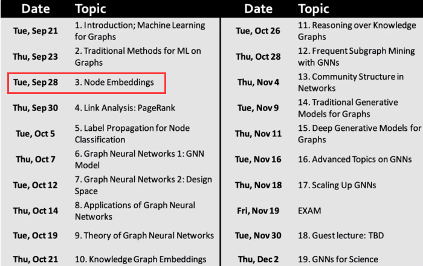
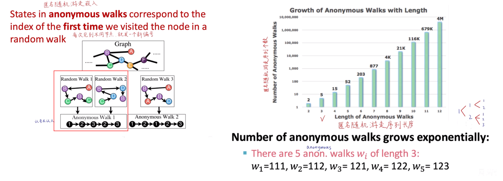

# 斯坦福大学CS224W图机器学习笔记

## 学习参考

CS224W公开课：[双语字幕 斯坦福CS224W《图机器学习》课程(2021) by Jure Leskove](https://www.bilibili.com/video/BV1RZ4y1c7Co?vd_source=55755af81e9ec7ae17d639fb86860235)

官方课程主页：[官方主页](https://web.stanford.edu/class/cs224w)

子豪兄精讲：[斯坦福CS224W图机器学习、图神经网络、知识图谱 同济子豪兄](https://www.bilibili.com/video/BV1pR4y1S7GA?vd_source=55755af81e9ec7ae17d639fb86860235)

子豪兄公开代码：[TommyZihao/zihao_course: 同济子豪兄的公开课 (github.com)](https://github.com/TommyZihao/zihao_course)

基于图的项目：

* 读论文、搜论文、做笔记、吐槽论文的社区：[ReadPaper](https://readpaper.com/)
* 可以画出来论文之间的应用关系：[CONNECTED PAPERS](https://www.connectedpapers.com/)
* 医疗知识图谱：[BIOS](https://bios.idea.edu.cn)

知识图谱专业老师：刘焕勇老师[主页](https://liuhuanyong.github.io)，[github主页](https://github.com/liuhuanyong)，[CSDN主页](https://blog.csdn.net/lhy2014)，也有公众号：老刘说NLP。

CS224W的课程目录：

往期笔记回顾：[CS224W笔记](https://github.com/lyc686/CS224W_notes/tree/main/notes)

## Task_04、图嵌入表示学习

## 一、图机器学习任务

图机器学习可以按照任务的不同分为：

* 节点层面
* 连接层面
* 全图层面
  * 子图层面

但是不管是哪一个层面的任务都需要首先**提取特征**，都需要将研究的对象用D维的计算机能够识别的特征表示出来。

而且我们任务中所提到的特征**不考虑属性特征**，**只考虑连接特征**。（例如，节点A和节点B，我们只考虑他们之间有什么关系，而不会考虑A节点和节点B本身的一些属性特征）

**`好的食材才能制作出好的饭菜`**：只有我们的D维向量抽取的够好（充分反映研究对象在原图中的结构、语义等信息），放到模型里面才会得到好的计算结果。

如何把节点映射维D维向量：

* **人工特征工程**
  * 节点重要度
  * 集群系数
  * Graphlet
  * PageRank
* **图表示学习**
  * 通过**随机游走**构造**自监督学习任务**，DeepWalk & Node2Vec & LINE
* **矩阵分解**
* **深度学习**
  * 图神经网络

## 二、图嵌入Graph Embedding

图嵌入首先研究的重点目标是：**节点**。`图嵌入`：**把节点映射为一个D维的向量**

图嵌入与传统机器学习的区别：**不需要去人工提取特真正**，通过**表示学习**，自动学习特征（将各模态的输入转为向量），如下图所示：

这种自动学习特征的**表示学习**就是减轻人工的**端到端**的工程

而且通过表示学习映射的D维向量往往具有以下三个特征：

* **低维**：向量维度远小于节点数
* **连续**：每个元素都是实数（有正有负、有大有小）
* **稠密**：每个元素都不为0

由于这三大特征的存在，经过图表示学习得到的D维向量也叫做**分布式**（分布式表示真正的价值所在：它有通过概念来发现数据之间“语义相似性”的能力，也就是数据之间不是稀疏的而是稠密的、有关联的）。

### 1.什么是表示学习（嵌入）

嵌入的思想是将一个研究对象映射到D维的向量中，类比一个2维向量表示**平面**中的一个点，3维向量表示**3维空间**中的一个点，D维向量表示的就是一个**D维空间**中的一个点。即，将我们的研究对象映射到了D维空间中的点，而且由于我们映射的时候采取的方式都是对研究对象中的节点做**相似度度量**，所以最终的D维向量就可以很好的反应出研究对象的特征、结构、语义等信息。

所以虽然我们再做嵌入的时候并没有考虑**下游任务**是什么，但是我们通过合理的方式得到**效果非常好的D维向量**（好的食材），只要使用的模型不是很拉跨（厨师有点手艺），我们最终就可以去适配各种各样的下游任务（做出来的饭都是beautiful的）。

一些下游任务例如：

* 节点分类
* 连接预测
* 图预测
* 异常节点检测
* 社群检测（聚类）
* 等等

**将空手道俱乐部的图**使用`DeepWalk`映射到一个2维的空间中（无监督学习），就可以完成下游任务（有监督学习）如下图所示：

通过图嵌入的方式，将一个**复杂**的图映射到**简单**的2维空间中，我们就可以很轻松的完成下游任务。比如右图所示我们完成分类任务（红色和蓝色节点是一类，紫色和绿色节点是一类），我们简简单单使用一个线性分类器就可以拟合出分类边界（右图中的红色线）。

**原图中相近的节点嵌入后依然相近**

### 2.图嵌入基本框架-编码器、解码器

**编码器**：输入一个节点，输出一个向量

**解码器**：向量之间做点乘（也就是余弦相似度），得到的标量数值可以反映**节点的相似度**，这个节点的相似度是**人为定义的**（比如节点相近就认为他们相似）

* 如果两个节点完全不相似，那么这两个节点的向量就是**正交**的（垂直），点乘就等于0
* 如果两个节点直接相连，那么这两个节点的向量就是**共线**的（甚至就是同一个向量），点乘就等于1

**图神经网络**就是一种**编码器**用于将研究对象输出为向量，而**解码器**也是可以人为设计的，比如用上面的**点乘**或者用一个**L2距离**等等，节点的**相似度**也可以是认为设定的，比如用两节点的邻居节点来衡量两节点是否相似，或者用两个节点是否在图中扮演了相似的角色来判断两节点是否是相似的。

上图右边所示的就是一些**节点相似度**的指标，我们当前学习的是使用**随机游走**的方式来定义节点形似度（一个“醉汉”在图中随机行走，如果两个节点出现在了同一个游走的序列里面，我们就认为这两个节点是相似的）

我们的**目标**：

* 迭代优化每个节点的D维向量
  * 使得图中**相似节点**向量点乘数量积**大**
  * 使得图中**不相似节点**向量点乘数量积**小**

### 3.编码器

#### （1）最简单的编码器

最简单的编码器不需要使用任何的神经网路、算法模型，只需要**查表**即可。表是一个**矩阵**，其中的每一行是一个节点的d维向量的一个元素，每一列数对应一个节点。每次需要使用哪个节点的特征向量，只需要用表乘以一个`one-hot`编码的向量（提取矩阵中的某一行）表示某一个节点的嵌入向量。最终通过**迭代优化**去更新矩阵中的数值，如下图所示：

如上图所示的5x6的矩阵最终我们需要更新的参数只有30个，这种方式被称为**浅编码器（shallow encoder）**，对应于神经网络的**深编码器（deep encoder）**。

这个编码器完成的任务是**无监督/自监督**的方式完成的，我们并没有使用任何节点类别标签，也没有使用节点属性（只使用连接属性便于处理，并且恩格斯说过：“人，是一切社会关系的总和”），直接优化**嵌入向量**，而且不需要考虑特定的下游任务，就可以输出最终的**嵌入向量**。

#### （2）基于随机游走的方法

随机游走（Random Walk），一个“醉汉”在图中随机行走，最终行走得到的节点序列就是一个随机游走序列，可以采集很多随机的序列，也可以采集不同长度的随机游走序列，或者定义随机的策略。

**图的概念可以和自然语言处理进行一一的对应**，所以NLP里的一些技术都可以拿来图中来**复用**，如下图所示：

#### （3）DeepWalk

DeepWalk的思想类似word2vec，使用**图中节点与节点的共现关系**来学习节点的向量表示。那么关键的问题就是如何来描述节点与节点的共现关系，DeepWalk给出的方法是使用随机游走(**RandomWalk**)的方式在图中进行节点采样。

随机游走：从节点u出发的随机游走序列经过节点v的概率P(v | Zu)。如果希望u经过v，概率P就应该大一点，如果不希望u经过v，概率P就应该小一点。而这个概率P是使用**`Softmax`**函数来计算的。使用Softmax函数可以把任意大小、正负的数值变到0~1之间。

参考前面提到的节点“相似”的定义是**人为设定**的，在随机游走中，我们用两节点**共同出现**在一同一个随机游走序列来表示两个点是否相似。如果两个向量比较相似那么他们的数量积会比较大。如下图所示：

随机游走的步骤：

* 采样得到若干随机游走序列，计算条件概率
* 迭代优化每个节点的D维向量
  * 使得序列中**共现节点**向量数量积**大**
  * 使得序列中**不共现节点**向量数量积**小**
  * 数量积其实就反映了两个向量的**余弦相似度**（数量积 = 两向量模长xCosθ），我们的向量模长假设都在同一**数量级**，并且会在**softmax**中被压缩到0~1之间，所以模长就显得不那么重要。

##### 随机游走的优点

1. 随机游走的**表示能力**是完全足够的，看似随机实则可以通过大量次数的随机游走捕捉很多高阶和邻域的信息。
2. 随机游走的**计算便捷**，不需要去考虑节点对之间的连接关系，只需要暴力游走即可。
3. 随机游走是**无监督/自监督**学习的问题，不需要定义类别标签以及下游任务，得到的向量可以应用在各种下游任务中。

##### 最大化目标似然函数

在随机游走的任务中我们所要求解的概率是：
$$
P(N_R(u)|z_u)
$$

其中u表示从节点u开始随机游走，R表示采用的随机游走策略是R。而**目标函数**是在所有节点上这个概率的**连乘**，由于乘法不是很好计算所以我们将目标函数**取对数**将乘法转换为加法得到一个**似然目标函数**，由于**单调性没有变化**所以我们仍然是寻找这个似然目标函数的**最大值**，也就是**极大似然估计**。

如右图所示，计算步骤就是：

* 先遍历所有节点V
* 然后遍历从u节点出发的随机游走序列所有邻域节点
* 最后再将我们的似然函数加负号，得到损失函数（Loss function）
* 最终将求最大值问题转换成求解最小值问题
* P(v|zu)表示从u节点出发预测出v节点的概率，即u的D维向量中有v节点的概率（通过softmax计算，具体计算再右图下面，softmax计算的概率也叫做**后验概率**）

如下图所示，公式中遍历所有节点一共有两次，所以**复杂度**是节点的平方。

我们可以针对这个复杂度的问题做一些**优化**来解决softmax难算的问题，比如：

* 分层softmax
* 负采样

##### 负采样

在之前的似然函数softmax计算中我们需要计算节点u和其他**所有节点**的**数量积**，而在负采样中我们只计算u节点和**k个负样本**的**数量积**（k个负样本也是随机找出来的）

* k越多，模型的效果越好，越鲁棒
* k也不能太大，防止样本不均衡（正负样本数量相差大）
* 往往取k在5~20之间
* 理论上，同一个随机游走序列中的节点，不应被采样为负样本。但是由于节点数量可能很大随机采5~20个节点很难采到同一个随机游走序列中的节点，所有随机采样作负样本即可。

##### 随机梯度下降

* 求**全局**的随机梯度下降（Gradient Descent）
  * 随机初始化所有节点u的D维向量
  * 求所有节点u的总梯度
  * 通过随机梯度下降迭代更新每一个节点u的D维向量的每个元素

* 求**每个样本**的随机梯度下降（Stochastic Gradient Descent）
  * 随机初始化所有节点u的D维向量
  * 每次随机游走优化一次当前节点u的D维向量的每个元素

* 全局梯度下降：每次喂全部数据进去，计算全局梯度不会产生**振荡**，直达靶心。
* 每个样本梯度下降：由于每个样本每一步的梯度下降并不一定是全局最优的方向，所有是**振荡**的，虽然道路曲折但是未来仍然是光明的。
* 两种方式的折中：使用Mini-batch的方式进行梯度下降，一次读入一小批数据，虽然也**振荡**但是没有小批次那么厉害。

如下图所示：

#### （4）Node2Vec

上述的随机游走策略是**完全随机**的方式，那么我们能否**改变优化**一下随机游走的策略，也就是`Node2Vec`解决的问题。

Node2Vec和随机游走的区别在于完全随机的随机游走是**无偏**的，而Node2Vec是**是有偏的二阶随机游走**，通过设置`p、q`两个参数控制这个“醉汉”是探索自己的**邻域**还是探索**远方**，如下图所示：

##### 参数p、q

参数`p、q`一个控制是否要回到上一个节点，另一个控制是否走向更远的节点，也就是每一个节点都要记**得上一个节点**是谁，所以是一个**二阶游走**。

##### 二阶随机游走

在Node2Vec中节点有`1/p`的概率回到上一个节点，权重为`1`的走向和上一个节点距离相同的节点，``1/q`的概率走向下一个比上一个节点距离远的节点。

如下图所示：

通过**不同的p、q**可以形成**不同的探索**结果：

* p大q小，探索远方（DFS深度优先）
  * 例如，探索同质社群（homophily community）
* p小q大，探索近邻（BFS宽度优先）
  * 例如，探索节点功能角色：中枢、桥接、边缘（structural equlvalence）
* 注：p、q相当难调，没有必要一定p大q小探索出同质社群，p小q大探索出节点功能角色

##### Node2Vec步骤

* 生成随机游走序列，计算每一个边的权重和概率
* 以u节点为起始节点，长度为l生成r个随机游走序列
* 随机梯度下降优化d维向量
* 注：上述三步都是独立的可以并行，所以**复杂度**是线性O(n)级别的

#### （5）其他的一些随机游走策略

不同的游走策略有的是基于节点特征，有的是基于连接权重，有的是在原图基础上改了新图进行随机游走，如下图所示：

不同的游走策略都是为了用得到的d维**向量的相似度**表示**节点相似度**。

### 4.矩阵分解

矩阵分解和随机游走在**数学**上本质是一回事，邻接矩阵中某2行4列元素为1表示节点2和节点4有边相连。

在随机游走中如果我们假设两个节点相连就是相似，如果两个节点相连那么ZTZ的**数量积**的最终结果1，如果两个节点不相连，数量积就是0，如下图所示：

但是实际情况中Z（d行n列）是矮胖的，而A（邻接矩阵nxn）是方阵。矮胖的矩阵Z很难做**矩阵分解**（很难直接得到解析解，因为列数>行数，所以有无穷多解）

我们可以使用**数值计算估计**的方式来做矩阵分解，求**A - ZTZ的二范数**，使其最小，此时我们就可以用ZTZ来**近似代替**A。如下图所示：

同样我们在`DeepWalk`和`Node2Vec`中也可以使用矩阵分解，就是计算非常麻烦，`DeepWalk`的矩阵分解如下图所示：

### 5.PageRank、随机游走的缺点

1. 不论是PageRnk还是随机游走都有一个缺点是，只能基于已有的节点进行分析，**无法立刻泛化到新加入的节点，可以理解为某种程度上的过拟合**（将新来的节点视为测试集，却无法很好的泛化到新节点上），每次有新节点出现都需要从头重新随机游走。
2. 随机游走只是**探索一个节点相邻局部的信息**，不论策略多么优秀，他只能从开始的节点u出发，大概率采样u节点附近的节点，所以只能采样出**地理上相近作为节点相似的指标**，但是很多时候离得很远的两个节点在**结构上也可能是相似的**。**解决方法**就是匿名随机游走、图神经网络。
3. 仅利用了连接信息而没有使用属性信息，没有考虑节点自身的属性。**解决方法**：图神经网络。
4. 没有真正的用到神经网络和深度学习。

更总结化的一些缺点如下图所示：

## 三、嵌入整张图

最简单的想法就是**把所有节点的d维向量求和**，有了全图的特征之后就可以对图层面的问题进行处理

### 1.把所有节点的d维向量求和

如下图所示：

### 2.添加一个虚拟节点

虚拟节点和我们要研究的所有节点是相连的，求出虚拟节点的嵌入向量，将这个虚拟节点的嵌入向量作为图整体的嵌入。

### 3.匿名随机游走（Anonymous Walk Embedding）

每次见到不同节点，就发一个新编号（**认号不认人**）

如下图左侧的两个随机游走序列是不同的，但是由于认号不认人，每见到一个不同的节点就发一个编号，使得两个随机游走序列是同一个编号序列。

右图可以反映出不同节点数可能的**匿名随机游走序列长度**（**指数暴增**）

#### （1）Bag-of-Anonymous Walks

用**不同匿名随机游走的个数构成全图的嵌入向量**，如下图所示假设有3个节点的匿名随机游走，会产生5中可能的序列，所以我们的全图向量就是5维的，每一维都是这三个节点的一种随机游走序列，例如[111, 112, 121, 122, 123]作为全图的向量

#### （2）匿名随机游走的次数

基于下图中的公式，我们可以计算出匿名随机游走在**长度固定**的时候需要的采样次数。

#### （3）匿名随机游走上下文预测

给每种匿名随机游走序列**单独**学习一种嵌入编码，再给**全图**学习一个嵌入编码，再去构造**无监督/自监督**学习。例如3个节点，有五种匿名随机游走序列，我们就学习5个嵌入编码+1个全图的嵌入编码一共学习6个嵌入编码。

如下图所示：

* 假设我们现在产生了4个匿名随机游走序列
* 我们就用其中三个分别做嵌入编码做**平均**得到一个d维向量
* 再和全图学习的嵌入编码做**堆叠**得到一个2d维的向量
* 然后经过一个线性分类层+sofrmax最终产生一个d维向量
* 让这个向量去预测匿名游走的第四个序列概率越大越好

其实本质就是一个**上下文预测问题**，用上文内容去预测下文的内容，只不过这里的上下文都是**匿名随机游走的序列**。然后构建**自监督**学习的任务去继续迭代优化。

### 4.分层聚类

在后续的学习中我们会学习如下图所示的分层聚类的学习，例如下图中的每一个聚类可以映射为下一层中一种颜色的节点。最终的绿色节点就可以输入到下游任务中。

如果对于**连接预测**，我们可以把连接两侧的节点`concat`拼接起来成一个2d维的向量，也可以把他们求和、求平均、求二范式距离等等。

对于**全图分类**，可以用这次任务学习的节点求和，添加虚拟节点，匿名游走的方式进行。

## 总结

本次任务学习到了图表示学习，是一种不需要人工特征工程的**端到端**的表示学习，我们的任务就是去构建一个**自监督的任务**，具体而言就是**随机游走**的方式，目的就是得到`Z表`，表示了图中的每一个嵌入向量。其中如何用矩阵把图表示出来至关重要。
