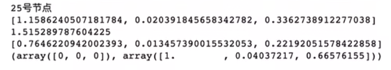

# 斯坦福大学CS224W图机器学习笔记

## 学习参考

CS224W公开课：[双语字幕 斯坦福CS224W《图机器学习》课程(2021) by Jure Leskove](https://www.bilibili.com/video/BV1RZ4y1c7Co?vd_source=55755af81e9ec7ae17d639fb86860235)

官方课程主页：[官方主页](https://web.stanford.edu/class/cs224w)

子豪兄精讲：[斯坦福CS224W图机器学习、图神经网络、知识图谱 同济子豪兄](https://www.bilibili.com/video/BV1pR4y1S7GA?vd_source=55755af81e9ec7ae17d639fb86860235)

子豪兄公开代码：[同济子豪兄CS224W公开课](https://github.com/TommyZihao/zihao_course/tree/main/CS224W)

基于图的项目：

* 读论文、搜论文、做笔记、吐槽论文的社区：[ReadPaper](https://readpaper.com/)
* 可以画出来论文之间的应用关系：[CONNECTED PAPERS](https://www.connectedpapers.com/)
* 医疗知识图谱：[BIOS](https://bios.idea.edu.cn)

知识图谱专业老师：刘焕勇老师[主页](https://liuhuanyong.github.io)，[github主页](https://github.com/liuhuanyong)，[CSDN主页](https://blog.csdn.net/lhy2014)，也有公众号：老刘说NLP。

CS224W的课程目录：


往期笔记回顾：[CS224W笔记](https://github.com/lyc686/CS224W_notes/tree/main/notes)

## Task_05、DeepWalk和Node2Vec图嵌入代码实战

## 一、DeepWalk代码实战

**维基百科词条图嵌入可视化**

通过维基百科中每一个词条下面的`See also`（相近词条的引用），在这个图中每一个节点就是一个词条，关系就是相互的引用，在此基础上使用DeepWalk来把每一个节点编码成D维向量，最终将为可视化出D维向量。

**参考资料**


1. https://www.analyticsvidhya.com/blog/2019/11/graph-feature-extraction-deepwalk/
2. https://github.com/prateekjoshi565/DeepWalk

### 1.环境工程

**安装配置工具**

`gensim`是自然语言处理领域的一个工具包，所以自然语言处理和随机游走其实是相通的。

```python
!pip install networkx gensim pandas numpy tqdm scikit-learn matplotlib
```

导入工具包

```python
import networkx as nx # 图数据挖掘

# 数据分析
import pandas as pd
import numpy as np

import random # 随机数
from tqdm import tqdm # 进度条

# 数据可视化
import matplotlib.pyplot as plt
%matplotlib inline

plt.rcParams['font.sans-serif']=['SimHei']  # 用来正常显示中文标签  
plt.rcParams['axes.unicode_minus']=False  # 用来正常显示负号
```

### 2.构建图生成随机游走序列

**获取维基百科网页引用关联数据**

1. 打开网站（**爬虫网站**）`https://densitydesign.github.io/strumentalia-seealsology`

2. Distance（爬取跳数）设置为`4`

3. 输入以下链接（一个或者几个链接都可以）

​		https://en.wikipedia.org/wiki/Computer_vision

​		https://en.wikipedia.org/wiki/Deep_learning

​		https://en.wikipedia.org/wiki/Convolutional_neural_network

​		https://en.wikipedia.org/wiki/Decision_tree

​		https://en.wikipedia.org/wiki/Support-vector_machine

4. 点击`START CRAWLING`，爬取1000个网页之后，点击`STOP & CLEAR QUEUE`

5. Download-下载TSV文件（TSV与CSV很相似，只不过CSV用逗号分隔，TSV用制表符\t分隔），保存至代码相同目录，命名为`seealsology-data.tsv`

   文件中每一条的第一列是起始节点，第二列是终止节点表示这两个节点有关系

```python
df = pd.read_csv("seealsology-data.tsv", sep = "\t")
df.head()
```


```python
df.shape
```


**构建无向图**

但凡是类似这种没有指定方向的图都可以用这种方式构建**无向图**

```python
G = nx.from_pandas_edgelist(df, "source", "target", edge_attr=True, create_using=nx.Graph())

# 节点个数
len(G)
```


可视化（节点太多就不必可视化了，堆在一起没什么效果）

```python
# # 可视化
# plt.figure(figsize=(15,14))
# nx.draw(G)
# plt.show()
```

**生成随机游走节点序列的函数**

```python
def get_randomwalk(node, path_length):
    '''
    输入起始节点和路径长度，生成随机游走节点序列
    '''
    
    random_walk = [node]
    
    for i in range(path_length-1):
        # 汇总邻接节点
        temp = list(G.neighbors(node))
        temp = list(set(temp) - set(random_walk))    
        if len(temp) == 0:
            break
        # 从邻接节点中随机选择下一个节点
        random_node = random.choice(temp)
        random_walk.append(random_node)
        node = random_node
        
    return random_walk
```

将所有的词条放入一个列表中

```python
all_nodes = list(G.nodes())
all_nodes
```


随机游走，从`random forest`开始走五步，发现确实是把相似的一些节点随机游走出来（此时都是一些集成算法）

```python
get_randomwalk('random forest', 5)
```


**生成随机游走序列**

```python
gamma = 10 # 每个节点作为起始点生成随机游走序列个数
walk_length = 5 # 随机游走序列最大长度

random_walks = []

for n in tqdm(all_nodes): # 遍历每个节点
    for i in range(gamma): # 每个节点作为起始点生成gamma个随机游走序列
        random_walks.append(get_randomwalk(n, walk_length))
        
# 生成随机游走序列个数
len(random_walks)

# 查看第二个随机游走序列
random_walks[1]
```


### 3.训练DeepWalk(Word2Vec)

**训练Word2Vec模型**

```python
from gensim.models import Word2Vec # 自然语言处理

model = Word2Vec(vector_size=256, # Embedding维数
                 window=4, # 窗口宽度
                 sg=1, # Skip-Gram
                 hs=0, # 不加分层softmax
                 negative=10, # 负采样
                 alpha=0.03,  # 初始学习率
                 min_alpha=0.0007, # 最小学习率
                 seed=14 # 随机数种子
                )

# 用随机游走序列构建词汇表
model.build_vocab(random_walks, progress_per=2)

# 训练（耗时1分钟左右）
model.train(random_walks, total_examples=model.corpus_count, epochs=50, report_delay=1)
```


**分析Word2Vec(训练DeepWalk本质就是Word2Vec)**

```python
# 查看某个节点的Embedding
model.wv.get_vector('random forest').shape

model.wv.get_vector('random forest')
```


```python
# 找相似词语
model.wv.similar_by_word('decision tree')
```


### 4.可视化

**PCA降维可视化**

**PCA是一种线性降维的算法，效果并不一定很好**

可视化全部词条的二维Embedding

```python
X = model.wv.vectors

# 将Embedding用PCA降维到2维
from sklearn.decomposition import PCA
pca = PCA(n_components=2)
embed_2d = pca.fit_transform(X)

embed_2d.shape

plt.figure(figsize=(14,14))
plt.scatter(embed_2d[:, 0], embed_2d[:, 1])
plt.show()
```


**可视化某个词条的二维Embedding**

```python
term = 'computer vision'

term_256d = model.wv[term].reshape(1,-1)
term_256d.shape

term_2d = pca.transform(term_256d)
term_2d

# 可视化
plt.figure(figsize=(14,14))
plt.scatter(embed_2d[:,0], embed_2d[:,1])
plt.scatter(term_2d[:,0],term_2d[:,1],c='r',s=200)
plt.show()
```


**可视化某些词条的二维Embedding**

```python
# 计算PageRank重要度
pagerank = nx.pagerank(G)
# 从高到低排序
node_importance = sorted(pagerank.items(), key=lambda x:x[1], reverse=True)

# 取最高的前n个节点
n = 30
terms_chosen = []
for each in node_importance[:n]:
    terms_chosen.append(each[0])
    
# 手动补充新节点
terms_chosen.extend(['computer vision','deep learning','convolutional neural network','convolution','natural-language processing','attention (machine learning)','support-vector machine','decision tree','random forest','computational imaging','machine vision','cognitive science','neuroscience','psychophysics','brain','visual cortex','visual neuroscience','cognitive model','finite difference','finite difference time domain','finite difference coefficients','finite difference methods for option pricing','iso 128','iso 10303'])


terms_chosen
```


```python
# 输入词条，输出词典中的索引号
term2index = model.wv.key_to_index

# index2term = model.wv.index_to_key
# term_index = np.array(term2index.values())

# 可视化全部词条和关键词条的二维Embedding
plt.figure(figsize=(14,14))
plt.scatter(embed_2d[:,0], embed_2d[:,1])

for item in terms_chosen:
    idx = term2index[item]
    plt.scatter(embed_2d[idx,0], embed_2d[idx,1],c='r',s=50)
    plt.annotate(item, xy=(embed_2d[idx,0], embed_2d[idx,1]),c='k',fontsize=12)
plt.show()
```


**T-SNE降维可视化**

可视化全部词条的二维Embedding

```python
# 将Embedding用TSNE降维到2维
from sklearn.manifold import TSNE
tsne = TSNE(n_components=2, n_iter=1000)
embed_2d = tsne.fit_transform(X)

plt.figure(figsize=(14,14))
plt.scatter(embed_2d[:, 0], embed_2d[:, 1])
plt.show()
```


可视化全部词条和关键词条的二维Embedding

```python
plt.figure(figsize=(14,14))
plt.scatter(embed_2d[:,0], embed_2d[:,1])
embed_2d.shape

for item in terms_chosen:
    idx = term2index[item]
    plt.scatter(embed_2d[idx,0], embed_2d[idx,1],c='r',s=50)
    plt.annotate(item, xy=(embed_2d[idx,0], embed_2d[idx,1]),c='k',fontsize=12)
plt.show()
```


**导出T-SNE降维到二维之后的Embedding**

```python
terms_chosen_mask = np.zeros(X.shape[0])
for item in terms_chosen:
    idx = term2index[item]
    terms_chosen_mask[idx] = 1
    
df = pd.DataFrame()
df['X'] = embed_2d[:,0]
df['Y'] = embed_2d[:,1]
df['item'] = model.wv.index_to_key
df['pagerank'] = pagerank.values()
df['chosen'] = terms_chosen_mask

print(df)

df.to_csv('tsne_vis_2d.csv',index=False)
```


**T-SNE可视化全部词条的三维Embedding**

```python
# 将Embedding用TSNE降维到3维
from sklearn.manifold import TSNE
tsne = TSNE(n_components=3, n_iter=1000)
embed_3d = tsne.fit_transform(X)

plt.figure(figsize=(14,14))
plt.scatter(embed_3d[:,0], embed_3d[:,1])
embed_3d.shape

for item in terms_chosen:
    idx = term2index[item]
    plt.scatter(embed_3d[idx,0], embed_2d[idx,1],c='r',s=50)
    plt.annotate(item, xy=(embed_3d[idx,0], embed_3d[idx,1]),c='k',fontsize=12)
plt.show()
```


**导出T-SNE降维到三维之后的Embedding**

```python
df = pd.DataFrame()
df['X'] = embed_3d[:,0]
df['Y'] = embed_3d[:,1]
df['Z'] = embed_3d[:,2]
df['item'] = model.wv.index_to_key
df['pagerank'] = pagerank.values()
df['chosen'] = terms_chosen_mask

print(df)

df.to_csv('tsne_vis_3d.csv',index=False)
```


### 5.拓展

**扩展：**

用`tsne_vis_2d.csv`和`tsne_vis_3d.csv`做可视化


参考代码：https://echarts.apache.org/examples/zh/editor.html?c=scatter3d&gl=1&theme=dark

## 二、Node2Vec代码实战

**《悲惨世界》人物关系-Node2Vec图嵌入**

参考资料：

Elior Cohen代码：https://github.com/eliorc/node2vec


Elior Cohen代码博客：https://maelfabien.github.io/machinelearning/graph_5/#graph-embedding

### 1.环境工程

**安装、导入工具包**

```python
!pip install node2vec networkx numpy matplotlib
```

```python
import networkx as nx # 图数据挖掘
import numpy as np # 数据分析
import random # 随机数

# 数据可视化
import matplotlib.pyplot as plt
%matplotlib inline
plt.rcParams['font.sans-serif']=['SimHei']  # 用来正常显示中文标签  
plt.rcParams['axes.unicode_minus']=False  # 用来正常显示负号
```

**导入数据集**

```python
# 空手道俱乐部数据集
# G = nx.karate_club_graph()

# 《悲惨世界》人物数据集
G = nx.les_miserables_graph()

print(G.nodes)
print(len(G))

# 可视化
plt.figure(figsize=(15,14))
pos = nx.spring_layout(G, seed=5)
nx.draw(G, pos, with_labels=True)
plt.show()
```


### 2.构建Node2Vec模型

**构建模型**

```python
from node2vec import Node2Vec

# 设置node2vec参数
node2vec = Node2Vec(G, 
                    dimensions=32,  # 嵌入维度
                    p=1,            # 回家参数
                    q=3,          # 外出参数
                    walk_length=10, # 随机游走最大长度
                    num_walks=600,  # 每个节点作为起始节点生成的随机游走个数
                    workers=4       # 并行线程数
                   )

# p=1, q=0.5, n_clusters=6。DFS深度优先搜索，挖掘同质社群
# p=1, q=2, n_clusters=3。BFS宽度优先搜索，挖掘节点的结构功能。

# 训练Node2Vec，参数文档见 gensim.models.Word2Vec
model = node2vec.fit(window=3,    # Skip-Gram窗口大小
                     min_count=1,  # 忽略出现次数低于此阈值的节点（词）
                     batch_words=4 # 每个线程处理的数据量
                    )
X = model.wv.vectors

X.shape
```


### 3.可视化

**节点Embedding聚类可视化**

**运行聚类**


Kmeans聚类算法讲解：https://www.bilibili.com/video/BV1HJ411P7cs

```python
# # DBSCAN聚类
# from sklearn.cluster import DBSCAN
# cluster_labels = DBSCAN(eps=0.5, min_samples=6).fit(X).labels_
# print(cluster_labels)

# KMeans聚类
from sklearn.cluster import KMeans
import numpy as np
cluster_labels = KMeans(n_clusters=3).fit(X).labels_ # 聚成3簇
print(cluster_labels)
```


**将networkx中的节点和词向量中的节点对应**

将词汇表的节点顺序转为networkx中的节点顺序

```python
colors = []
nodes = list(G.nodes)
for node in nodes: # 按 networkx 的顺序遍历每个节点
    idx = model.wv.key_to_index[str(node)] # 获取这个节点在 embedding 中的索引号
    colors.append(cluster_labels[idx]) # 获取这个节点的聚类结果
```

**可视化聚类效果**

```python
plt.figure(figsize=(15,14))
pos = nx.spring_layout(G, seed=10)
nx.draw(G, pos, node_color=colors, with_labels=True)
plt.show()
```


**节点Embedding降维可视化**

```python
# 将Embedding用PCA降维到2维
from sklearn.decomposition import PCA
pca = PCA(n_components=2)
embed_2d = pca.fit_transform(X)

# # 将Embedding用TSNE降维到2维
# from sklearn.manifold import TSNE
# tsne = TSNE(n_components=2, n_iter=5000)
# embed_2d = tsne.fit_transform(X)

# plt.figure(figsize=(14,14))
plt.scatter(embed_2d[:, 0], embed_2d[:, 1])
plt.show()
```


**查看Embedding**

```python
model.wv.get_vector('Napoleon').shape

# 查看某个节点的Embedding
model.wv.get_vector('Napoleon')
```


```python
# 查找 Napoleon 节点的相似节点
model.wv.most_similar('Napoleon')
```


```python
model.wv.similar_by_word('Napoleon')
```


```python
# 查看任意两个节点的相似度
model.wv.similarity('Napoleon', 'Champtercier')
```


```python
# 查看任意两个节点的相似度
model.wv.similarity('Napoleon', 'Brujon')
```


### 4.对连接做嵌入

**对Edge（连接）做Embedding**

```python
from node2vec.edges import HadamardEmbedder

# Hadamard 二元操作符：两个 Embedding 对应元素相乘
edges_embs = HadamardEmbedder(keyed_vectors=model.wv)

# 查看 任意两个节点连接 的 Embedding
edges_embs[('Napoleon', 'Champtercier')]
```


```python
# 计算所有 Edge 的 Embedding
edges_kv = edges_embs.as_keyed_vectors()

edges_kv.index_to_key
```


```python
# 查看 关系与 某两个节点 最相似的 节点对
edges_kv.most_similar(str(('Bossuet', 'Valjean')))
```


## 三、Node2Vec官方作者代码解读

**参考资料**

Node2Vec官方作者Aditya Grover代码：https://github.com/aditya-grover/node2vec

深度之眼 赵老师

### 1.环境工程

```python
import warnings
warnings.filterwarnings('ignore')
import argparse
import numpy as np
import networkx as nx
from gensim.models import Word2Vec
import random

import matplotlib.pyplot as plt
%matplotlib inline
```

**读入命令行参数**

```python
def parse_args():
    '''
    Parses the node2vec arguments.
    '''
    # 使用parser加载信息
    parser = argparse.ArgumentParser(description="Run node2vec.")
    # 输入文件：邻接表
    parser.add_argument('--input', nargs='?', default='karate.edgelist',
                        help='Input graph path')
    # 输出文件：节点嵌入表
    parser.add_argument('--output', nargs='?', default='karate.emb',
                        help='Embeddings path')
    # embedding嵌入向量维度
    parser.add_argument('--dimensions', type=int, default=128,
                        help='Number of dimensions. Default is 128.')
    # 随机游走序列长度
    parser.add_argument('--walk-length', type=int, default=80,
                        help='Length of walk per source. Default is 80.')
    # 每个节点生成随机游走序列次数
    parser.add_argument('--num-walks', type=int, default=10,
                        help='Number of walks per source. Default is 10.')
    # word2vec窗口大小，word2vec参数
    parser.add_argument('--window-size', type=int, default=10,
                        help='Context size for optimization. Default is 10.')
    # SGD优化时epoch数量，word2vec参数
    parser.add_argument('--iter', default=1, type=int,
                        help='Number of epochs in SGD')
    # 并行化核数，word2vec参数
    parser.add_argument('--workers', type=int, default=8,
                        help='Number of parallel workers. Default is 8.')
    # 参数p
    parser.add_argument('--p', type=float, default=1,
                        help='Return hyperparameter. Default is 1.')
    # 参数q
    parser.add_argument('--q', type=float, default=2,
                        help='Inout hyperparameter. Default is 2.')
    # 连接是否带权重
    parser.add_argument('--weighted', dest='weighted', action='store_true',
                        help='Boolean specifying (un)weighted. Default is unweighted.')
    parser.add_argument('--unweighted', dest='unweighted', action='store_false')
    parser.set_defaults(weighted=False)
    
    # 有向图还是无向图
    parser.add_argument('--directed', dest='directed', action='store_true',
                        help='Graph is (un)directed. Default is undirected.')
    parser.add_argument('--undirected', dest='undirected', action='store_false')
    parser.set_defaults(directed=False)
    
    return parser.parse_args(args=[])

args = parse_args()
```

```python
args
```


### 2.载入图

**空手道数据集**

```python
# 连接带权重
if args.weighted:
    G = nx.read_edgelist(args.input, nodetype=int, data=(('weight', float),), create_using=nx.DiGraph())
# 连接不带权重
else:
    G = nx.read_edgelist(args.input, nodetype=int, create_using=nx.DiGraph())
    for edge in G.edges():
        G[edge[0]][edge[1]]['weight'] = np.abs(np.random.randn())
        
# 无向图
if not args.directed:
    G = G.to_undirected()
    
print(len(G))

print(G.nodes)

print(G.edges)

# 可视化
pos = nx.spring_layout(G, seed=4)
nx.draw(G, pos, with_labels=True)
plt.show()
```


### 3.Alias Sampling

**Alias Sampling**

参考博客

https://keithschwarz.com/darts-dice-coins

https://www.bilibili.com/video/av798804262

https://www.cnblogs.com/Lee-yl/p/12749070.html

**原理讲解**

https://keithschwarz.com/darts-dice-coins


如上图所示，最开始我们有**发生概率**分别为1/2、1/3、1/12、1/12的四个**离散**的事件，现在希望对这四个时间进行**随机采样**，由于四个事件是离散的，而随机数是连续的，即，需要**用连续的随机数解决离散事件的采样**。

用**官网**的话说就是，最开始四个事件的发生概率不同所以采样的时候需要考虑各个事件对应的概率。现在需要使用一种方法将四个事件都变成发生概率为1/4的情况，这样进行采样就不需要区分各个事件的发生概率了（随便采样即可）。

`Alias Sampling`**具体操作**：

1. 由于一共有4个事件，所以将四个事件的概率都**乘以4**
   * 1/2 -> 2
   * 1/3 -> 4/3
   * 1/12 -> 1/3
2. 当大家的概率发生变化之后画一条水平线开始“**劫富济贫**”
3. 按照③④⑤的步骤依次进行**填补**
4. 最终达到⑥所示的状态，此时就可以开始用0-4的**连续的随机数**随机采样了
   * 0 - 1表示在第一个方框中采样（前2/3是事件1，后1/3是事件2）
   * 1 - 2表示在第二个方框中采样（全是事件2）
   * 2 - 3表示在第三个方框中采样（前1/3是事件3，后2/3是事件1）
   * 3 - 4表示在第四个方框中采样（前1/3是事件4，后2/3是事件1）
5. 这样就实现了只需要生成一个0 - 4的随机数就可以实现对应一个事件的采样

**时间复杂度：`O(1)`**，是一种**空间换时间**的算法，我们只需要提前**预处理**存储下来最终的⑥表，就可以以O(1)的时间复杂度进行采样。最终的`Alias Sampling`采样结果每一个采样中最多只有两个事件，最少一个事件。

**伪代码：**


### 4.算法代码

```python
def alias_setup(probs):
    '''
    Compute utility lists for non-uniform sampling from discrete distributions.
    Refer to https://hips.seas.harvard.edu/blog/2013/03/03/the-alias-method-efficient-sampling-with-many-discrete-outcomes/
    for details
    '''
    K = len(probs)
    # q corrsespond to Prob
    q = np.zeros(K)
    # J Alias
    J = np.zeros(K, dtype=np.int)

    smaller = []
    larger = []
    
    # 将各个概率分成两组，一组的概率值大于1，另一组的概率值小于1
    for kk, prob in enumerate(probs):
        q[kk] = K*prob # 每类事件的概率 乘 事件个数
        
        # 判定”劫富”和“济贫“的对象
        if q[kk] < 1.0:
            smaller.append(kk)
        else:
            larger.append(kk)
    
    # 使用贪心算法，将概率值小于1的不断填满
    # pseudo code step 3
    while len(smaller) > 0 and len(larger) > 0:
        small = smaller.pop()
        large = larger.pop()

        J[small] = large
        # 更新概率值，劫富济贫，削峰填谷
        q[large] = q[large] - (1 - q[small])
        if q[large] < 1.0:
            smaller.append(large) # 把被打倒的土豪归为贫农
        else:
            larger.append(large)

    return J, q
```

```python
def alias_draw(J, q):
    '''
    Draw sample from a non-uniform discrete distribution using alias sampling.
    O(1)的采样
    '''
    K = len(J) # 事件个数

    kk = int(np.floor(np.random.rand()*K)) # 生成1到K的随机整数
    if np.random.rand() < q[kk]:
        return kk # 取自己本来就对应的事件 
    else:
        return J[kk] # 取alias事件
```

```python
def get_alias_edge(src, dst):
    p = args.p
    q = args.q

    unnormalized_probs = []
    
    # 论文3.2.2节核心算法，计算各条边的转移权重
    for dst_nbr in sorted(G.neighbors(dst)):
        if dst_nbr == src:
            unnormalized_probs.append(G[dst][dst_nbr]['weight']/p)
        elif G.has_edge(dst_nbr, src):
            unnormalized_probs.append(G[dst][dst_nbr]['weight'])
        else:
            unnormalized_probs.append(G[dst][dst_nbr]['weight']/q)

    # 归一化各条边的转移权重
    norm_const = sum(unnormalized_probs)
    normalized_probs =  [float(u_prob)/norm_const for u_prob in unnormalized_probs]
    
    # 执行 Alias Sampling
    return alias_setup(normalized_probs)
```

```python
get_alias_edge(15, 16)
```


```python
is_directed = args.directed
alias_nodes = {}

# 节点概率alias sampling和归一化
for node in G.nodes():
    unnormalized_probs = [G[node][nbr]['weight'] for nbr in sorted(G.neighbors(node))]
    norm_const = sum(unnormalized_probs)
    normalized_probs =  [float(u_prob)/norm_const for u_prob in unnormalized_probs]
    alias_nodes[node] = alias_setup(normalized_probs)
    # 信息展示
    if node == 25:
        print('25号节点')
        print(unnormalized_probs)
        print(norm_const)
        print(normalized_probs)
        print(alias_nodes[node])
```


```python
alias_edges = {}
triads = {}

# 边概率alias sampling和归一化
if is_directed:
    for edge in G.edges():
        alias_edges[edge] = get_alias_edge(edge[0], edge[1])
else:
    for edge in G.edges():
        alias_edges[edge] = get_alias_edge(edge[0], edge[1])
        alias_edges[(edge[1], edge[0])] = get_alias_edge(edge[1], edge[0])
```

下面输出的就是25号节点的`alias`表，`J表：`[0, 0, 0]表示这三个格子的alias事件都是同一个（蓝），蓝色把自己的土地分给了其他人。`q表：`[1, 0.04037217, 0.66576155]分别表示每一个新的事件中前一部分占据的区间，例如第二个区间红色占据了0.04037217，剩下的1 - 0.04037217是蓝色。




由此我们就可以计算出**每个节点的`J表`和`q表`**

```python
# 每个节点的 J表 和 q表 （不考虑p、q值）相当于一阶游走
alias_nodes
```


```python
# 二阶随机游走（考虑p、q值）
alias_edges
```


### 5.生成随机游走序列

**生成一条随机游走序列**

```python
def node2vec_walk(walk_length, start_node):
    '''
    从指定的起始节点，生成一个随机游走序列
    '''
    # 上一步计算出的alias table，完成O(1)的采样

    walk = [start_node]

    #  直到生成长度为walk_length的节点序列位为止
    while len(walk) < walk_length:
        cur = walk[-1]
        # 对邻居节点排序，目的是和alias table计算时的顺序对应起来
        cur_nbrs = sorted(G.neighbors(cur))
        if len(cur_nbrs) > 0:
            # 节点序列只有一个节点的情况
            if len(walk) == 1:
                walk.append(cur_nbrs[alias_draw(alias_nodes[cur][0], alias_nodes[cur][1])])
            # 节点序列大于一个节点的情况
            else:
                # 看前一个节点,prev是论文中的节点t
                prev = walk[-2]
                next = cur_nbrs[alias_draw(alias_edges[(prev, cur)][0],
                    alias_edges[(prev, cur)][1])]
                walk.append(next)
        else:
            break

    return walk
```

```python
node2vec_walk(7, 3) # 生成一个起始节点为3，长度为7的随机游走序列
```


**采样得到所有随机游走序列**

```python
def simulate_walks(num_walks, walk_length):
    '''
    图中每个节点作为起始节点，生成 num_walk 个随机游走序列
    '''
    walks = []
    nodes = list(G.nodes())
    print('Walk iteration:')
    for walk_iter in range(num_walks):
        print(str(walk_iter+1), '/', str(num_walks))
        # 打乱节点顺序
        random.shuffle(nodes)
        for node in nodes:
            walks.append(node2vec_walk(walk_length=walk_length, start_node=node))

    return walks
```

```python
# 测试
simulate_walks(3, 7)
```


```python
print(args.num_walks)
print(args.walk_length)

# 生成训练用的随机游走序列
walks = simulate_walks(args.num_walks, args.walk_length)
print(len(walks))
```


**将node的类型int转化为string，因为需要用Word2Vec词向量进行训练**

```python
# 将node的类型int转化为string，因为需要用Word2Vec词向量进行训练
walk_str = []
for walk in walks:
    tmp = []
    for node in walk:
        tmp.append(str(node))
    walk_str.append(tmp)

len(walk_str)
```


### 6.利用word2vec训练Node2Vec模型

```python
# 调用 gensim 包运行 word2vec
model = Word2Vec(walk_str, vector_size=args.dimensions, window=args.window_size, min_count=0, sg=1, workers=args.workers)

# 导出embedding文件
model.wv.save_word2vec_format(args.output)
```

### 7.可视化

**查看Node Embedding**

```python
print(model.wv.get_vector('17').shape)

print(model.wv.get_vector('17'))
```


**查找相似节点**

```python
pos = nx.spring_layout(G, seed=4)
nx.draw(G, pos, with_labels=True)
plt.show()
```


```python
# 节点对 相似度
print(model.wv.similarity('25', '26'))
print(model.wv.similarity('17', '25'))
```


```python
# 找到最相似的节点
print(model.wv.most_similar('25'))
```


```python
# 自定义相似性距离度量指标
from scipy import spatial
def cos_similarity(v1, v2):
    # 余弦相似度
    return 1 - spatial.distance.cosine(v1, v2)

v1 = model.wv.get_vector('25')
v2 = model.wv.get_vector('26')

# 25号和26号节点的余弦相似度
cos_similarity(v1, v2)
```


**Node Embedding聚类**

```python
# # DBSCAN聚类
# from sklearn.cluster import DBSCAN
# cluster_labels = DBSCAN(eps=0.5, min_samples=6).fit(X).labels_
# print(cluster_labels)

# KMeans聚类
from sklearn.cluster import KMeans
import numpy as np

X = model.wv.vectors
cluster_labels = KMeans(n_clusters=3, random_state=9).fit(X).labels_

cluster_labels
```


**将networkx中的节点和词向量中的节点对应**

```python
colors = []
nodes = list(G.nodes)
for node in nodes: # 按 networkx 的顺序遍历每个节点
    idx = model.wv.key_to_index[str(node)] # 获取这个节点在 embedding 中的索引号
    colors.append(cluster_labels[idx]) # 获取这个节点的聚类结果
```

**可视化聚类效果**

```python
pos = nx.spring_layout(G, seed=4)
nx.draw(G, pos, node_color=colors, with_labels=True)
plt.show()
```

