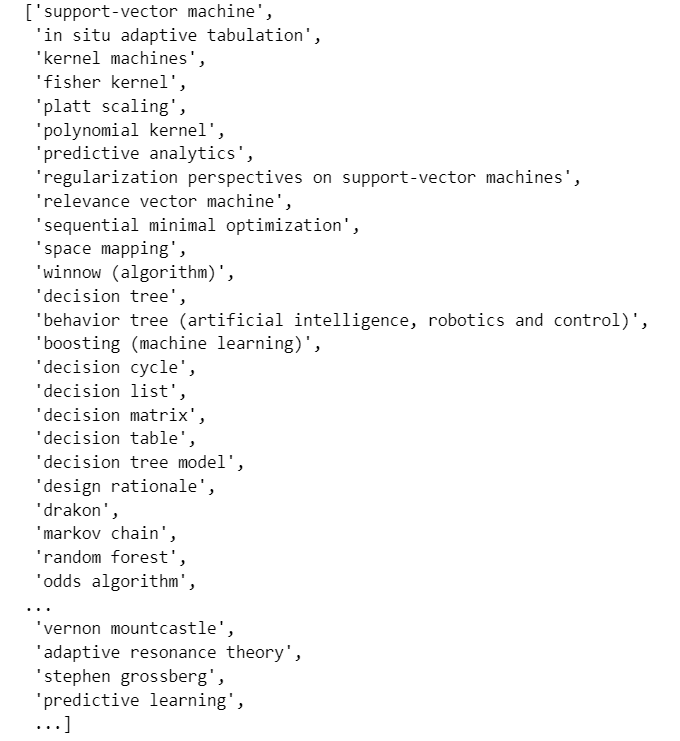
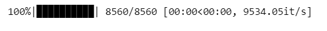

# 斯坦福大学CS224W图机器学习笔记

## 学习参考

CS224W公开课：[双语字幕 斯坦福CS224W《图机器学习》课程(2021) by Jure Leskove](https://www.bilibili.com/video/BV1RZ4y1c7Co?vd_source=55755af81e9ec7ae17d639fb86860235)

官方课程主页：[官方主页](https://web.stanford.edu/class/cs224w)

子豪兄精讲：[斯坦福CS224W图机器学习、图神经网络、知识图谱 同济子豪兄](https://www.bilibili.com/video/BV1pR4y1S7GA?vd_source=55755af81e9ec7ae17d639fb86860235)

子豪兄公开代码：[TommyZihao/zihao_course: 同济子豪兄的公开课 (github.com)](https://github.com/TommyZihao/zihao_course)

基于图的项目：

* 读论文、搜论文、做笔记、吐槽论文的社区：[ReadPaper](https://readpaper.com/)
* 可以画出来论文之间的应用关系：[CONNECTED PAPERS](https://www.connectedpapers.com/)
* 医疗知识图谱：[BIOS](https://bios.idea.edu.cn)

知识图谱专业老师：刘焕勇老师[主页](https://liuhuanyong.github.io)，[github主页](https://github.com/liuhuanyong)，[CSDN主页](https://blog.csdn.net/lhy2014)，也有公众号：老刘说NLP。

CS224W的课程目录：


往期笔记回顾：[CS224W笔记](https://github.com/lyc686/CS224W_notes/tree/main/notes)

## Task_05、DeepWalk图嵌入

## 一、简述DeepWalk

Deepwalk是用来解决图嵌入的问题的一种技术，能够使得在原图中结构相近的点，映射到d维空间之后距离相近。

Deepwalk的实现就是直接套用的`Word2Vec`（一种自然语言处理中的方法）、Deepwalk中的一个节点就对应Word2Vec中的一个单词。

* Word2Vec是认为一个单词和他**相近的单词**比较相似
  * 中心节点预测周围节点（Skip-gram）
  * 周围节点预测中心节点（CBOW）
* Deepwalk是认为一个节点和他**相近的节点**比较相似
  * 通过大量的随机游走来模拟Word2Vec中语料库的句子

## 二、Embedding嵌入

因为计算机能够识别的是向量，所以我们需要把万事万物都变成向量（表示学习/嵌入的艺术）

人工智能实现的工作就是：将一个计算机无法直接识别的问题通过嵌入的方式编码成一个向量，然后对这个向量进行后处理。人工智能的**底层逻辑**就是**嵌入**，只是说随着技术的进步，我们能够在向量中嵌入越来越多的信息，能够使得模型有越来越好的可解释性。

### 1.嵌入的艺术

在自然语言处理领域我们使用**嵌入**，能够把单词嵌入到d维的空间中，并且这个d维向量还具有原来单词的语义特征。**相似的单词**之间是**平行**的关系，如下图所示的男人---女人，国王---女王。


我们最后就可以使用这种**嵌入**的方式将研究的问题转换成计算机能够识别的向量的形式，同理一张图，一条语音也可以变成向量的形式。本质就是人工智能实现的**特征工程**的概念。

下图对比的是**有监督**和**无监督**的形式实现的对`MINIST`手写数字数据集的**语义降维可视化**结果，左图是有监督，右图是无监督。


同理当我们对于一个**知识图谱**也可以做嵌入，将多模态的数据嵌入成为向量，进行后处理。

### 2.Word2Vec词向量 词嵌入

词嵌入，顾名思义就是把一个词嵌入成为一个向量，这个向量可以表示出词与词之间的关系。

#### （1）CBOW v.s. Skip-gram

`CBOW`用周围词预测中心词、`Skip-gram`用中心词预测周围词。如下图所示，CBOW想法就是输入一连串的周围词信息，试图预测中间词。Skip-gram想法就是输入一个中心词尝试去预测周围的词。

**原理**就是因为邻近的词是相关的，是相似的，我们并不是一定要完成预测中心词或预测周围词的目的，而是要完成**词向量**的构建。通过构造出CBOW、Skip-gram这两个**自监督**的任务，我们就可以把词向量表示出来。


### 3.DeepWalk随机游走

Word2Vec中的单词对应到Deepwalk就是一个节点。我们也许并不知道全图的样子，但是我们可以通过海量的随机游走去**管中窥豹**，帮助我们去认识图中的一些信息。在Deepwalk中的假设类似Word2Vec，我们假设相邻节点应该相似，同样构造`CBOW`和`Skip-gram`的问题。比如我们使用Skip-gram我们就可以得到每一个节点的向量表。

## 三、CS224W官方ppt-DeepWalk

#### （1）基础知识

在官方的ppt中这一部分的引入使用的就是一个自然语言中的例子，如下图所示，我们使用**嵌入**的方式进行自监督学习之后，发现雏菊和玫瑰花的距离确实比老虎和玫瑰花的距离要近很多。


**长尾分布/幂律分布/2、8定律**：出现频率很高的词数量很少（and、or、of等等），大部分词出现的次数比较少，所以会呈现出一种**相差悬殊的**长尾分布/幂律分布，如下图所示：


这种长尾分布是自然界的一种普遍现象，例如少部分的人掌握着大部分的财富，少部分的网站被大量的访问（搜索引擎），图中的无标度问题也服从这样的分布，所以对于这些**相同分布**的问题我们就可以使用同样的方法来解决。

DeepWalk最酷的地方就是：**随机游走就相当于句子**。

#### （2）DeepWalk

DeepWalk是按照如下的五步进行的：

* 输入图数据
* 采样随机游走序列
* 用随机游走序列训练Word2Vec
* 为了解决最终分类过多的问题，可以添加分层softmax / 霍夫曼编码树
* 得到最终每一个节点的图嵌入向量表示


**具体的实现**就是下图所示的样子，我们首先生成一个随机游走的序列，然后对这个序列中的v1节点求Skip-gram，通过霍夫曼树的形式将最终的一个8分类的问题转化成了一个只需要进行三次分类的问题(每一个都是一个二分类的逻辑回归)。

在这个分层softmax / 霍夫曼树里面有**两套参数**，一套是Skip-gram里面用于优化词嵌入向量的权重参数，另一套是逻辑回归计算交叉熵损失函数的权重参数，这两组权重同时优化最终得到最后的结果。


`DeepWalk`可以在图中标注非常少的时候取得优于其他算法的效果，同时也可以用用在非常大的图中。而且还可以同时用**多卡**来进行训练，大大降低训练时间而且不会出现训练不好的效果。

#### （3）改进和未来展望

* **Streaming**

我们不需要知道这个图的全貌，我们只需要直接随机游走管中窥豹即可

* **Non-Random Walks**

不完全随机，可以有一些倾向性（传送回起点，或者更愿意探索邻域还是探索远方），能够更加优化我们的随机游走

* 把我们的随机游走当作是一种语言，反过来语言也是图，两个领域可以相辅相成。

## 四、DeepWalk论文精读

论文：`《DeepWalk Online Learning of Social Representations》`

**知识点汇总**

* **论文背景相关知识**

  * `Online Learning在线`指的是即来即训的算法，当有一个新的节点出现或者新的连接出现，只需要去训练新的关系构建随机游走序列，进行**增量学习**进行**迭代**更新原有的模型中。对应于`Offline Learning`

  * `Social Representations`指的就是网络的图嵌入表示，所以图嵌入既是机器学习也是表示学习。

  * 常见的机器学习方法（线性分类、逻辑回归、神经网络、支持向量机）都是**统计学习方法**都要求我们将一个研究问题用**向量**的形式进行输入，所以就需要我们先把研究问题表示成一个D维的向量。区别于**硬编码的专家系统**（设置非常复杂的人工规则，例如复杂的if-else）
* **DeepWalk相关知识**
  * DeepWalk将Word2Vec应用在了图中，也是一种**无监督**的**表示学习**
  * 通过限定**随机游走步长**来使用**机器学习**的方式自动学习特征
  * 节点对应单词，随机游走序列对应句子
  * DeepWalk这种基于**局部**的求解比常见的基于**全局**的算法效果好，尤其是在非常大的图、标注非常少的的图中效果非常明显。
  * 随机游走并不需要了解图的全貌就可以去管中窥豹，通过大量的随机游走序列反应全图中的信息。
  * DeepWalk做图嵌入的**本质**：原图中相近的节点嵌入后依然相近。
  * 图嵌入领域中的**“果蝇”**：空手道数据集。
  * 异质图`heterogeneous graphs`
  * Deepwalk的优势：
    * 灵活可变，弹性扩容（新节点、新连接出现可以很简单的加入原模型）
      * <font color="blue">注意：这里提到的对于新节点出现的时候的灵活，指的是重新采样随机游走序列训练即可，很“容易”。
        按照后面GCN论文说的，新节点出现的时候仍然要重新训练，是Transductive Learning直推式学习，并“不容易”。所以关键在于对“容易”的定义。</font>
    * 反应社群聚类信息（原图中结构相似的节点嵌入后依然相近）
    * 低维（低维嵌入有利于防止过拟合）
    * 连续（最终的分类边界非常平滑、可以观察到不同样本细微的差别）
    * 稠密（特征为0的非常少）
    * 异步并行（可以多个线程或者电脑同时跑多个mini-batch然后最终的梯度下降结果汇总到一个电脑中做最终的梯度下降更新，就可以一次性输入一个个非常大的batch分给各个小电脑去一人一个mini-batch）
* 图（**交叉学科**），可以归到如下领域中：
  * 数据库
  * 人工智能
  * 模式识别
  * 统计学
* **取关键词的心得**：希望论文的潜在用户搜什么样的词能把论文搜出来，就把这些词作为关键词。
* **连接的稀疏性**
  * 图中的数据随着图的不断增大会越来越稀疏（节点数>边数）
  * 而对于稀疏的节点使用**统计机器学习模型**来做分类、回归预测，效果会非常不好，因为机器学习希望看到的特征都是：
    * 希望特征都有用
    * 希望特征0少1多
  * 但是对于一些**离散算法**连接稀疏往往是比较有效的，例如**求最短距离**。
  * DeepWalk是首次把**深度学习**方法应用在了**图数据挖掘**中。
    * 将数据嵌入成了**连续**、**低维**、**稠密**的D维向量。
* **数据集的特点**
  * 独立同分布
    * 例如**鸢尾花**和**MINIST手写数字**数据集，这种图像之间没有边相连的图像称为**独立**
    * 然而不同图像之间又是满足同样的性质（都是花、都是数字）称为**同分布**
  * 在图中节点之间是有联系的
    * 既不满足独立，也不满足同分布。
    * 所以不能直接使用传统机器学习方法将一张图数据直接输入模型，需要我们先通过嵌入的方式将其变成向量。
* **节点分类、集体分类、关系分类说的是一回事**
  * **吉布斯采样**：对无向的马尔可夫链进行采样（现在用的很少了）
  * DeepWalk中**不把标签和连接特征进行混合**，只在Embedding中编码**连接**信息
    * 把网络的标签信息和连接信息分开，可以防止一步错步步错的误差累积。
* **幂律分布、长尾分布、二八定律**
  * 幂律分布指的是在**无标度网络中**节点分布严重不均，少数中枢节点拥有极其多的连接，节点的**度**呈现**幂律分布、长尾分布、二八分布**。
  * 区别于**随机网络**，没有连接数远大于其他节点的中枢节点，节点的**度**呈现**正态分布**。
  * 现实中的网络多数都是无标度网络
* **语言模型**
  * 用前n-1个词预测第n个词
  * 能够反应出一句话出现的**似然概率**，所以语言模型也叫通顺度模型
    * 我爱写代码（似然概率高）
    * 代码爱写我（似然概率低）
  * Word2Vec用周围词预测中心词，也算是一种语言模型d 推广
  * DeepWalk把节点看作单词，也算一种语言模型的推广
    * 由于正常计算Skip-gram最后需要将嵌入的向量进行分类来预测周围词，而当节点数很多比如1亿个的时候，分类非常慢，也许地球毁灭都没预测出来。
    * 分类最后的softmax的分母也会由于节点数太多而难以计算
    * **n层softmax**，将大量的节点用简单的二分类进行表示，比如8个节点用3个二分类表示，二分类中的参数量与嵌入表示的D维向量一致。
    * 使用n层softmax之后复杂度从O(n)变成了O(logn)

## 五、DeepWalk代码实战

**维基百科词条图嵌入可视化**

通过维基百科中每一个词条下面的`See also`（相近词条的引用），在这个图中每一个节点就是一个词条，关系就是相互的引用，在此基础上使用DeepWalk来把每一个节点编码成D维向量，最终将为可视化出D维向量。

**参考资料**


1. https://www.analyticsvidhya.com/blog/2019/11/graph-feature-extraction-deepwalk/
2. https://github.com/prateekjoshi565/DeepWalk

### 1.安装配置工具

`gensim`是自然语言处理领域的一个工具包，所以自然语言处理和随机游走其实是相通的。

```python
!pip install networkx gensim pandas numpy tqdm scikit-learn matplotlib
```

导入工具包

```python
import networkx as nx # 图数据挖掘

# 数据分析
import pandas as pd
import numpy as np

import random # 随机数
from tqdm import tqdm # 进度条

# 数据可视化
import matplotlib.pyplot as plt
%matplotlib inline

plt.rcParams['font.sans-serif']=['SimHei']  # 用来正常显示中文标签  
plt.rcParams['axes.unicode_minus']=False  # 用来正常显示负号
```

### 2.获取维基百科网页引用关联数据

1. 打开网站（**爬虫网站**）`https://densitydesign.github.io/strumentalia-seealsology`

2. Distance（爬取跳数）设置为`4`

3. 输入以下链接（一个或者几个链接都可以）

​		https://en.wikipedia.org/wiki/Computer_vision

​		https://en.wikipedia.org/wiki/Deep_learning

​		https://en.wikipedia.org/wiki/Convolutional_neural_network

​		https://en.wikipedia.org/wiki/Decision_tree

​		https://en.wikipedia.org/wiki/Support-vector_machine

4. 点击`START CRAWLING`，爬取1000个网页之后，点击`STOP & CLEAR QUEUE`

5. Download-下载TSV文件（TSV与CSV很相似，只不过CSV用逗号分隔，TSV用制表符\t分隔），保存至代码相同目录，命名为`seealsology-data.tsv`

   文件中每一条的第一列是起始节点，第二列是终止节点表示这两个节点有关系

```python
df = pd.read_csv("seealsology-data.tsv", sep = "\t")
df.head()
```


```python
df.shape
```


### 3.构建无向图

但凡是类似这种没有指定方向的图都可以用这种方式构建**无向图**

```python
G = nx.from_pandas_edgelist(df, "source", "target", edge_attr=True, create_using=nx.Graph())

# 节点个数
len(G)
```


可视化（节点太多就不必可视化了，堆在一起没什么效果）

```python
# # 可视化
# plt.figure(figsize=(15,14))
# nx.draw(G)
# plt.show()
```

### 4.生成随机游走节点序列的函数

```python
def get_randomwalk(node, path_length):
    '''
    输入起始节点和路径长度，生成随机游走节点序列
    '''
    
    random_walk = [node]
    
    for i in range(path_length-1):
        # 汇总邻接节点
        temp = list(G.neighbors(node))
        temp = list(set(temp) - set(random_walk))    
        if len(temp) == 0:
            break
        # 从邻接节点中随机选择下一个节点
        random_node = random.choice(temp)
        random_walk.append(random_node)
        node = random_node
        
    return random_walk
```

将所有的词条放入一个列表中

```python
all_nodes = list(G.nodes())
all_nodes
```



随机游走，从`random forest`开始走五步，发现确实是把相似的一些节点随机游走出来（此时都是一些集成算法）

```python
get_randomwalk('random forest', 5)
```


### 5.生成随机游走序列

```python
gamma = 10 # 每个节点作为起始点生成随机游走序列个数
walk_length = 5 # 随机游走序列最大长度

random_walks = []

for n in tqdm(all_nodes): # 遍历每个节点
    for i in range(gamma): # 每个节点作为起始点生成gamma个随机游走序列
        random_walks.append(get_randomwalk(n, walk_length))
        
# 生成随机游走序列个数
len(random_walks)

# 查看第二个随机游走序列
random_walks[1]
```




### 6.训练Word2Vec模型

```python
from gensim.models import Word2Vec # 自然语言处理

model = Word2Vec(vector_size=256, # Embedding维数
                 window=4, # 窗口宽度
                 sg=1, # Skip-Gram
                 hs=0, # 不加分层softmax
                 negative=10, # 负采样
                 alpha=0.03,  # 初始学习率
                 min_alpha=0.0007, # 最小学习率
                 seed=14 # 随机数种子
                )

# 用随机游走序列构建词汇表
model.build_vocab(random_walks, progress_per=2)

# 训练（耗时1分钟左右）
model.train(random_walks, total_examples=model.corpus_count, epochs=50, report_delay=1)
```


### 7.分析Word2Vec(训练DeepWalk本质就是Word2Vec)

```python
# 查看某个节点的Embedding
model.wv.get_vector('random forest').shape

model.wv.get_vector('random forest')
```


```python
# 找相似词语
model.wv.similar_by_word('decision tree')
```


### 8.PCA降维可视化

**PCA是一种线性降维的算法，效果并不一定很好**

可视化全部词条的二维Embedding

```python
X = model.wv.vectors

# 将Embedding用PCA降维到2维
from sklearn.decomposition import PCA
pca = PCA(n_components=2)
embed_2d = pca.fit_transform(X)

embed_2d.shape

plt.figure(figsize=(14,14))
plt.scatter(embed_2d[:, 0], embed_2d[:, 1])
plt.show()
```


### 9.可视化某个词条的二维Embedding

```python
term = 'computer vision'

term_256d = model.wv[term].reshape(1,-1)
term_256d.shape

term_2d = pca.transform(term_256d)
term_2d

# 可视化
plt.figure(figsize=(14,14))
plt.scatter(embed_2d[:,0], embed_2d[:,1])
plt.scatter(term_2d[:,0],term_2d[:,1],c='r',s=200)
plt.show()
```


### 10.可视化某些词条的二维Embedding

```python
# 计算PageRank重要度
pagerank = nx.pagerank(G)
# 从高到低排序
node_importance = sorted(pagerank.items(), key=lambda x:x[1], reverse=True)

# 取最高的前n个节点
n = 30
terms_chosen = []
for each in node_importance[:n]:
    terms_chosen.append(each[0])
    
# 手动补充新节点
terms_chosen.extend(['computer vision','deep learning','convolutional neural network','convolution','natural-language processing','attention (machine learning)','support-vector machine','decision tree','random forest','computational imaging','machine vision','cognitive science','neuroscience','psychophysics','brain','visual cortex','visual neuroscience','cognitive model','finite difference','finite difference time domain','finite difference coefficients','finite difference methods for option pricing','iso 128','iso 10303'])


terms_chosen
```


```python
# 输入词条，输出词典中的索引号
term2index = model.wv.key_to_index

# index2term = model.wv.index_to_key
# term_index = np.array(term2index.values())

# 可视化全部词条和关键词条的二维Embedding
plt.figure(figsize=(14,14))
plt.scatter(embed_2d[:,0], embed_2d[:,1])

for item in terms_chosen:
    idx = term2index[item]
    plt.scatter(embed_2d[idx,0], embed_2d[idx,1],c='r',s=50)
    plt.annotate(item, xy=(embed_2d[idx,0], embed_2d[idx,1]),c='k',fontsize=12)
plt.show()
```


### 11.T-SNE降维可视化

可视化全部词条的二维Embedding

```python
# 将Embedding用TSNE降维到2维
from sklearn.manifold import TSNE
tsne = TSNE(n_components=2, n_iter=1000)
embed_2d = tsne.fit_transform(X)

plt.figure(figsize=(14,14))
plt.scatter(embed_2d[:, 0], embed_2d[:, 1])
plt.show()
```


可视化全部词条和关键词条的二维Embedding

```python
plt.figure(figsize=(14,14))
plt.scatter(embed_2d[:,0], embed_2d[:,1])
embed_2d.shape

for item in terms_chosen:
    idx = term2index[item]
    plt.scatter(embed_2d[idx,0], embed_2d[idx,1],c='r',s=50)
    plt.annotate(item, xy=(embed_2d[idx,0], embed_2d[idx,1]),c='k',fontsize=12)
plt.show()
```


### 12.导出T-SNE降维到二维之后的Embedding

```python
terms_chosen_mask = np.zeros(X.shape[0])
for item in terms_chosen:
    idx = term2index[item]
    terms_chosen_mask[idx] = 1
    
df = pd.DataFrame()
df['X'] = embed_2d[:,0]
df['Y'] = embed_2d[:,1]
df['item'] = model.wv.index_to_key
df['pagerank'] = pagerank.values()
df['chosen'] = terms_chosen_mask

print(df)

df.to_csv('tsne_vis_2d.csv',index=False)
```


### 13.T-SNE可视化全部词条的三维Embedding

```python
# 将Embedding用TSNE降维到3维
from sklearn.manifold import TSNE
tsne = TSNE(n_components=3, n_iter=1000)
embed_3d = tsne.fit_transform(X)

plt.figure(figsize=(14,14))
plt.scatter(embed_3d[:,0], embed_3d[:,1])
embed_3d.shape

for item in terms_chosen:
    idx = term2index[item]
    plt.scatter(embed_3d[idx,0], embed_2d[idx,1],c='r',s=50)
    plt.annotate(item, xy=(embed_3d[idx,0], embed_3d[idx,1]),c='k',fontsize=12)
plt.show()
```


### 14.导出T-SNE降维到三维之后的Embedding

```python
df = pd.DataFrame()
df['X'] = embed_3d[:,0]
df['Y'] = embed_3d[:,1]
df['Z'] = embed_3d[:,2]
df['item'] = model.wv.index_to_key
df['pagerank'] = pagerank.values()
df['chosen'] = terms_chosen_mask

print(df)

df.to_csv('tsne_vis_3d.csv',index=False)
```


### 15.扩展：

用`tsne_vis_2d.csv`和`tsne_vis_3d.csv`做可视化


参考代码：https://echarts.apache.org/examples/zh/editor.html?c=scatter3d&gl=1&theme=dark

## 六、简述Node2Vec

### 1.KDD

一般和图、图神经网络、知识图谱相关的论文就会发布在KDD这个网站上。

在YouTube2016上有KDD2016的内容分享包括了三篇非常著名的论文（可解释性分析领域的LIME，自动生成rapper歌词，Node2Vec）

### 2.图嵌入

DeepWalk，Node2Vec的核心本质都是做**图嵌入**，想要把研究问题（节点、连接、子图、全图）嵌入 / 编码 成为一个低维连续稠密的d维向量，以便于输入到计算机中进行下游任务处理。

图嵌入的方法也是多种多样的，比如：

* 手工构造特征（可解释性好，但是特征不一定真的有用）
* 矩阵分解（把邻接矩阵做分解、把图的拉普拉斯矩阵做分解，用降维算法把矩阵做分解得到低维向量）-- 注：一般矩阵分解拿出来都是让其他方法来吊打的。
* 随机游走
* 图神经网络

### 4.DeepWalk的缺点

虽然DeepWalk可以把原图中相近的点再嵌入之后依旧相近，但是也正是这种局部性的存在，使得他没有办法使得原图中距离较远的相似的点嵌入到低维中仍然相近。

如下图所示，苏伊士运河和巴拿马运河都是交通咽喉但是由于原图中距离较远使得他在DeepWalk嵌入之后并不相近。


### 5.Node2Vec的随机游走策略

在`DeepWalk`中的随机游走是**完全随机**的游走，而在`Node2Vec`中的随机游走是**有策略**的随机游走（三种选择：**徘徊**-α=1、**返回**-α=1/p、**远行**-α=1/q）所以`Node2Vec`是一种**有偏**的随机游走（与p、q的大小有关）也叫做**二阶**随机游走，即每次的随机游走需要记录上一次的节点以便于返回。

* p大q小，更愿意探索远方（深度优先DFS）
* p小q大，更愿意探索近邻（广度优先BFS）
* 对于无向图每次节点移动就用α x 权重(1)，对于有向图每次节点移动就用α x 相应的权重。然后这个相乘的结果作为新的权重，对每一个节点的所有邻居的新权重进行**归一化**，以此来获得向各个邻居移动的**概率**，从而逐步生成随机游走序列。

DeepWalk也可以看作是一个p=1、q=1的特例。

### 6.Node2Vec的优缺点

优点：

* 通过调节p、q值，实现有偏ui既有走，探索节点社群、功能等等不同的属性
* 首次把节点分类用于连接预测
* 可解释性、可扩展性好，性能卓越
* 斯坦福CS224W公开课主讲人亲自带货

缺点：

* 需要大量随机游走序列训练（管中窥豹）
* 距离较远的节点任然无法直接相互影响，看不到全图信息
* 无监督，仅使用图的连接信息编码，没有使用节点的属性信息
* 没有真正的用到神经网络和深度学习

## 七、Node2Vec论文精读

论文：`《Scalable Feature Learning for Networks》` - 可扩展的图嵌入表示学习算法

**知识点汇总：**

* **Node2Vec相关知识**

  * Node2Vec可以学得比DeepWalk更多的节点的信息
  * 嵌入得到的向量具有**低维、连续、稠密**的特征
  * Node2Vec使用**极大似然估计**来实现向量的训练
  * 使用**有偏**的游走灵活地探索更多的特征
  * Node2Vec可以完成基础的节点分类任务（判断老赖）、也可以相似的把连接预测问题抽象为节点分类的任务

* `homophily(同质社群)`和`structural equivalence(节点角色)`（**用节点嵌入实现连接嵌入**）

  * 通过对两个相连节点的嵌入向量进行**逐元素的相乘**可以实现用节点嵌入表示连接嵌入
  * **homophily(同质社群)**是基于DFS深度优先的情况下得到的结果，即，距离很远的两个相似的节点也会被嵌入到d维空间中位置相近。
    * 这种能够识别homophily(同质社群)的节点嵌入也可以反映连接嵌入
    * 由于DFS捕获的是距离较远的信息，所以节点之间的**方差大**（来自不同地方的节点差异较大）
  * **structural equivalence(节点角色)**是基于BFS广度优先的情况下得到的结果，即，节点的相近邻域内可以查到哪一个是中枢节点，哪一个是桥接结点。
    * 由于BFS捕获的是局部的信息，所以节点之间的**方差小**（来自相近的地方）
  * 一张图使用图嵌入之后可以同时具有homophily和structural equivalence两种特质。

* **基于矩阵分解的图嵌入**

  * **图的谱属性**

    * 无监督学习和网络中经常使用图的谱属性，图的谱属性就可以理解为是节点的邻域属性
    * **谱聚类**的先验假设是我们使用`graph cuts`是有利于分类的，但是这种假设是否科学（在很多场合其实不科学）

  * **拉普拉斯矩阵**

    * 可以理解为是求二阶偏导
    * 可以理解为对于图像这种**离散**的属性也进行了求二阶偏导
    * 拉普拉斯矩阵 `L = D - A `（D是**度矩阵**，但是只在**对角线**上有值，表示的是每一个节点的度/连接数，A是**邻接矩阵**）

    * 归一化的拉普拉斯矩阵
      * 归一化的拉普拉斯矩阵L<sub>n</sub> = D<sup>-1/2</sup>LD<sup>1/2</sup> = I - D<sup>-1/2</sup>AD<sup>1/2</sup> (I是单位矩阵)

  * **矩阵分解的缺点**

    * 当矩阵**非常大**的时候特征值非常难以计算，所以深度学习往往是用其他方法去寻找**近似解**而不是解析解
    * 而且矩阵分解无法反应如`homophily`和`structural equivalence`这样的节点和连接的特征
    * 一般矩阵分解都是用来被吊打作比较的

* **无监督学习的好处**

  * 如果是有监督学习，那么最终的下游任务就要和标签有关
  * 但是无监督学习下游任务没有限制，所以无监督学习出来的图嵌入向量具有**普适性**

* **Skip-gram损失函数**

  * 
  * 根据当前节点u的嵌入向量计算邻居节点预测结果，使得红框内的结果最大化，遍历图中的所有节点分别作为u。
  * 为了让问题容易处理，做如下假设：
    1. **周围节点互不影响**（输入节点u去计算第一个邻居节点和第二个邻居节点之间互不影响），即，**条件独立（马尔科夫假设）**
       * 我们就可以使得累加变成**连乘**
       * 
    2. **两个节点之间相互影响的程度一样（对称性）**
       * 比如节点u对节点v的影响为x，那么节点v对节点u的影响也是x
       * 最终计算就是使用softmax
       * 
       * 将绿色部分替换为`Zu`如下所示
       * 
       * 当节点数比较多的时候绿色这一部分非常难以计算，可以使用**分层softmax**或者**负采样**的方法来进行简化和改进。
  * **真实情况**是广度优先(捕获节点角色)和深度优先(捕获同质社群)这两种**极端**的**混合**。

* **时间复杂度与空间复杂度**

  * 随着硬件的发展，空间复杂度就显得不是那么重要（总能存的下）
    * 用于**存储**的空间复杂度是`O(|E|)`即，存一个**邻接表**的大小即可。
    * 用于**随机游走**的空间复杂是`O(a^2|V|)`**a是每个节点的平均连接数**，需要a的平方是因为，我们是考虑二阶的马尔科夫，所以需要当前节点的平均连接数和上一个节点的平均连接数，再乘以节点个数。
  * 而时间复杂度直接导致了**算力**的问题，所以还是很有必要考虑到
    * 此时的时间复杂度是`O(l/k(l-k)) = O(1/k + 1/(l-k))`，k是邻域的节点个数，l是可以由人为控制的，l越大，节点越容易被采样。
    * 可以理解为1/k为领域中一个节点已经被**采样**的概率，1/(l-k)是在步长为l的随机游走中这个节点在**之后**被采样的概率。k是一个无法改变的**常数**（不一定是人为设置的，比如邻域内结点的个数会随着邻域这个概念定义的不同而发生变化，但是本质上都是个无法改变的常数）

* **Node2Vec算法的步骤**

  * 1. 生成随机游走采样策略
    2. 每个节点生成r个随机游走序列
    3. Skip-gram训练随机游走序列得到节点嵌入表示

  * 采样算法**AliasSample(V<sub>curr</sub>, π)**

    * 是一种采样策略用于找到下一个节点
    * **算法**的时间复杂度为`O(1)`
    * **预处理**的时间复杂度为`O(n)`，是一种用空间（预处理）换时间的算法（一劳永逸，只需要在预处理的时候直接生成基于图G和参数p、q的表π，后续就只需要O(1)的时间复杂度）
    * 而且适用于**大量反复抽样**情况下，使得优势更突出。
    * 实现了**离散分布抽样**转换为了**均匀分布抽样**，我们只需要生成一个连续的离散的随机数就可以转换成连续的均匀分布。

    

* **实验**：结果总而言之就是说效果相当不错。
  * 每次实验都是在相同的条件下进行
    * LINE - 前d/2维向量是根据BFS学习得来，后2/d维向量是2-hop（更远的特征）（由于有一种人工特征的感觉，所以这种方法其实效果受限，我们只能让他去近似其他方法）
    * 矩阵分解效果拉跨一般会拿来做对比
    * DeepWalk效果优于之前的方法
    * Node2Vec又更加优秀
    * **标注数据**越多，Node2Vec效果越好
  * 在智人蛋白质数据集上，DeepWalk可以视为Node2Vec的性能下界
  * 每次随机游走的**d(嵌入维度)**、**r(每个节点的随机游走序列生成次数)**、**l(每个节点的随机游走序列长度)**、**k(邻域节点个数)**都是**统一**的，而且每组实验都要做10次，每次用不同的**随机数种子**，并且要对这10次的结果进行p-value检验（显著性检验）才能证明实验是科学的。**参数p、q值**是通过**10折交叉验证**和**网格搜索(p、q排列组合来遍历{0.25, 0.50, 1, 2, 4}这五个值一共25种排列组合)**得来的。
  * 可以利用分类出**一对节点**来完成两节点之间的连接预测
* **探索-利用困境**
  * 是应该广度优先呢还是深度优先呢，好比读论文是应该看多个领域的文章还是在一个领域不断向深处探索。
  * Node2Vec就可以通过调整，来控制更偏向BFS还是DFS（参数p、q），所以我们对于Node2Vec由不错的可解释性。
  * BFS - structural equivalence
  * DFS - homophily
