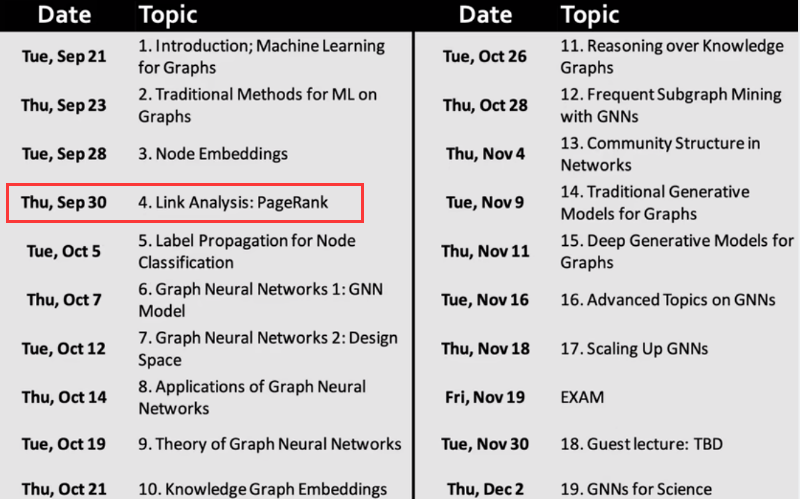

# 斯坦福大学CS224W图机器学习笔记

## 学习参考

CS224W公开课：[双语字幕 斯坦福CS224W《图机器学习》课程(2021) by Jure Leskove](https://www.bilibili.com/video/BV1RZ4y1c7Co?vd_source=55755af81e9ec7ae17d639fb86860235)

官方课程主页：[官方主页](https://web.stanford.edu/class/cs224w)

子豪兄精讲：[斯坦福CS224W图机器学习、图神经网络、知识图谱 同济子豪兄](https://www.bilibili.com/video/BV1pR4y1S7GA?vd_source=55755af81e9ec7ae17d639fb86860235)

子豪兄公开代码：[同济子豪兄CS224W公开课](https://github.com/TommyZihao/zihao_course/tree/main/CS224W)

基于图的项目：

* 读论文、搜论文、做笔记、吐槽论文的社区：[ReadPaper](https://readpaper.com/)
* 可以画出来论文之间的应用关系：[CONNECTED PAPERS](https://www.connectedpapers.com/)
* 医疗知识图谱：[BIOS](https://bios.idea.edu.cn)

知识图谱专业老师：刘焕勇老师[主页](https://liuhuanyong.github.io)，[github主页](https://github.com/liuhuanyong)，[CSDN主页](https://blog.csdn.net/lhy2014)，也有公众号：老刘说NLP。

CS224W的课程目录：



往期笔记回顾：[CS224W笔记](https://github.com/lyc686/CS224W_notes/tree/main/notes)

## Task_06、PageRank

## 一、代码实战

### 1.环境工程

**安装和导入工具包**

```python
!pip install networkx numpy matplotlib
```

```python
import networkx as nx # 图数据挖掘
import numpy as np # 数据分析
import random # 随机数
import pandas as pd

# 数据可视化
import matplotlib.pyplot as plt
import matplotlib as mpl
%matplotlib inline
plt.rcParams['font.sans-serif']=['SimHei']  # 用来正常显示中文标签  
plt.rcParams['axes.unicode_minus']=False  # 用来正常显示负号
```

### 2.导入样例数据集

**OpenKG中文开放知识图谱**-四大名著人物关系知识图谱和OWL本体：http://www.openkg.cn/dataset/ch4masterpieces

```python
# 导入 networkx 自带的数据集

# 空手道俱乐部数据集
# G = nx.karate_club_graph()

# 《悲惨世界》人物数据集
# G = nx.les_miserables_graph()

# 导入 csv 文件定义的有向图
# df = pd.read_csv('data/西游记/triples.csv')
df = pd.read_csv('data/三国演义/triples.csv')
```

```python
df
```


```python
edges = [edge for edge in zip(df['head'], df['tail'])]

G = nx.DiGraph()
G.add_edges_from(edges)

print(G)

print(G.nodes)

print(len(G))

# 可视化
plt.figure(figsize=(15,14))
pos = nx.spring_layout(G, iterations=3, seed=5)
nx.draw(G, pos, with_labels=True)
plt.show()
```


### 3.计算节点PageRank值

```python
pagerank = nx.pagerank(G,                     # NetworkX graph 有向图，如果是无向图则自动转为双向有向图
                       alpha=0.85,            # Damping Factor
                       personalization=None,  # 是否开启Personalized PageRank，随机传送至指定节点集合的概率更高或更低
                       max_iter=100,          # 最大迭代次数
                       tol=1e-06,             # 判定收敛的误差
                       nstart=None,           # 每个节点初始PageRank值      
                       dangling=None,         # Dead End死胡同节点
                      )

pagerank
```


**按PageRank值从高到低排序**

```python
sorted(pagerank.items(),key=lambda x : x[1], reverse=True)
```


### 4.节点尺寸可视化PageRank值

参考代码：https://networkx.org/documentation/stable/auto_examples/drawing/plot_directed.html#sphx-glr-auto-examples-drawing-plot-directed-py

```python
# 节点尺寸
node_sizes = (np.array(list(pagerank.values())) * 8000).astype(int)

print(node_sizes)

# 节点颜色
M = G.number_of_edges()
edge_colors = range(2, M + 2)

plt.figure(figsize=(15,14))

# 绘制节点
nodes = nx.draw_networkx_nodes(G, pos, node_size=node_sizes, node_color=node_sizes)

# 绘制连接
edges = nx.draw_networkx_edges(
    G,
    pos,
    node_size=node_sizes,   # 节点尺寸
    arrowstyle="->",        # 箭头样式
    arrowsize=20,           # 箭头尺寸
    edge_color=edge_colors, # 连接颜色
    edge_cmap=plt.cm.plasma,# 连接配色方案，可选：plt.cm.Blues
    width=4                 # 连接线宽
)

# 设置每个连接的透明度
edge_alphas = [(5 + i) / (M + 4) for i in range(M)]
for i in range(M):
    edges[i].set_alpha(edge_alphas[i])

# # 图例
# pc = mpl.collections.PatchCollection(edges, cmap=cmap)
# pc.set_array(edge_colors)
# plt.colorbar(pc)

ax = plt.gca()
ax.set_axis_off()
plt.show()
```


