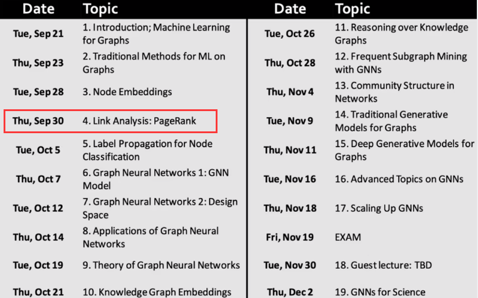
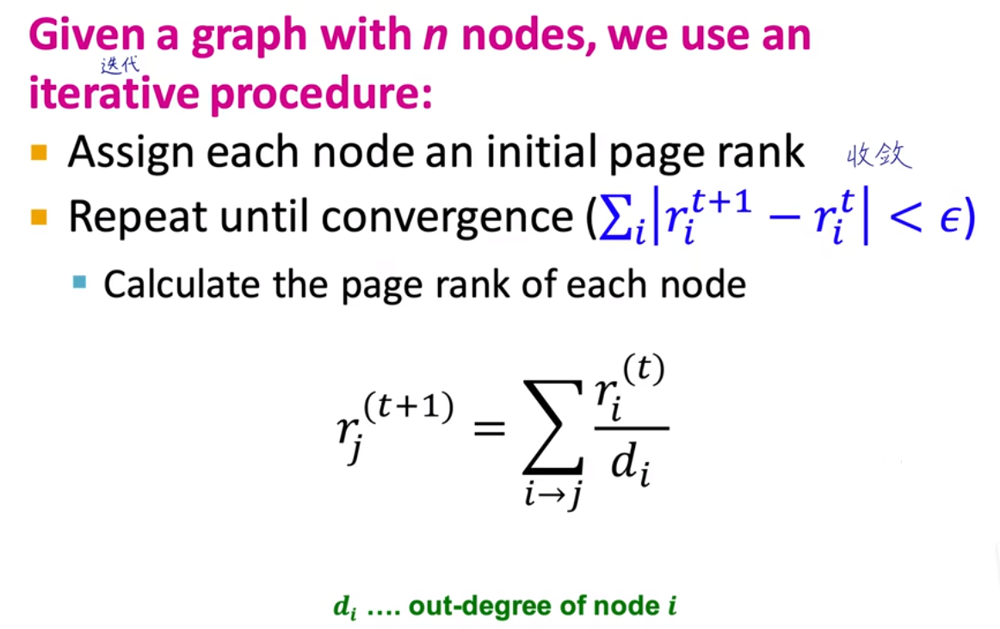

# 斯坦福大学CS224W图机器学习笔记

## 学习参考

CS224W公开课：[双语字幕 斯坦福CS224W《图机器学习》课程(2021) by Jure Leskove](https://www.bilibili.com/video/BV1RZ4y1c7Co?vd_source=55755af81e9ec7ae17d639fb86860235)

官方课程主页：[官方主页](https://web.stanford.edu/class/cs224w)

子豪兄精讲：[斯坦福CS224W图机器学习、图神经网络、知识图谱 同济子豪兄](https://www.bilibili.com/video/BV1pR4y1S7GA?vd_source=55755af81e9ec7ae17d639fb86860235)

子豪兄公开代码：[同济子豪兄CS224W公开课](https://github.com/TommyZihao/zihao_course/tree/main/CS224W)

基于图的项目：

* 读论文、搜论文、做笔记、吐槽论文的社区：[ReadPaper](https://readpaper.com/)
* 可以画出来论文之间的应用关系：[CONNECTED PAPERS](https://www.connectedpapers.com/)
* 医疗知识图谱：[BIOS](https://bios.idea.edu.cn)

知识图谱专业老师：刘焕勇老师[主页](https://liuhuanyong.github.io)，[github主页](https://github.com/liuhuanyong)，[CSDN主页](https://blog.csdn.net/lhy2014)，也有公众号：老刘说NLP。

CS224W的课程目录：

往期笔记回顾：[CS224W笔记](https://github.com/lyc686/CS224W_notes/tree/main/notes)

## Task_06、PageRank算法

## 一、PageRank小知识

PageRank是谷歌提出的一个非常高效一种由根据网页之间相互的超链接计算的技术，而作为网页排名的要素之一，谷歌根据这一个评价指标来体现网页的相关性和重要性。

## 二、互联网的图表示

互联网用图表示，就是将每一个网页作为一个**节点**，每一条网页的引用作为一条**连接**，是带有方向的。PageRank的最大贡献就是将互联网看作一个**整体**表示成了一张图（有向图），但是现在由于网页使用的非常普遍，随时都在动态变化，而且还有一些**暗物质**的区域，比如个人微信的朋友圈，是无法被直接爬取的，所以现在互联网很难的用一张图表示出来。

### 1.PageRank算法及其变体

当网络的图已经表示出来之后，我们就需要去计算每一个网页的**重要度**：

* 无标度网络：少数的网页被大量引用，而大多数的网页引用较少（幂律分布）
* 区别于**随机网络**，没有连接数远大于其他节点的中枢节点，节点的**度**呈现**正态分布**。

本次任务主要学习一下三种`PageRank`算法：

* 计算节点**重要度** - 可以用在**搜索引擎**
  * PageRank本身

* 计算节点**相似度** - 可以用在**推荐系统**
  * Personalized PageRank(PPR)
  * Random Walk with Restarts

### 2.连接的介绍

网页的连接（link）分为两种`In-coming links`和`Out-going links`，一种是我引用别人，另一种是别人引用我。在分析节点重要度的时候我们需要考虑`Out-coming links`。这是一个递归求解重要度的问题，即，计算网页A的重要度，需要看所有引用网页A的网页的重要度，而所有引用网页A的网页的重要度又要看所有引用......无限套娃。

理解递归问题的五个角度（同一件事）：

* 迭代求解线性方程组
* 迭代左乘M矩阵
* 矩阵的特征向量
* 随机游走
* 马尔科夫链

下面针对这五个角度我们分别来讨论一下：

#### 1. 迭代求解线性方程组

如下图所示，我们要求解`j`节点的`PageRank`，一共有两个节点指向`j`节点，分别是`i`和`k`，这就是一次迭代。

注意：这里我们的所有节点的Out-coming links的权重都是相同的，例如节点i指向节点j的是ri / 3因为i一共有三条Out-coming links，但是这样是否合理还需要思考一下。

下面是一个经典例子：

看似是三个方程三个未知数，其实就是一个方程两个未知数，带入之后发现得到一个**恒等式**ry = ry，所以还需要添加一组限制条件，即ri + rm + ry  = 1

这种联立方程组求解的方法被称为**高斯消元法**，随着连接数量的增多，这个方法越来越难解。

下面是另一个具体计算的例子，**每一列表示一次迭代，且每一列求和为1，初始状态大家的PageRank都是1/4**。

#### 2.迭代左乘M矩阵

还是用上面这个例子，在我们初始的PageRank全为1/4的前提下，左乘一个矩阵M（每一个元素值对应一个`Out-coming links`的权重）相当于完成了一次迭代。

这个矩阵`M`称为`Stochastic adjacency matrix`或者`column stochastic matrix`表示每一列求和都是1。右侧的矩阵`r`表示的是当前节点的PageRank值，一共n个节点`r`就是n维向量，每一个元素表示第i个节点的PageRank值，所有PageRank值求和也为1。具体计算式如下图所示：

#### 3.矩阵的特征向量

一个矩阵实际上就是对应一种**线性变换**（原点不变，可以做缩放可以旋转，但是不能平移），例如[0, 1] -> [0, 3]表示放大3倍。

**特征向量**：矩阵在**特征向量的方向**上缩放**特征值**的倍数，使得所得的向量与原来的向量**平行**。其他方向线性变换之后的向量都和原向量**不平行**。

根据我们习惯的**线性代数**中求解特征值和特征向量的式子：我们可以看作是特征向量`v`左乘矩阵A做了一个线性变换，这个线性变换的结果是一个`λ`倍数的放缩。

最终我们上一步的**r = M · r**可以看作是**1 · r = M · r**做左乘矩阵M相当于，放缩特征值为1的线性变换。这种特征值为1的特征向量也称之为矩阵M的**`主特征向量`**。

随着`PageRank`的不断迭代（不断地左乘M矩阵）最终结果`r`会**收敛**到一个稳定的值，此时的`r`就称为**特征向量**。这种迭代方法也叫做**幂迭代**。

##### Pereon-Frobenius定理

对于`Column Stochastic`矩阵，由Pereon-Frobenius定理：

* 最大的特征值为1
* 存在唯一的主特征向量（特征值1对应的特征向量），向量所有元素求和为1
* 即，多次迭代左乘M后我们的特征向量会趋于收敛

#### 4.随机游走

随机游走和PageRank其实是一个意思：

如果一个用户随机的访问图中的网页，网页的被访问次数（**频率**）就可以使用**归一化**，得到这个网页的访问**概率**，概率越大说明这个网页越重要。这个概率其实就是PageRank值。

如下图所示，`t+1`时刻的概率就是`t`时刻的概率左乘矩阵M得来的，最终收敛的时候等式的左右会趋于相等，如下面红框所示，本质上也是之前提到的特征值为1的特征向量的式子：**r = M · r**。

#### 5.马尔科夫链

马尔科夫过程是由**状态**和**状态之间的转移信息**来表示的。每一个节点表示一种状态，节点之间的连接表示状态的转移。根据马尔科夫矩阵的计算式子我们可以计算下一个时刻的节点状态，如下图所示（还是随机游走）。

## 三、求解PageRank

### 1.推荐解法

现实中的节点实际连接时无标度的网络，而且会有一些诡异的连接，求解PageRank可以参考刚刚的五个角度：

现代的计算机在**矩阵乘法**方面已经进行了很大的程度的优化，所以我们使用迭代的左乘矩阵M的方式其实是效果比较好的。

收敛条件如下图所示：

注：这个收敛的评价指标可以自己定义，图中使用的是绝对值小于**ε**，我们也可以换成L2范数等等。

### 2.求解

如下图所示求解步骤：**初始化（均分每一个Out-coming links）**、**迭代左乘矩阵M**、**最终收敛到绝对值距离小于ε**

### 3.PageRank收敛性分析

#### （1）是否收敛 - Ergodic定理

Ergodic定理：如果**马尔科夫链**满足irreducible（不可约的）和aperiodic（非周期震荡）那么一定有：

1. 存在唯一的解π
2. 所有的初始条件π0都能收敛到同一个π

`reducible`表示的是图中有的节点不和其他节点进行连接（**孤立**），互联网的马尔科夫链中都是由节点的有向图构成的，并且没有孤立的节点。

`aperiodic`指的是两个节点之间存在**周期性**的访问，那么他们最终就无法收敛到一个值，互联网的节点访问之间肯定是没有周期性的。

所以，互联网的PageRank最终一定会收敛到一个值。

#### （2）是否能够收敛到我们想要的结果

存在两种奇怪的节点：Spider trap（自己指向自己的节点）、Dead end（死胡同节点）

* Spider trap（自己指向自己的节点）
  * 进入一个节点不出来了（例如打开抖音出不去了，踢我一下...）
* Dead end（死胡同节点）
  * 一个节点没有任何的Out-coming links（例如，访问这个网站之后的网民都退网了，哈哈哈哈）

由于这两种特殊的节点的存在，最终我们的收敛结果可能就不是我们想要的。

如下图所示的都是一些**实际场景**中PageRank可能会遇到的问题：

* 左图表示有节点没有Out-coming links也就是违背了矩阵M每一列求和都要为1
* 右图表示有两个独立的连通域，违背了收敛特征的马尔科夫链（Ergodic定理）

#### （3）PageRank的解决措施

* Spider trap（自己指向自己的节点）

  * 节点在游走过程中有`β`的概率继续随机游走

  * 有`1 - β`的概率被传走，随机传送到任意一个节点。

  * 例如，β取0.8或0.9

* Dead end（死胡同节点）

  * 百分之百的让他传送走，给他M矩阵全为0的每一列修改为均分的其他节点，使其百分之百的会被传到其中一个节点
  * 

基于这两种解法，我们对于特征向量r和矩阵M可以做如下新的定义，这个G矩阵称为**谷歌矩阵**：

#### （4）思考

PageRank值可以自己刷高吗？当然是很难的，要想刷高自己的PageRank，就需要有大佬节点来引用你的节点，所以提升自己PageRank的最好方式就是提升自己，被大佬引用。

## 四、PageRank求解节点相似度

除了上面介绍的PageRank求解节点**重要度**之外，PageRank还可以用来求解节点**相似度**，最常见的就是**推荐系统**。

- 同一个用户访问过的节点更可能是相似的
  - 如下图所示：
  - 
  - A和A'都被绿色用户买过，所以他们很相似，而B和B‘需要通过蓝色用户和紫色用户才能联系起来，所以他们不那么相似。
- 优化：将PageRank随机传送到任一节点**优化**为随机传送到**指定的一些**节点或随机传送到**指定的一个**节点，用**访问次数**来反映节点的相似度。
  - 如下图所示：
  - 
  - 想了解节点Q和哪些节点相似，我们就从Q开始进行随机游走，按照上面的游走策列，最终观察哪些节点的访问次数多。
  - 看似简单其实内部考虑了所有的情况

## 五、PageRank变种：

- `Topic-Specific PageRank/ Personalized PageRank`：随机传送到指定的**一些**节点
- `Random Walk with Restarts`：随机传送到指定的**一个**节点
- 如下图所示：

## 总结

图可以用矩阵表示，也可以通过随机游走的方式模拟，矩阵M的每一列求和为1，PageRank就是迭代左乘M之后稳定收敛的解，对应的就是主特征向量。

## 思考题

- [ ] PageRank值可以被恶意刷高吗？
- [ ] PageRank为什么被称为“民主自治”算法？
- [ ] 简述理解和计算PageRank的几个角度：线性方程组、矩阵左乘、特征向量、随机游走、马尔科夫链
- [ ] PageRank假设某节点的所有出链接权重相同，这是否足够合理？如何改进？
- [ ] Spider Trap和Dead End节点，会对求解PageRank值产生什么影响？如何改进？改进方法足够科学吗？
- [ ] Random Teleport概率β的值，会对求解PageRank值产生什么影响？
- [ ] PageRank、Personlized PageRank、RandomWalk with Restart，这三种算法有什么区别？
- [ ] 求解PageRank时，为什么求解线性方程组和矩阵特征值的算法复杂度是O(n^3)？
- [ ] 求解PageRank时，为什么最终选择了简单粗暴的Power Iteration（幂迭代）？
- [ ] Damping Factor设置为一个常数，是否足够科学？（看完抖音后更可能看微博，而不是公开课网站）
