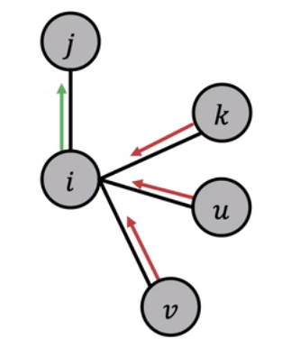

# 斯坦福大学CS224W图机器学习笔记

## 学习参考

CS224W公开课：[双语字幕 斯坦福CS224W《图机器学习》课程(2021) by Jure Leskove](https://www.bilibili.com/video/BV1RZ4y1c7Co?vd_source=55755af81e9ec7ae17d639fb86860235)

官方课程主页：[官方主页](https://web.stanford.edu/class/cs224w)

子豪兄精讲：[斯坦福CS224W图机器学习、图神经网络、知识图谱 同济子豪兄](https://www.bilibili.com/video/BV1pR4y1S7GA?vd_source=55755af81e9ec7ae17d639fb86860235)

子豪兄公开代码：[同济子豪兄CS224W公开课](https://github.com/TommyZihao/zihao_course/tree/main/CS224W)

基于图的项目：

* 读论文、搜论文、做笔记、吐槽论文的社区：[ReadPaper](https://readpaper.com/)
* 可以画出来论文之间的应用关系：[CONNECTED PAPERS](https://www.connectedpapers.com/)
* 医疗知识图谱：[BIOS](https://bios.idea.edu.cn)

知识图谱专业老师：刘焕勇老师[主页](https://liuhuanyong.github.io)，[github主页](https://github.com/liuhuanyong)，[CSDN主页](https://blog.csdn.net/lhy2014)，也有公众号：老刘说NLP。

CS224W的课程目录：

往期笔记回顾：[CS224W笔记](https://github.com/lyc686/CS224W_notes/tree/main/notes)

## Task_07、半监督节点分类：标签传播和消息传递

## 一、基础知识回顾

图机器学习，图数据分析，图数据挖掘解决的问题有：

* 节点层面（最重要，节点是组成图的基本单元）
* 连接层面
* 子图层面
* 全图层面

**半监督**节点分类：根据已知类别的节点来推测未知类别的节点

**直推式学习（`Transductive`）**：在训练模型过程中会使用到没有标签的节点，而且没有新节点产生，不需要对新节点进行泛化。

与之相对的就是**归纳式学习（`Inductive`）**：对新来的节点接入图中进行泛化。

后续**图神经网络**是归纳式的学习，新节点出现之后只需要走一遍前向传播即可泛化到新节点，但是本节的**半监督节点分类**是直推式的。

### 1.半监督节点分类问题求解思路

大致有以下四种思路进行求解：

1. 节点特征工程+分类器
2. 节点表示学习（图嵌入）+分类器
3. 标签传播（消息传递）：用周围节点来推测当前节点，我的类别既取决于我本身也取决于周围人对我的看法。
4. 图神经网络

#### （1）问题引入

为了完成半监督的节点分类问题，我们的节点具有：**自身的属性特征向量**、**和其他节点的连接关系**。

从图的视角审视各种模态数据（都可以看作是半监督问题）

* 文本分类
* 词性标注
* 连接预测
* OCR光学字符识别
* 图像/3D数据语义分割
* 实体统一问题（一个物体有两个名字但是都是一个物体我们需要告诉人们他们是一回事，例如、鲁迅和周树人）
* 垃圾/欺诈邮件检测

总的来说就是学习一门技术就像拿起一个**锤子**，我们可以拿他去敲以下任意的问题看看效果怎么样。

#### （2）求解方法对比

半监督节点分类问题各种方法的求解对比如下表是所示：

|        方法        | 图嵌入 | 表示学习 | 使用属性特征 | 使用标注 | 直推式 | 归纳式 |
| :----------------: | :----: | :------: | :----------: | :------: | :----: | :----: |
|    人工特征工程    |   是   |    否    |      否      |    否    |   /    |   /    |
| 基于随机游走的方法 |   是   |    是    |      否      |    否    |   是   |   否   |
| 基于矩阵分解的方法 |   是   |    是    |      否      |    否    |   是   |   否   |
|      标签传播      |   否   |    否    |    是/否     |    是    |   是   |   否   |
|     图神经网络     |   是   |    是    |      是      |    是    |   是   |   是   |

* 人工特征工程：节点重要度、集群系数、Graphlet等。
* 基于随机游走的方法，构造自监督表示学习任务实现图嵌入。无法泛化到新节点。
  * 例如：DeepWalk、Node2Vec、LINE、SDNE等。
* 标签传播：假设“物以类聚，人以群分”，利用邻域节点类别，猜测当前节点类别。无法泛化到新节点。
  * 例如：Label Propagation、Iterative Classification、Belief Propagation、Correct & Smooth等。
* 图神经网络：利用深度学习和神经网络，构造邻域节点信息聚合计算图，实现节点嵌入和类别预测。可以泛化到新节点。
  * 例如：GCN、GraphSAGE、GAT、GIN等。

这些论文一般都是在GCN相关论文中拿来被比较，被吊打的一些方法。

## 二、标签传播和集体分类

主要介绍以下五种算法

* Label Propagation(Relational Classification)
* Iterative Classification
* Correct & Smooth
* Belief Propagation
* Masked Lable Prediction

### 1.大自然对图的基本假设

`homophily`在图中是广泛存在的，即具有**相似属性特征**的节点更可能相连且具有**相同类别**。

`Influence`物以类聚，人以群分；近朱者赤，近墨者黑（社交关系会影响自己）。

- 相似节点更可能相近，最简单的方法就是用knn最近邻分类方法，如果某一个节点最亲近的节点是什么类别，那么这个节点也就是什么类别。
  - 例如，不良网站之间会相互引流。
- 标签分类节点，除了需要节点**自身**的属性特征、更重要的是也需要**领域节点**类别和属性特征

而且，如果一个节点**周围**全是绿色节点那么这个节点大概率也是一个绿色节点，所以`Correlation`（相邻节点往往是相同类别）也是广泛存在的。

### 2.Label Propagation

逐渐的由已知类别的节点去扩散传播出未知类别的节点，即，你怎么看自己不是取决于你怎么说，而是取决于村里人怎么看你。

如下图所示：初始化已知标签标注{1， 0}未知的节点标注0.5

然后逐渐按照邻域内节点的标签来更新未知节点的标签，如下图所示，以此类推一直到9号节点就完成了第一轮的计算：

之后随着轮次的加多，我们的未标注节点上的值会逐渐**收敛**（稳定），然后按照：

* P > 0.5 属于{1}
* P < 0.5 属于{0}

就通过**标签传播**猜出来了每个节点的类别（实际上就是一个**加权平均**的思想，没有权重就是普通平均，有权重就是加权平均）

计算公式如下图所示：

**存在的缺陷：**

* 不能保证最后多轮标签传播后未知类别节点的计算结果一定收敛
* 仅用到网络连接信息，没有用到节点属性特征

子豪兄线代小课堂：对于对称矩阵和非对称矩阵中的可对角化矩阵，最大奇异值就是最大特征值的平方，奇异值和特征值是一一对应的，对于这种情况如果我们的特征值是（-1, 1）之间，就算左乘矩阵M很多次仍然是收敛的，但是当特征值 < -1或者特征值 > 1左乘矩阵M之后就会发散。

### 3.Iterative Classification

在这种方法中既要使用节点的**属性特征**，也要使用节点的**连接特征**。

- 节点v的属性特征向量为fv，领域节点连接信息为zv
- 分类器ϕ1(fv)仅使用节点属性特征fv，又称作`base classifier`
- 分类器ϕ2(fv, zv)既使用节点属性特征fv，又使用了网络连接特征zv（即领域节点类别信息），又称作`relational classifier`
- zv表示连接信息的summary(摘要)，即，包含邻域节点类别信息的向量。
  - zv的计算可以自己定义，比如可以看周围不同类别的节点有多少个，或者看哪一个类别的节点数量是最多的
  - 然后根据自己定义的特征zv变成一个n维的向量代表连接信息（类似人工特征工程）

算法步骤：

1. 对于**已经标注好**的节点训练分类器ϕ1和分类器ϕ2
2. 对于**未标注类别**的节点，先用分类器ϕ1预测出Yv，再用Yv计算出zv
3. 接着用分类器ϕ2去预测所有未知节点的类别（这之后就不需要分类器ϕ1了）
4. 然后更新邻域节点的zv
5. 再用新的zv输入分类器ϕ2预测新的Yv
6. 不断迭代4.5.直到最终**收敛**或者达到**最大次数**

缺点：

* 不保证收敛

这种模式可以抽象为马尔科夫假设，P(Yv) = P(Yv | Nv)，即，我是什么类别仅取决于和我**直接相连**的节点是什么类别，和我邻居的邻居没有关系。

### 4.Correct & Smooth

#### （1）算法步骤

`Correct & Smooth`是一种**后处理**的方法。

在Open Graph Benchmark（OGB）的竞赛中冠军选手都有使用`Correct & Smooth`的后处理方法。

算法步骤：

1. 首先在有标注的节点上训练一个基础的分类器（什么模型的分类器都可以）
2. 用这个分类器去预测全部所有节点的类别（soft labels意味着每一次预测类别不是非0即1的，而是预测有a的概率是0，有b的概率是1，a + b = 1）
3. 后处理（当两个类别的概率比较接近的时候，就不是很好判断类别）
   1. Correct step
      * 计算training error，把不确定性进行计算和均摊、分散
   2. Smooth step
      * 类似Label Propragation，让最终的预测结果变得平滑

`Correct step`：假设error在图中也有`homophily`，即具有**相似属性特征**的节点更可能相连且具有**相同类别**，相似节点的error也应该是差不多的，不能说两个相似节点一个节点error大，另一个节点error小。我们需要让error大的分一点给error小的节点。

**计算error**：仅计算**有标注**的节点，用他的**真实标记 - soft label**来计算error，由于我们的分类器是在有标注的节点上训练出来的，所以这个error是非常小的，**没有标注**的节点，计算的error都是0。

`Smooth step`：将之前第一步计算的error写成一个矩阵的形式命名为E(0)，然后希望这个矩阵中的error值尽可能的均一，分散，使用的就是类似`Label Propragation`的方法，让他的error扩散到。

#### （2）Correct step对error进行扩散

计算公式如下所示：

* α是一个**超参数**，可以是自己定义的。
  * α越大，表示我们越相信传播过来的error(蓝色框的部分)
  * α越小，表示我们越相信自己上一时刻的error
* 将邻接矩阵A进行**归一化**，得到A~。
* D是一个对角矩阵，只有对角线有值，对角线的值是第i个节点的度（连接数）。
  * 归一化之后的矩阵**A~∈[-1, 1]**
  * 如下图所示的就是矩阵A，D和拉普拉斯矩阵L = D - A，以及D-1/2
  * 
  * 如果节点i和j是相连的那么归一化之后的**A~ij**是下图所示，i和j节点的度di和di越大（连接数越多），A~ij越小，反之A~ij越大。
    * 
    * 所以我们也可以把归一化之后的A~ij的值看作是error扩散的一种**权重**。
* t+1时刻的error矩阵E(t+1) 在α≠1的情况下，既要和**上一个时刻的error矩阵**E(t)有关，也要和后面的蓝色框里的**传播扩散**相关。

当我们完成上述步骤之后我们就可以获得下图所示的一个`Soft labels的矩阵`和一个`经过扩散传播之后的error矩阵`，我们让Soft labels矩阵 + s x error矩阵就得到了最终的结果（s也是一个超参数可以自己指定）

#### （3）Smooth step对最终的结果进行扩散

在得到了上面最终的Correct step之后的结果，我们使用类似`Label Propagation`的方法，仍然对结果矩阵进行**传播**，区别在于此时不是传播error而是**传播置信度z(t)**，公式如下

* α仍然是一个超参数是认为定义的
* t+1时刻的置信度zt+1既和t时刻的置信度zt有关，也和置信度的传播有关（蓝色框中的部分）

经过多次迭代之后我们可以得到下图所示的**最终结果**（此时是三次迭代）

注意：此时的每一个节点的两个类的数值相加不一定等于1，但是他的大小关系仍然是有意义的，仍然可以通过大小关系来作为预测类别的结果（也就是说此时的值并不是概率，但是大小关系仍然是对于分类是有效的）

观察节点4在使用了`smooth`之前与之后我们可以发现，节点4本来是处于脚踩两条船应该很困惑，但是没有`smooth`之前他非常鉴定自己是第二类，使用了`smooth`之后他就变的中立了（更符合真实情况）。

#### （5）Correct & Smooth总结

下图是使用了Correct & Smooth的效果：

`Correct`和`Smooth`是两步后处理操作，不论前面使用的是什么的模型方法我们都可以对最终的结果进行后处理。

* Correct step对error进行扩散
* Smooth step对最终的结果进行扩散

### 5.Loopy Belief Propagation

`Loopy Belief Propagation`就涉及到了**消息传递**（类似传纸条），是一种**动态规划**算法，下一时刻的状态仅仅取决于上一时刻的状态。

#### （1）算法步骤

例如

* 一个**队列**所有的节点从起始节点开始沿着顺序依次向后报数
* 或者**树状结构**所有节点从下级到上级逐级汇报

本质就是**你怎么看自己，取决于你家里人怎么看你，而你家里人怎么看你又受到村里人的影响。**

一些定义：

* `Label-label potential matrix ψ`：当邻居节点i为类别Yi时，节点节点j为类别Yj的概率（**一个标量**），反映了节点和其邻居节点之间的依赖关系。
  * 可以是**“盲人”**：节点i是啥我就是啥
  * 也可以是**“杠精”**：节点i是啥我就偏不是啥
  * **这个矩阵中的所有参数都是需要学习的，当我们最终得到这个矩阵之后，消息传递的机制就建立了。**
* `Prior belief ϕ（先验的belief）`：ϕ(Yi)表示节点i为类别Yi的概率。
* mi->j(Yj)：表示节点i认为节点j是类别Yj的概率（相当于是一个消息）。
* L：表示节点的所有标签。

数学形式：

最终是要计算**mi->j(Yj)**这个消息。

* 紫色框表示i本身的各种类别，需要分别计算最终求和
* 红色框和蓝色框是与j无关的部分也就是节点i的先验belief，可以如下图所示，拿出来单独计算抽象为bi(Yi)。
  * 
* 绿色框部分就是矩阵`Label-label potential matrix ψ`，当邻居节点i为类别Yi时，节点节点j为类别Yj的概率（**一个标量**）
* 最终这几个框的结果**乘积**就是消息传递的结果，一开始需要**初始化所有的消息为1**，对每个节点**迭代**的运行这个算法，最终就可以**收敛**得到最终信息。

#### （2）优缺点

优点：

* 优点：易于编程实现，可以很简单的设置为高阶ψ(Yi, Yj, Yk, Yv …)，类似一个**猜疑链**，即，节点i认为节点j认为节点k认为节点v是一个什么类别（我认为你觉得他...）。

缺点：

* 参数需要训练得到

* 如果图中有**环**：如果图中有环，难以收敛（“三人成虎”的效果，最开始的消息在传递过程中也许会被增强，再回到这个节点之后已经是另一个样子的信息了，例如，发出信息“我头疼”，经过一个环再回来可能就是“地球要毁灭了”）

然而环的这种方法其实很少见，通常情况下`Loopy Belief Propagation`的效果都是不错的，可以用来做自己设计的方法的`baseline`。

### 6.Masked Label Prediction

灵感来源于`bert`（一种基于transformer的语言模型），扣掉一部分词，让模型去猜扣掉的是什么，通过**自监督**的形式阅读大量的文章，自己给自己出题，理解每一个词的语义是什么。

#### （1）算法思路

* 随机将节点的标签设置为0，用[X,Y~]预测已标记的节点标签（类似bert做填空题）
* 使用Y~预测未标注的节点

## 总结

本节介绍的前两种`Label Propagation(Relational Classification)`和`Iterative Classification`属于**集体分类**，`Correct & Smooth`属于**后处理**方法，`Belief Propagation`属于**消息传递**，最后一个`Masked Lable Prediction`属于**自监督学习**，五种方法都是用来解决**半监督节点分类问题**。参照本节最开始的重要表格，每一种解决**半监督节点分类问题**的方法都有自己的特点与使用方法。

## 思考题

- [ ] 哪些图数据挖掘问题，可以抽象成半监督节点分类问题？
- [ ] 有哪些解决半监督节点分类问题的方法？各有什么特点？（对照表格简述）
- [ ] 如何理解Transductive learning（直推式学习）？
- [ ] 如何理解Inductive learning（归纳式学习）？
- [ ] 本讲讲了哪些标签传播和集体分类方法？
- [ ] 如何理解网络种的Homophily？
- [ ] 简述Label Propagation的算法原理？
- [ ] Label Propagation是否用到了节点的属性特征？
- [ ] 简述Iterative Classification的算法原理？
- [ ] Iterative Classification如何使用节点之间的关联信息？
- [ ] 为什么Relation Classification和Iterative Classification都不保证收敛？
- [ ] 简述C & S的基本原理？
- [ ] 如何计算Normalized Adjacency Matrix？
- [ ] 如何用图论解释成语“三人成虎”、“众口铄金”？
- [ ] 如何用图解释《三体》种的“猜疑链”？
- [ ] 简述Loopy Belief Propagation的基本原理？
- [ ] 简述Masked Label Prediction的基本原理？
- [ ] Masked Label Prediction可以是Inductive的吗？可以泛化到新来的节点吗？
- [ ] 本讲的方法，与图神经网络相比，有何异同和优劣？
- [ ] 如何重新理解“出淤泥而不染”？
- [ ] 如何重新理解“传销”、“病毒式裂变”？